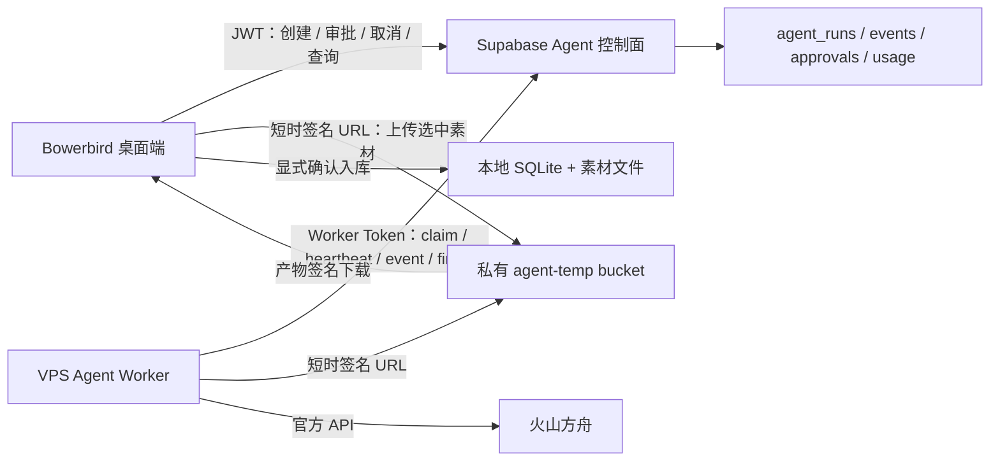

# Bowerbird 内置 Skill Agent Runtime 开发计划

> 版本：v1.1（2026-08-13，补充 Bowerbird Agent Kernel / harness 设计）  
> 状态：架构方向已冻结，尚未开始实现  
> 适用范围：Bowerbird 应用内 / Bowerbird Cloud 的内置 Skill Agent loop  
> 前置文档：[PROJECT.md](PROJECT.md)、[Bowerbird开发计划.md](Bowerbird开发计划.md)、[ARCH-ADJUST-PLAN.md](ARCH-ADJUST-PLAN.md)、[ARCH-ADJUST-PROGRESS.md](ARCH-ADJUST-PROGRESS.md)、[Bowerbird定价方案v2-订阅积分制.md](Bowerbird定价方案v2-订阅积分制.md)、[研究报告-服务器化CLI与API化改造可行性.md](研究报告-服务器化CLI与API化改造可行性.md)

---

## 0. 一页结论

Bowerbird 不建设“用户上传 Skill 的通用 Agent 平台”，而是建设一套**只运行 Bowerbird 官方内置 Skill 的云端工作流执行器**。

首版架构固定为：

- **桌面端**：选择本地素材、填写目标、批准计划、查看进度、下载并入库产物。
- **Supabase**：继续承担 Auth、积分、Agent Run 控制面、短期私有对象存储；不执行长时间 Agent loop。
- **VPS Worker**：以常驻容器轮询任务、运行受限 Agent loop、调用官方模型 API、保存短期检查点；默认不开放公网入站端口。
- **火山方舟**：继续作为托管模型与生成能力来源；不在服务器共享 Codex / 即梦会员 CLI。
- **Skill**：仅随 Worker 镜像发布的 Bowerbird 内置版本；没有上传、安装、市场、用户代码执行。
- **工具**：显式白名单，不提供 shell、任意网络访问、浏览器自动化或文件系统越界能力。
- **本地优先**：素材库和长期 Agent 历史仍在用户本机；云端只保存用户为该次 Run 明确选择的输入、中间状态和产物，并按短 TTL 清理。

首个 Skill 固定为 **“系列创作导演”**：用户选择 3–8 张参考图并描述创作目标，Agent 完成分析、创作计划、人工确认、首图生成、结果评估、至多一次重试，最后返回计划、评估报告和图片，用户确认后写入 Bowerbird 素材库。

这条路线复用现有收费化闭环，不重做 Auth、积分账本、方舟 adapter、FeaturePolicy 或桌面本地生成任务系统。

---

## 1. 目标、非目标与完成定义

### 1.1 目标

1. 在 Bowerbird 内提供一个比“单次生图”更高阶、可暂停和恢复的多步骤创作工作流。
2. 让官方内置 Skill 可以在 VPS 上稳定执行，而不受 Edge Function 单请求时长限制。
3. 保持本地素材库为长期数据权威，不演变为云端素材同步服务。
4. 复用现有账号、权益、积分预授权和方舟官方 API，并把 Agent 的可变成本纳入同一账本。
5. 为后续增加第二、第三个官方 Skill 留下清晰但最小的版本化契约。

### 1.2 明确不做

- 不允许用户上传、编辑、安装或分享 Skill。
- 不建设 Skill 商店、Skill 权限申请、第三方插件协议或任意代码沙箱。
- 不接入 AgentKit / OpenAI 托管 Skill 作为首版运行时。
- 不把 Worker 做成通用聊天 Agent、通用电脑助手或多 Agent 编排平台。
- 不给模型开放 shell、包管理器、任意 URL 抓取、浏览器、SSH 或直接数据库访问。
- 不上传整库、不后台同步素材、不把云端产物自动写回本地库。
- 不通过 VPS 共享 Codex CLI / ChatGPT 订阅或 dreamina CLI / 即梦会员账号。
- 不在本计划内恢复真实支付；支付仍遵守备案/商户资质前置约定。
- 不在首版自动发社交媒体、发邮件或执行其他外部副作用。

### 1.3 MVP 完成定义

以下条件全部满足才算 MVP 完成：

- 一个真实内置 Skill 从桌面端发起并完整走通“上传 → 排队 → 分析 → 计划 → 审批 → 生成 → 评估 → 产物下载 → 本地入库”。
- Worker 重启后 Run 能从检查点恢复；同一工具调用不会重复扣费或重复生成。
- 用户可以取消 queued / running / awaiting_approval Run，结算行为与已产生上游成本一致。
- 最大预算先预授权，最终积分由服务端按可信 usage 明细计算并结算，不能超过授权上限。
- 用户只能读取自己的 Run、事件和产物；Worker 无 Supabase `service_role` 和直接数据库权限。
- 输入、检查点和输出按 TTL 删除；日志不含图片、目标全文、模型提示词、签名 URL 或密钥。
- 真实 VPS、真实方舟、真实 Supabase 上完成一次小规模 E2E，并通过失败注入、安全和清理验收。

---

## 2. Bowerbird 现状与复用边界

### 2.1 直接复用

| 现有能力 | Agent Runtime 中的用途 | 处理原则 |
|---|---|---|
| Supabase Auth + 桌面 `AuthClient` | Run 所有权、JWT、桌面调用云函数 | 原样复用，不新增第二套登录 |
| `billing_accounts` / credits / holds | 最大预算预授权、实际结算、流水 | 扩展可变成本，不另建余额系统 |
| `FeaturePolicy` | 是否可见、并发数、预算档位 | 仍是唯一门控事实源 |
| Edge Functions 共享鉴权/错误码/脱敏日志 | Agent 控制面 API | 复用 `_shared` 约定 |
| `VolcArkAdapter` 已验证的 Seedream / Vision 契约 | Worker 方舟适配参考与回归 fixture | 复用协议和测试样本；不从 Worker 调 public generate-proxy 造成二次 hold |
| `ingest_generated` + library event | Agent 图片下载后的本地入库 | 扩展 source/meta，不另写一套素材导入 |
| 桌面多 job UI 经验 | Run 标签、进度、取消和历史交互 | 复用交互范式，不复用本地 `task_queue` 状态源 |

### 2.2 不应强行复用

- **本地 `task_queue`** 负责本地 CLI / 当前生成任务恢复；云端 Agent Run 的权威状态在 Supabase。两者可以呈现一致，但不要塞进同一张 SQLite 任务表。
- **`GenProvider`** 是单次图片/视频生成抽象，不应扩成通用 Agent Runtime。Agent 的 `generate_image` 工具可以复用其数据语义，但 Runner、审批、检查点和 usage 是独立层。
- **public `generate-proxy` / `understand-proxy`** 自带单次请求 hold/confirm。Worker 若直接调用会形成嵌套预授权和重复扣费；Worker 应使用内部方舟适配器，整个 Run 只由 Agent 控制面统一结算。
- **Edge Function** 只做短请求控制面，不在其中运行循环、等待审批或轮询长任务。

### 2.3 当前缺口

- 没有云端 Run / event / approval / artifact / usage 数据模型。
- 没有私有、短 TTL 的 Agent 临时对象存储。
- 没有可租约认领、心跳续约和崩溃恢复的 Worker 队列。
- 没有服务端 Agent 模型回合、工具白名单和 Skill 版本契约。
- 没有可变成本的预算上限、逐项 usage 与最终聚合结算。
- 桌面端没有 Agent Run UI、审批 UI、产物校验下载与本地历史。

---

## 3. 目标架构



### 3.1 为什么 Worker 采用轮询

- VPS 只需出站 HTTPS，不要求公网域名、反向代理或开放 Worker API。
- 避免把 Supabase 数据库密钥暴露给 Worker。
- 控制面可以原子认领、发短期签名 URL、校验 usage 和状态转换。
- 一台轻量服务器即可起步，未来增加 Worker 只需增加 `worker_id`，不改桌面协议。

### 3.2 首版部署单元

- 一个 `bowerbird-agent-worker` 容器，常驻进程。
- 一个容器内同时只运行少量 Run；每个 Run 使用独立 `/workspaces/<run-id>`。
- Skill 是镜像内只读文件，Run 工作区只允许访问自己的输入、输出和检查点。
- 首版不做“一 Run 一容器”。由于没有用户代码与 shell，这不是安全前置；当后续工具增加原生二进制、浏览器或高风险解析器时再升级隔离。

### 3.3 Worker 运行约束

- 非 root 用户、只读 root filesystem、drop Linux capabilities、`no-new-privileges`。
- 建议单 Run 默认：1 CPU、1 GiB 内存、128 PIDs、20 分钟总时限、12 个模型回合、1 次生成重试。
- 只允许访问 Supabase 控制面、Supabase Storage 签名地址和方舟域名；条件允许时用 egress allowlist。
- VPS 磁盘仅存运行期工作区；完成后立即删，兜底清理不晚于 24 小时。
- 不向公网开放 Worker 业务端口；健康状态通过心跳事件和容器监控判断。

---

## 4. 信任边界与数据生命周期

### 4.1 权限边界

| 主体 | 可以做 | 不可以做 |
|---|---|---|
| 桌面用户 | 创建自己的 Run、上传该 Run 输入、审批/取消、读自己的事件和产物 | 指定任意 Skill 路径、伪造 user_id、直接改状态/usage |
| Agent 控制面 | 验证 JWT、预授权、签发短期 URL、执行状态机、可信结算 | 执行长 Agent loop |
| VPS Worker | 用 Worker Token 认领 Run、读短期输入、提交事件/usage/产物 | 持有 `service_role`、读任意用户表、直接改积分、执行客户端自带代码 |
| 模型 | 选择白名单工具和参数 | 直接访问文件、网络、数据库、密钥或操作系统 |

### 4.2 临时数据范围

允许进入云端的内容仅限：

- 用户为当前 Run 明确选择的 3–8 张图片。
- 当前 Run 的目标文本和必要参数。
- Agent 计划、检查点、模型工具结果和生成产物。
- 运行所需的安全事件、usage 与哈希元数据。

禁止上传：整个项目目录、整个素材库、未选中素材、系统路径、Codex/dreamina 凭据、其他应用数据。

### 4.3 TTL

| 数据 | 正常完成 | 失败/取消 | 长期保留 |
|---|---:|---:|---|
| 输入图片、目标正文 | 本地确认下载后立即清理，最迟 24h | 最迟 24h | 否 |
| 模型检查点/中间图 | Run 结束立即清理，最迟 24h | 最迟 24h | 否 |
| 最终产物 | 本地下载确认后清理，最迟 7d | 最迟 24h | 否 |
| 可展示事件正文 | 最迟 7d | 最迟 7d | 否 |
| 技术状态、usage、积分流水 | 按账务/运维策略 | 按账务/运维策略 | 是，但不含用户内容 |
| 本地 Run 历史与入库资产 | 用户本地管理 | 用户本地管理 | 是 |

对象必须位于 private bucket；签名 URL 单次、短时有效。对象 key 使用随机 ID，不包含文件名、邮箱或用户输入。桌面下载后校验 SHA-256、声明 MIME、实际 MIME 和大小，再入库。

### 4.4 日志红线

只记录：`run_id`、哈希 user、skill/version、状态、step、worker、时延、错误码、模型名、token/调用量、积分。

不得记录：目标全文、模型 prompt/response、图片内容/原文件名、本地路径、对象签名 URL、JWT、Worker Token、方舟密钥。

---

## 5. 数据模型

表名和字段可在 A0 spike 后微调，但职责不可合并成一个大 JSON 表。

### 5.1 `agent_runs`

核心字段：

- `id`, `user_id`, `skill_id`, `skill_version`, `worker_version`, `kernel_version`
- `status`, `current_step`, `progress`
- `input_count`, `input_manifest_hash`, `request_object_key`
- `budget_credits`, `hold_id`, `actual_credits`, `pricing_version`
- `lease_owner`, `lease_expires_at`, `heartbeat_at`, `attempt_count`
- `cancel_requested_at`, `approval_required`
- `checkpoint_object_key`, `checkpoint_hash`, `snapshot_schema_version`, `context_capsule_hash`
- `error_code`, `safe_message`
- `created_at`, `queued_at`, `started_at`, `finished_at`, `content_expires_at`

DB 行不保存目标全文、完整计划或模型上下文；这些属于短期私有对象。

### 5.2 `agent_events`

- `run_id`, 单调递增 `seq`, `type`, `step`, `progress`
- `display_payload` 仅存 UI 必需且可过期的内容
- `created_at`, `content_expires_at`

Worker 批量上报；唯一键 `(run_id, seq)` 保证重放幂等。长期清理时删除正文，仅保留必要技术统计。

### 5.3 `agent_approvals`

- `id`, `run_id`, `kind`, `proposal_object_key`
- `estimated_additional_credits`, `status`
- `requested_at`, `decided_at`, `expires_at`

首版只支持 `creative_plan`。审批只能从 `pending` 转 `approved` / `rejected` / `expired`，由拥有该 Run 的用户操作。

### 5.4 `agent_artifacts`

- `id`, `run_id`, `kind`, `object_key`, `mime`, `bytes`, `sha256`
- `source_call_id`, `expires_at`, `downloaded_at`, `deleted_at`

不存公开 URL。下载时由控制面短时签名；桌面确认校验通过后回报 `downloaded_at`。

### 5.5 `agent_usage_items`

- `id`, `run_id`, `call_id`, `kind`, `provider`, `model`
- `input_units`, `output_units`, `image_count`, `resolution`
- `provider_cost_micros`, `credits`, `pricing_version`, `created_at`

唯一键 `(run_id, call_id)` 防止恢复重放重复计费。Worker 上报原始用量，**Edge Function 按版本化费率重新计算 credits**，不接受 Worker 给出的总额作为权威。

### 5.6 `agent_tool_calls`

这是 harness 的副作用账本，不能只用日志替代：

- `run_id`, `call_id`, `phase`, `tool_name`, `args_hash`, `attempt`
- `status`：`prepared / submitted / succeeded / failed / outcome_unknown`
- `provider_request_id`, `result_object_key`, `result_hash`
- `started_at`, `submitted_at`, `finished_at`, `safe_error_code`

唯一键 `(run_id, call_id)`；同一个 `call_id` 只有在规范化参数 hash 完全一致时才能读取既有结果。昂贵或外部副作用工具必须先写 `prepared`，向上游成功提交后立刻写 `submitted + provider_request_id`；Worker 崩溃后如果状态是 `submitted`，必须先查询上游结果，不能直接重放。

### 5.7 RLS 与 RPC

- 用户对 `agent_runs/events/approvals/artifacts/usage/tool_calls` 仅 own-row `SELECT`；tool call 参数和结果正文仍放短期对象，不直接暴露内部 prompt。
- 用户不能直接 `INSERT/UPDATE/DELETE`；所有写入经 Edge Functions。
- `claim_agent_run` 使用事务与 `FOR UPDATE SKIP LOCKED`，返回租约而非永久占有。
- `heartbeat_agent_run`、`transition_agent_run`、`append_agent_events`、`record_agent_usage` 均验证当前租约。
- `finish_agent_run` 在服务端聚合 usage、执行 `credit_confirm`，状态与结算同一事务收口。
- stale lease 可重新排队；超过恢复上限进入 `failed`，按实际已产生 usage 结算。

---

## 6. API 与状态机

### 6.1 用户侧 `agent-run` Edge Function

统一使用现有 Bearer JWT + publishable key 约定，按 action 分派：

| action | 作用 |
|---|---|
| `create` | 校验 FeaturePolicy、并发、输入清单和预算；建立 Run、预授权；返回签名上传 URL |
| `enqueue` | 校验对象大小/hash/数量后从 `uploading` 入队 |
| `get` | 返回 Run 快照、可展示事件游标和审批状态 |
| `approve` / `reject` | 决策当前 pending approval |
| `cancel` | 设置取消意图或直接取消未开始 Run |
| `artifact_url` | 为自己的可下载产物签发短期 URL |
| `artifact_received` | 记录桌面已校验并落地，可提前清理 |

首版桌面可轮询 `get`；如现有 Supabase Realtime 配置安全且稳定，再作为优化加入，不设为 MVP 前置。

### 6.2 Worker 侧 `agent-worker` Edge Function

使用独立高熵 Worker Token，存于 VPS secret 与 Supabase Function secret；不复用用户 JWT，也不把 `service_role` 下发到 VPS。

| action | 作用 |
|---|---|
| `claim` | 原子认领一条 queued / 可恢复 Run，返回租约、Skill/version、短期输入 URL |
| `heartbeat` | 延长租约、读取 cancel/approval 信号 |
| `events` | 幂等批量追加安全事件 |
| `usage` | 幂等上报原始 usage，服务端计算积分 |
| `checkpoint` | 登记版本化 Run snapshot 对象/hash/step |
| `tool_prepare` / `tool_submitted` / `tool_complete` | 原子维护工具调用副作用账本 |
| `approval_request` | 创建审批并使 Run 暂停 |
| `artifact` | 登记输出对象/hash/类型 |
| `finish` / `fail` | 服务端校验状态、聚合 usage、结算和清理计划 |

Worker Token 支持 `worker_id`、轮换和撤销；Function 使用常量时间比较。首版可使用 TLS Bearer Token，后续只有在出现重放或多 Worker 密钥管理需求时再升级请求签名。

### 6.3 Run 状态

```text
uploading
  ├─ enqueue ─> queued ─> leased ─> running
  │                                  ├─> awaiting_approval ── approve ─> queued
  │                                  │                     └─ reject/expire ─> cancelled
  │                                  ├─> exporting ─> succeeded
  │                                  ├─> failed
  │                                  └─> cancel_requested ─> cancelled
  └─ timeout/cancel ─> cancelled
```

规则：

- `queued` 取消：无上游 usage 时 rollback 全部预授权。
- `running` 取消：Worker 在下一安全点停止；已产生 usage 按实际结算，未使用部分释放。
- 已向上游提交但结果未知的工具调用不得盲目重试或退款；进入可恢复/待对账状态，复用现有 `pending_settlement` 原则。
- 每个有副作用的工具调用都带稳定 `call_id`；恢复时先查 usage/artifact，再决定是否重放。
- 审批期间不占 Worker 执行槽；检查点已上传后释放租约，批准后重新入队。

---

## 7. Bowerbird Agent Kernel（harness）

### 7.1 定位与取舍

首版 harness 正式命名为 **Bowerbird Agent Kernel**。它不是一个通用聊天框架，而是一个“模型可提出下一步、确定性代码掌握最终控制权”的受阶段约束执行内核。

三个层次必须分开：

| 层 | 职责 | 是否允许模型决定 |
|---|---|---|
| Control Plane | Run 所有权、租约、积分、审批、对象签名、最终状态 | 否 |
| Agent Kernel | 阶段推进、上下文构建、策略、工具校验、幂等、检查点、停止条件 | 否；只接受模型建议 |
| Model Backend | 理解素材、形成计划、选择阶段内下一动作、生成/修订内容 | 是，但只能在当前阶段允许的动作集合内 |

不植入 OpenClaw，也不复现 Claude Code：两者的多渠道、通用 workspace、shell/代码编辑、用户 Skill、MCP/插件和长期开放式会话不属于 Bowerbird MVP。也不把 Claude Agent SDK 设为前置依赖；未来若真实 eval 证明 Claude backend 明显更优，优先用 Claude API 实现普通 `ModelBackend`，只有 Agent SDK 能在不引入第二套 session/tool 权威的前提下服从同一契约时才考虑它。无论实现方式如何，都不替换控制面、Kernel、工具和计费。

### 7.2 核心原则

1. **阶段约束，而非无限自主**：Skill 定义 phase graph；模型只能选择当前 phase 的合法 action，不能跳过审批或自行完成结算。
2. **能力安全，而非提示词安全**：模型没有 shell、HTTP、文件路径和数据库能力；prompt injection 即使成功也找不到可越权执行的工具。
3. **副作用先记账再执行**：任何生成/外部调用先建立稳定 `call_id` 和 tool-call ledger，再提交上游。
4. **上下文可重建**：每轮 prompt 都由版本化输入、阶段状态和摘要重新构建；不依赖某个进程的内存或供应商隐式 session。
5. **模型后端可替换，业务语义不可漂移**：方舟/未来 Claude 只负责统一 action 协议；审批、预算、事件和产物协议不随模型变化。
6. **记忆只读注入**：长期偏好由桌面本地系统维护；Kernel 只能消费偏好胶囊或提出候选，不能直接修改用户记忆。
7. **先窄后宽**：首个 Skill 允许固定 phase graph；第二个 Skill 出现前不设计通用 workflow DSL、多 Agent 或插件系统。

最终权限取交集：`GlobalKernelPolicy ∩ SkillPolicy ∩ RunStatePolicy ∩ FeaturePolicy`。Skill manifest 只能继续收紧，不能打开全局禁用能力。首版每个模型回合最多返回一个 action，Kernel 不执行并行工具调用，以简化幂等、预算和取消语义。

### 7.3 Kernel 模块边界

建议目录：

```text
apps/agent-worker/src/
  kernel/
    run-engine.ts          # 恢复并推进一个 Run
    phase-machine.ts       # phase/action 合法转换
    context-builder.ts     # 构造每轮 ModelTurnRequest
    policy-engine.ts       # 工具、预算、审批、次数、路径策略
    tool-dispatcher.ts     # prepare -> execute/query -> complete
    checkpoint.ts          # RunSnapshot 编解码与迁移
    compactor.ts           # 可丢弃消息 -> 事实摘要
    stop-controller.ts     # 取消、超时、回合/成本/失败上限
  contracts/
    model.ts
    skill.ts
    tools.ts
    snapshot.ts
    events.ts
  control-plane/
  providers/
    ark/
    claude/                # 仅未来 eval 通过后增加
  tools/
  skills/
    series-creative-director/
      skill.json
      SKILL.md
      phase-graph.ts
      schemas.ts
      evals/
```

模块职责：

- `RunEngine`：单步推进，不拥有全局队列；每完成一个可观察动作就检查停止信号并保存 snapshot。
- `PhaseMachine`：纯函数，输入 `phase + action + result`，输出新 phase；非法转换直接拒绝。
- `ContextBuilder`：按固定顺序拼上下文，并执行 token 预算和 provenance 标记。
- `PolicyEngine`：根据 Skill manifest 与 Run 状态返回 allow/deny/require_approval，不依赖模型自律。
- `ToolDispatcher`：唯一能够碰 provider、对象存储和工作区的入口。
- `CheckpointStore`：只保存版本化 `RunSnapshot`，支持 Worker 升级后的显式迁移或安全失败。
- `StopController`：取消优先级最高；随后检查 wall time、模型回合、tool 次数、预算和连续错误。

### 7.4 统一模型后端契约

首版接口保持很小，不暴露任何特定供应商 session：

```ts
interface ModelBackend {
  readonly id: "ark" | "claude";
  turn(request: ModelTurnRequest, signal: AbortSignal): Promise<ModelTurnResult>;
}

type ModelTurnRequest = {
  runId: string;
  phase: string;
  systemPolicy: string;
  skillInstructions: string;
  context: ContextBlock[];
  allowedActions: ActionDefinition[];
  responseSchemaVersion: number;
};

type ModelTurnResult =
  | { kind: "action"; action: string; arguments: unknown; providerUsage: ProviderUsage }
  | { kind: "message"; text: string; providerUsage: ProviderUsage }
  | { kind: "refusal"; reason: string; providerUsage: ProviderUsage };
```

约束：

- Ark 原生 tool call 与严格 JSON 输出都要归一为 `ModelTurnResult.action`。
- `message` 不能推进关键 phase；只有 Skill 明确允许时才作为可展示建议或 clarification。
- backend 不执行工具、不签发 URL、不写 checkpoint、不结算积分。
- 供应商返回的原始响应仅在短期 snapshot 中按需保留；事件和日志只写安全摘要。
- Claude 若未来接入，优先走直接模型 API；若采用 Agent SDK，则必须关闭 shell/文件/MCP 等通用工具，只把它视为 `ModelBackend`。若 SDK 自己的 session、tool loop 或权限体系不能被降为该契约，就不采用 SDK。

### 7.5 Skill 契约与阶段图

`skill.json` 至少声明：

- `id`, `version`, `kernel_min_version`, `snapshot_schema_version`
- 输入/产物 schema 与限制
- phase 列表、初始 phase、终止 phase
- 每个 phase 的 `allowed_actions`、最大模型回合、最大工具次数
- 需要审批的 transition
- Run 最大时长、预算档位、允许工具和 provider capability
- 可注入哪些 context block；不得通过 Skill 自行读取任意记忆

首个 Skill 的 phase graph 固定为：

```text
prepare_inputs
  -> analyze_references
  -> draft_plan
  -> await_plan_approval
  -> generate_draft
  -> evaluate_draft
      -> finalize
      -> revise_once -> evaluate_revision -> finalize
```

其中：

- `await_plan_approval` 只能由用户动作离开。
- `generate_draft` 与 `revise_once` 之前必须通过预算检查。
- `revise_once` 最多进入一次，不能形成模型自循环。
- `finalize` 只接受 Kernel 已登记且 hash 验证通过的产物。
- clarification 只在输入存在结构性缺失时允许；首版不把开放聊天作为 phase。

### 7.6 上下文组装与压缩

每轮上下文按以下固定顺序构建，后面的用户内容不能覆盖前面的系统约束：

1. Kernel 安全策略与当前 phase。
2. 版本固定的 Skill instructions 和 action schemas。
3. 当前 Run 预算、已用次数、审批结果和 rubric。
4. 用户目标、输入 manifest、已有 caption/视觉分析。
5. **本地生成的只读偏好胶囊**，如果用户允许本次使用。
6. 已完成工具的结构化结果和 compaction summary。
7. 本轮要求和合法 action 集。

`ContextBlock` 必须携带 `kind / source / trust / createdAt / contentHash`。用户目标、图片 OCR、模型产物和偏好都按“不可信内容”引用，不能被当作系统指令。

Token 预算遵循保留优先级：安全策略与 phase > 审批后的计划/rubric > 最近工具结果 > 输入分析 > 偏好胶囊 > 旧模型对话。`Compactor` 的裁剪顺序与输出 schema 必须确定；若语义摘要需要调用模型，只允许它压缩低信任内容，并由 Kernel 校验结构、保留被采纳事实的来源 hash。安全策略、phase、审批结果和预算不能交给模型摘要或改写。

### 7.7 偏好记忆接口

个性化不是 Worker 自由积累 conversation memory，而是桌面本地生成可审计的 `PreferenceCapsule`：

```ts
type PreferenceCapsule = {
  schemaVersion: 1;
  scope: { projectId?: string };
  preferred: PreferenceFact[];
  avoid: PreferenceFact[];
  workflow: PreferenceFact[];
  generatedAt: string;
  expiresAt: string;
};

type PreferenceFact = {
  category: string;
  value: string;
  confidence: number;
  evidenceCount: number;
  explicit: boolean;
};
```

规则：

- 桌面只发送本次相关的少量事实，不发送完整历史、其他项目或原始行为日志。
- 用户可关闭个性化；胶囊随 Run 临时数据一起过期。
- Kernel 可以输出 `preference_candidate` artifact，包含建议事实、证据和置信度，但不能写长期表。
- 桌面确定性规则负责去重、冲突、衰减和最低证据门槛；隐式候选应重复出现或经用户确认后才生效。
- 建议 UI 必须区分“依据既有偏好”和“探索性建议”，避免偏好把创意空间锁死。
- MVP 只预留 capsule 契约，先支持显式/项目级偏好；自动学习放在首个 Skill 小流量验证之后。

### 7.8 工具调用生命周期与幂等

所有工具统一经过：

```text
model action
  -> schema validate
  -> phase/policy/budget check
  -> derive stable call_id + args_hash
  -> tool_prepare（持久化）
  -> execute 或 query existing provider request
  -> tool_submitted（如有外部副作用）
  -> normalize result + usage + artifact hash
  -> tool_complete（持久化）
  -> checkpoint
```

`call_id` 由 `run_id + phase + logical_slot + revision_index` 派生，不直接由模型提供；模型重复请求相同逻辑动作时返回既有结果。参数变化但逻辑槽相同时，只有 Skill 明确允许 revision 才产生新 call。

错误分类：

- `validation_error`：不执行工具，允许模型修正一次。
- `policy_denied`：不执行，不把内部安全细节回传给模型。
- `transient_before_submit`：指数退避，最多 2 次。
- `outcome_unknown_after_submit`：只查询/对账，不自动重放。
- `provider_terminal`：记录实际 usage 后按 Skill fallback 或失败。
- `cancelled`：在安全点退出；已提交上游的调用进入查询/结算路径。

### 7.9 检查点、恢复与版本兼容

`RunSnapshot` 至少包含：

- `schemaVersion`, `kernelVersion`, `skillId/version`, `modelBackend/model`
- 当前 phase、revision index、模型回合数、工具计数和剩余预算快照
- 已完成/进行中的 `call_id`、provider request id、artifact/usage 引用
- 已批准计划的 hash、审批 id、context capsule hash
- compacted facts、待展示消息和最后事件 seq

保存时机：每次 tool prepare、上游 submitted、tool complete、审批暂停、phase transition 和终态之前。snapshot 必须先写临时对象、校验 hash 后原子更新指针。

恢复时不信任 snapshot 自报的积分或权限：重新读取控制面状态、租约、取消信号、usage ledger 和 FeaturePolicy，再决定下一步。Kernel/Skill 版本变化时只允许显式 snapshot migration；无法迁移则安全失败并按已有 usage 结算，不用新 prompt 猜测旧状态。

### 7.10 审批与用户交互

审批不是普通工具结果，而是控制面状态转换：

- Kernel 写入结构化 proposal artifact 和安全摘要。
- Control Plane 建立 `agent_approval`，Run 进入 `awaiting_approval`，保存 snapshot 并释放租约。
- 桌面显示计划、最大追加成本、将执行的工具与产物数量。
- 用户批准后，Control Plane 记录不可变 decision + proposal hash 并重新排队。
- 恢复时 Kernel 校验 approval 对应同一 proposal hash；计划发生变化必须重新审批。

首版只设“执行生图前”一个业务审批点。取消/拒绝后不让模型游说用户继续。

### 7.11 事件、可观测性与可回放

Kernel 只发稳定事件类型，不把模型自由文本当进度协议：

```text
run.started
phase.started / phase.completed
model.turn.completed
tool.prepared / tool.submitted / tool.completed / tool.failed
approval.requested / approval.resolved
artifact.created
run.cancelled / run.failed / run.succeeded
```

每条事件带 `run_id / seq / phase / safe_code / progress / references`。开发环境可以用脱敏 fixture 回放一次 Run；生产事件不含 prompt、图片、签名 URL 和原始模型响应。可回放的目标是重建状态转换与调用顺序，不是永久保存全部私密上下文。

### 7.12 首版动作与工具白名单

| 名称 | 类型 | 作用 | 主要限制 |
|---|---|---|---|
| `read_input_manifest` | 只读工具 | 读取选中图及已有分析摘要 | 只能当前 Run；不返回本地路径 |
| `understand_image` | Provider 工具 | 方舟视觉理解 | 最多输入数；结果计入 usage |
| `submit_plan_for_approval` | Kernel action | 提交创作计划并暂停 | 模型不调用审批 RPC；Kernel 校验 proposal 后转控制面状态 |
| `generate_image` | Provider 工具 | 调 Seedream 生成 | 最大 2 次；预算、phase 与幂等 `call_id` 必查 |
| `inspect_generated_image` | Provider 工具 | 对结果按 rubric 评估 | 只能读本 Run 已登记产物 |
| `write_artifact` | 工作区工具 | 写计划/报告/结构化摘要 | 只能 `/workspace/output`，有限类型和大小 |
| `propose_preference` | 工作区工具 | 输出偏好候选 | 只生成 artifact，不可写长期偏好 |
| `finish_run` | Kernel action | 提交最终产物清单 | Kernel 再校验 phase、hash 和完整性；模型不直接改终态 |

模型不直接接触文件系统或 HTTP。所有网络和文件操作封装在上述工具实现中；即使 Skill 指令被输入图片或文本污染，也无法动态增加工具。

### 7.13 首个 Skill：系列创作导演

输入：

- 3–8 张用户明确选择的图片。
- 1 段目标文本，建议上限 4,000 字符。
- 可选比例、输出用途、预算档位。
- 所选图片已有 caption 可随 manifest 提供；缺失时才调用视觉理解。

固定流程：

1. 读取输入与已有分析，必要时补视觉理解。
2. 归纳共同视觉语言、不可丢失元素和冲突点。
3. 产出结构化创作计划：目标、构图、光线、色彩、材质、约束、评估 rubric、预计消耗。
4. 请求用户审批。
5. 批准后生成首张图。
6. 使用 rubric 看图评估。
7. 若未达阈值，最多修改一次提示并重试；禁止无限自我改进。
8. 输出 `creative-brief.md`、`evaluation.json` 和 1 张最终图；桌面确认后入库。

MVP 不做“一次自动产出完整 8 张系列”。首版先证明闭环、成本、恢复和质量评估；后续再把同一已批准计划扩为多张批次。

### 7.14 不进入 MVP 的成熟 Harness 能力

以下能力只有出现明确产品需求时才立项：

- shell、代码编辑、浏览器、任意网页搜索与 MCP。
- 用户/第三方 Skill 发现、安装、优先级和热加载。
- 子 Agent、多 Agent 委派和跨 Agent 消息。
- 长期开放式 conversation、自动 cron 和消息渠道 Gateway。
- 一 Run 一容器和不受信代码 sandbox。
- 通用 workflow DSL、可视化编排器或自修改 Skill。

其中“一 Run 一容器”可以在工具风险或租户规模上升时作为部署增强，不能与“接入通用 Agent 平台”捆绑。

---

## 8. 积分、预算与权益

### 8.1 预算模型

- 创建 Run 时只允许选择服务端定义的预算档位，不接受任意超大整数。
- 控制面调用现有 `credit_hold`，`estimated_amount = budget_credits`，在执行前锁定最大成本。
- 每个模型/生成工具调用写 `agent_usage_items`；Edge 按 `pricing_version` 计算。
- 完成/取消/失败时，由服务端聚合实际 credits 后 `credit_confirm(actual)`；未使用的 hold 自动释放。
- Worker 每次昂贵工具前读取剩余预算；剩余不足时以 `budget_exhausted` 正常结束或回到用户审批，不允许透支。

### 8.2 费率实现

首版把 Agent 费率配置放进 `service_costs` 的新 service，例如 `agent_series_director`，其 parameters 保存：

- 可选预算档位与默认上限。
- 文本/视觉 token 或调用量换算规则。
- Seedream 各规格固定积分。
- 定价版本、生效时间和毛利保护参数。

积分计算放在 Edge 的纯函数并配 fixture。Worker 只提交方舟返回的原始 usage 和调用类型，不决定最终积分。若上游暂不返回可靠 token usage，A0 必须确定可审计的“每回合/每图固定积分”降级规则。

### 8.3 FeaturePolicy

新增能力字段建议为：

- `can_use_agent_runs`
- `max_parallel_agent_runs`
- `allowed_agent_skills`
- `agent_budget_options`

POC 阶段先用服务端 feature flag / 测试账号 allowlist，避免在定价未确认前公开。正式档位归属必须先更新定价文档，再落 `FeaturePolicy`；前端、store、Rust command 不散落 tier 比较。

---

## 9. 分阶段任务卡

### A0 — 契约 Spike 与产品边界冻结

**目标**：用最小真实调用消除会改变架构的未知项。

任务：

- A0-T1：验证选定方舟文本模型是否稳定支持 tool calling / strict structured output、最大上下文和 usage 返回；保存脱敏 fixture。
- A0-T2：验证 Vision + Seedream 从 VPS 出站调用、区域、时延、并发和错误恢复；不得使用用户素材，使用仓库测试样本或合成图。
- A0-T3：验证现有 `credit_hold(p_estimated_amount)` 能安全承载预算上限；列出需要的最小 migration。
- A0-T4：冻结首个 Skill 的输入、审批点、最大 2 次生图、产物 schema 和 10–20 个 eval case。
- A0-T5：确认 POC FeaturePolicy、预算档位、TTL 和 VPS 规格；记录仍需用户/运营决定的正式档位与价格。
- A0-T6：冻结 `ModelBackend` / `SkillManifest` / `RunSnapshot` / `ToolCall` / `PreferenceCapsule` v1 契约；同一 eval runner 能替换 Fake/Ark backend。
- A0-T7：用 5 个 adversarial case 验证“阶段约束”设计：跳过审批、重复生图、改预算、请求 shell、跨 Run 读取均在模型外被拒绝。

验收：

- 真实 API spike 能完成“模型发工具动作 → 本地假工具结果 → 模型继续”。
- 方舟调用返回可用于幂等/usage 的字段，或已记录确定性降级方案。
- 不存在“必须上 AgentKit / 必须执行用户代码”才能继续的依赖。
- 不存在“必须植入 OpenClaw / 复现 Claude Code”才能获得的 MVP 能力；未来 backend 替换不改变 Run/Tool/Usage 协议。

### A1 — Supabase Run 控制面

**目标**：在没有真实 Worker 的情况下，Run 生命周期和权限先成立。

任务：

- A1-T1：新增 migrations：Run/event/approval/artifact/usage/tool-call 六张 Agent 表、状态约束、索引、RLS、claim/heartbeat/transition RPC。
- A1-T2：建立 private `agent-temp` bucket、对象命名和签名 URL 策略。
- A1-T3：新增 `agent-run` Function：create/enqueue/get/approve/reject/cancel/artifact actions。
- A1-T4：新增 `agent-worker` Function：claim/heartbeat/events/usage/checkpoint/finish/fail actions。
- A1-T5：接入现有 daily credit ensure、managed usage guard、request id、CORS、稳定错误码和 safeLog。
- A1-T6：用 mock worker 脚本走通完整状态机与 RLS 攻击测试。

验收：

- 两个用户互相看不到 Run/对象；authenticated 无法直接写表或 RPC 越权。
- 双 Worker 并发 claim 只成功一个；stale lease 可恢复。
- create 重放不重复 hold，event/usage 重放不重复写或扣费。

### A2 — VPS Worker 骨架与 Bowerbird Agent Kernel

**目标**：先用 FakeModel / FakeTools 证明调度、检查点和恢复。

任务：

- A2-T1：新建 `apps/agent-worker` Node/TypeScript workspace、容器文件、配置校验和安全日志。
- A2-T2：实现 poll → claim → heartbeat → release、并发上限和优雅停机。
- A2-T3：实现 Bowerbird Agent Kernel：RunEngine、PhaseMachine、ContextBuilder、PolicyEngine、ToolDispatcher、StopController。
- A2-T4：实现 Run workspace、输入下载/hash 校验、输出上传、完成后删除。
- A2-T5：实现版本化 RunSnapshot、原子 checkpoint、awaiting approval 暂停、批准后重新认领、snapshot migration 和进程崩溃恢复。
- A2-T6：实现 tool-call ledger 的 prepare/submitted/complete/outcome_unknown 与稳定 `call_id + args_hash`。
- A2-T7：实现确定性上下文组装、trust/provenance 标记和 token 超限 compaction。
- A2-T8：FakeModel 单元测试覆盖成功、取消、审批、超时、预算耗尽、重复事件、上游提交后崩溃和重启。

验收：

- kill -9 Worker 后重启，Fake Run 从最后检查点继续且副作用只发生一次。
- Worker 容器无 root、无 shell 工具调用入口、无 Supabase service key。

### A3 — 方舟适配与“系列创作导演”

**目标**：首个真实内置 Skill 在 Worker CLI 测试环境闭环。

任务：

- A3-T1：实现 Ark `ModelBackend` adapter（tool call 或 strict JSON action），只返回统一 action/message/refusal。
- A3-T2：实现 `understand_image`、`generate_image`、`inspect_generated_image` 和 usage 归一化。
- A3-T3：实现 Skill manifest、system instructions、计划 schema、rubric 与产物 schema。
- A3-T4：实现一次审批、一次首图、至多一次修订重试的硬限制。
- A3-T5：运行 eval 集，记录结构化成功率、工具越权率、平均调用量、成本和失败分类。

验收：

- 测试集上无越权工具调用被执行；模型输出不合法时 Runner 能修复一次或安全失败。
- 任一 Run 最多 2 次生图、最多 12 回合、不会突破预算。
- Skill/version 和 Worker/version 写入 Run，可复现当次执行配置。

### A4 — 桌面 Agent Run 体验

**目标**：用户无需理解 Skill 文件或 Agent 基础设施即可完成工作流。

任务：

- A4-T1：Rust 新增 Agent cloud client：创建 Run、签名上传、查询、审批、取消、下载校验。
- A4-T2：只允许上传显式选中图片；复用格式/数量/总大小限制，必要时去除 EXIF。
- A4-T3：新增独立 `AgentRunPanel`，入口命名为“系列创作”，不暴露通用 Skill 选择器。
- A4-T4：呈现输入、目标、最大预算、排队/分析/审批/生成/评估/完成状态和稳定错误。
- A4-T5：审批卡展示创作计划、预计追加消耗、批准/拒绝；关闭窗口后可重新挂接云端 Run。
- A4-T6：产物下载后验证并调用 `ingest_generated`，source 记为 `bowerbird-agent`，meta 记录 run/skill/version；报告保存在本地历史。
- A4-T7：本地持久化最小 Run 历史及 artifact 与 asset_id 关联；云端正文过期后仍可查看本地结果。
- A4-T8：预留 `PreferenceCapsule v1`：首版只读取用户显式/项目级偏好；Agent 输出的候选只进本地待确认队列，不自动修改长期偏好。

验收：

- 桌面退出再打开能恢复进行中 Run；完成后图片只在用户确认下载后入库。
- UI、store 和 Rust command 都复核同一 FeaturePolicy；直接 invoke 不能绕过。
- Agent Run 不污染本地 generation `task_queue` 的恢复逻辑。

### A5 — 计费、取消、对账与清理收口

**目标**：可变成本和失败路径满足对外试用要求。

任务：

- A5-T1：实现版本化 usage calculator 和 `service_costs` 配置。
- A5-T2：昂贵工具前预算检查；finish/fail/cancel 统一服务端聚合结算。
- A5-T3：处理“已提交上游但结果未知”、限流、超时、Worker 丢租约和重复完成。
- A5-T4：实现对象/事件 TTL 清理任务与 orphan workspace 清理；清理可幂等重跑。
- A5-T5：积分流水增加 Agent Run 可识别 service/meta，但不写用户内容。
- A5-T6：加入单用户并发、全站队列、每日成本熔断和 VPS Worker 容量门控。

验收：

- 任意失败注入后满足：余额不透支、usage 不重复、已发生上游成本不盲退、未使用 hold 释放。
- 伪造 Worker usage 不能绕过服务端费率或突破 Run budget。
- TTL 到期后对象不可下载，DB 不残留用户正文，VPS 工作区为空。

### A6 — 安全与回归门槛

**目标**：证明新增边界没有破坏本地优先和现有商业化闭环。

任务：

- A6-T1：威胁测试：IDOR、RLS、签名 URL 越权、Worker Token 错误/轮换、对象类型伪造、zip/path traversal（如未来支持压缩包则必须测）。
- A6-T2：Prompt injection 测试：图片/文本要求 shell、读其他 Run、泄露密钥、改预算时均被工具层拒绝。
- A6-T2.1：Harness 越权测试：非法 phase transition、旧 proposal hash 审批、snapshot 篡改、args_hash 冲突、重复 `call_id`、backend 伪造 usage 均 fail closed。
- A6-T3：负载测试：队列堆积、租约抖动、Worker 重启、并发 claim、Supabase/Ark 短时不可用。
- A6-T4：完整回归桌面 Cloud 出图/理解、本地 Codex/即梦门控、积分流水、现有 105+ Rust 基线和前端 build。
- A6-T5：隐私文案明确上传范围、用途、最长保留期、取消/删除语义。

验收：

- 高风险问题为 0；没有 secret、JWT、签名 URL 或用户内容进入日志。
- 现有 Cloud 单次生成/理解链路与本地 provider 行为无回归。

### A7 — VPS 部署与真实 E2E

**目标**：在实际租用服务器上完成可运维部署。

任务：

- A7-T1：准备 Ubuntu 24.04 LTS 或等价系统、Docker/Podman、自动更新策略和受限运行用户。
- A7-T2：部署 Worker 镜像与 secret：Worker Token、Ark key、Supabase Function URL；不放 service role。
- A7-T3：配置容器 restart policy、磁盘上限、日志轮转、CPU/内存/PID 限制和只读文件系统。
- A7-T4：建立监控：queue depth、最老任务等待、心跳、租约过期、成功率、上游 429/5xx、单 Run 成本、磁盘、TTL 清理失败。
- A7-T5：真实测试账号完成一条端到端 Run，并验证暂停审批、Worker 重启、取消和积分对账。

POC 建议资源：2 vCPU / 4 GiB RAM / 40 GiB SSD。由于模型推理在方舟，Worker 主要消耗来自图片传输、校验、状态和临时文件；实际并发由 A7 指标再调整。

验收：

- Worker 无公网业务端口仍可稳定领取任务。
- 重启和小版本滚动更新不丢 Run；旧 Skill version 的进行中 Run 有明确兼容或安全失败策略。

### A8 — 小流量发布与后续判断

**目标**：用真实质量与成本数据决定是否扩大能力。

任务：

- A8-T1：仅测试账号/小名单开放，观察至少一个完整评估周期。
- A8-T2：统计成功率、审批后放弃率、平均耗时、重试率、每 Run 上游成本、积分毛利和清理成功率。
- A8-T3：根据数据调 prompt、rubric、预算档位和并发，不先扩工具。
- A8-T4：达到发布门槛后更新定价/FeaturePolicy/用户隐私文案与 `PROJECT.md`。
- A8-T5：只有首个 Skill 证明稳定复用后，才立项第二个官方 Skill 或“一次生成多张系列”。

建议发布门槛：

- Run 技术成功率 ≥ 95%。
- 非用户取消的不可恢复失败 ≤ 2%。
- 计费差错、越权访问、预算突破、TTL 泄漏均为 0。
- 至少 90% Run 在承诺的时间窗口内完成。
- 单 Run 成本分布可由服务端预算档位覆盖，毛利不依赖隐藏亏损。

---

## 10. 测试矩阵

| 层 | 必测内容 |
|---|---|
| Kernel unit | PhaseMachine、PolicyEngine、上下文顺序/provenance、schema、回合/重试/预算上限、call_id 幂等、取消、审批、snapshot migration |
| Kernel replay | 固定事件与 tool-call ledger 可重建 phase；submitted 后崩溃只查询不重复执行 |
| Model backends | Fake/Ark 共用 contract suite；未来 Claude backend 也必须通过同一 suite 和 eval |
| Ark adapter | tool call/JSON、usage、429、5xx、超时、异步生成结果未知、内容安全错误 |
| SQL | RLS、claim 竞争、lease、状态转换、usage 唯一、hold/confirm/rollback、TTL 查询 |
| Functions | JWT、Worker Token、输入限制、稳定错误码、签名 URL 所有权、重放 |
| Desktop Rust | 选中输入、上传、hash、下载/MIME 校验、取消、401 refresh、入库 source/meta |
| Desktop UI | FeaturePolicy、预算提示、审批、恢复、错误、过期产物、离线状态 |
| E2E mock | 全流程、Worker kill/restart、双 Worker、断网、审批超时、清理 |
| E2E real | VPS + Supabase + Ark 小样本、真实积分、实际成本和时延 |

真实测试禁止使用私人素材；使用明确可测试的合成图或仓库测试资产。

---

## 11. 主要风险与止损条件

| 风险 | 缓解 | 止损条件 |
|---|---|---|
| 模型工具调用不稳定 | strict schema、一次修复、阶段约束 Kernel | 结构化成功率不足则把首个 Skill 改成完全固定 DAG，模型只填内容 |
| Agent 成本波动 | 最大预算 hold、硬调用上限、服务端费率、成本熔断 | 无法审计 usage 时不公开，只保留测试名单 |
| 长任务重复副作用 | lease、checkpoint、call_id、usage/artifact 唯一 | 上游缺幂等且无法查询时，该工具不自动重试 |
| 临时数据变成事实云图库 | private bucket、短 TTL、本地下载确认、无公开 URL | 清理无法稳定达到 SLO 时暂停扩大开放 |
| VPS 单点故障 | 控制面持久化、租约重领、容器重启 | POC 可接受；开放规模前按指标增加第二 Worker |
| 通用平台过度设计 | 首版单 Skill、固定工具、无上传/市场/DSL | 新抽象必须由第二个已批准 Skill 的真实重复需求驱动 |
| 自研 harness 漏掉成熟机制 | contract tests、tool ledger、snapshot、replay、adversarial eval | 先补明确缺口；不以“成熟”为由整体引入 OpenClaw/Claude Code |
| 模型供应商锁定 | 小型 `ModelBackend` 契约、统一 eval | 只有替代 backend 在质量/成本上显著胜出才进入生产 |

---

## 12. 执行顺序与人工前置

依赖顺序：

```text
A0
 └─ A1 ─ A2 ─ A3 ─ A4 ─ A5 ─ A6 ─ A7 ─ A8
```

A1 与 A2 可在契约冻结后并行，但合并前必须用同一套 fixture。MVP 功能完成点为 A5；达到可公开小流量的完成点为 A7，A8 是发布观测阶段。

开工前需要人工提供或确认：

1. VPS 的系统、CPU/RAM/磁盘、SSH/部署方式；Worker 本身不要求域名。
2. 方舟用于 Agent 文本回合的 endpoint/model id；Vision 和 Seedream 可复用现有真实配置。
3. POC 测试账号 allowlist 与最大预算档位。
4. TTL 是否接受本计划默认值：输入/中间状态 24h，最终产物 7d。
5. 正式开放前的档位、价格与隐私条款；这些不是 A0–A5 编码的阻塞项。

每完成一个 Phase：运行该 Phase 验收 + 全量相关回归，更新 [PROJECT.md](PROJECT.md) 的“目前进展/关键约定/踩坑”；不要仅以代码完成代替真实云端验证。
