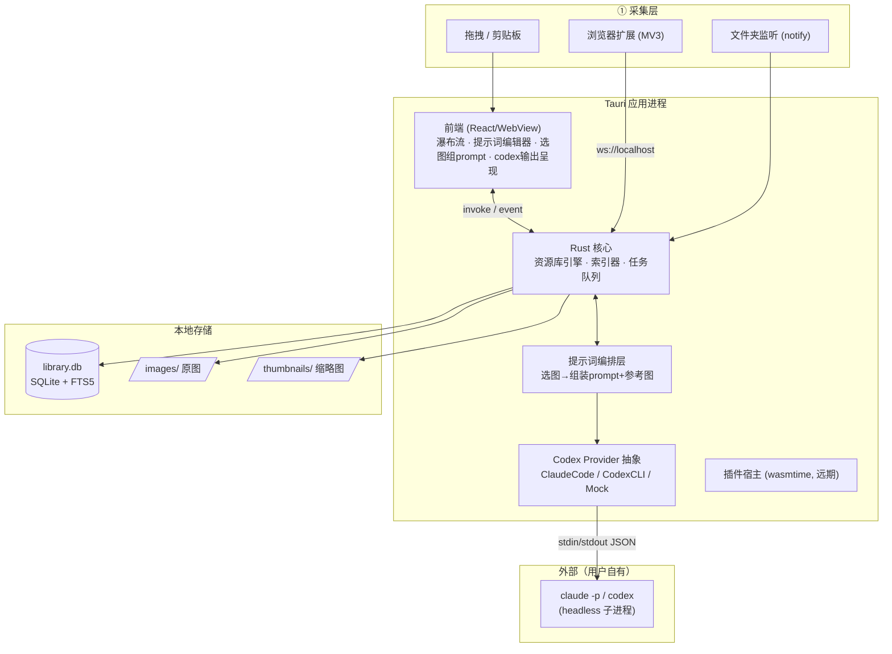
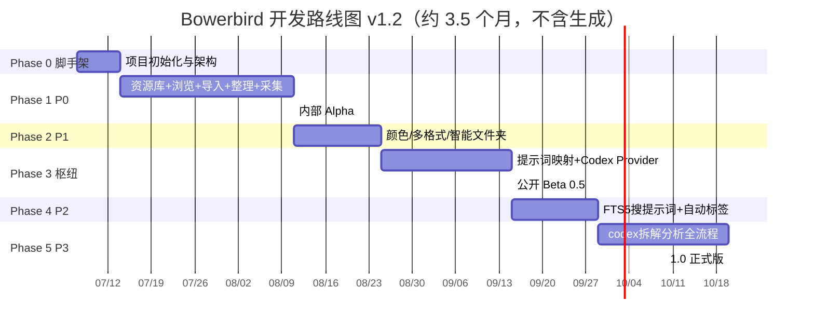

# Bowerbird — 开发计划（AI 编排版）

> **项目代号**：Bowerbird（园丁鸟）
> **定位**：为 AI 图像创作服务的「提示词 + 参考图」素材库与编排工作台。
> **形态**：Tauri 2 本地优先桌面应用 + 浏览器扩展。
> **文档版本**：v1.2 · 2026 年 7 月
>
> **v1.2 变更（重大）**：
> - **AI 全部外包**给 headless codex（抽象 Provider 接口，首期接 Claude Code `claude -p`，可扩展 Codex CLI），**移除所有自建本地模型**（ONNX/CLIP/candle/mistralrs/tesseract/向量）。
> - **新增核心**：图片 ↔ 提示词映射；核心交互 = 「选图 = 自动组装一段提示词 + 参考图集」。
> - **性能降级**：不追求「万图秒开」，目标改为千图级流畅浏览；重心转向 AI 编排 UX。
> - **检索调整**：去掉 CLIP 语义搜索与 pHash 以图搜图，改用 **FTS5 搜提示词/标签/描述**（pHash 仅保留作采集去重）。
> - **暂不做生成（⑥）**：v1 聚焦分析（⑤）。生成留待后续。
> - **优先级按评审结果重排**（见 §1.3 / §6）。

---

## 0. TL;DR（一页摘要）

| 项 | 决策 |
|---|---|
| **桌面框架** | Tauri 2.x（Rust 后端 + 系统 WebView） |
| **前端** | React 18 + TypeScript + Vite + Tailwind + Zustand |
| **数据库** | SQLite（`rusqlite`，bundled，含 FTS5） |
| **图像处理** | `image` + `fast_image_resize` + `psd`/`resvg`/`ffmpeg-next` |
| **颜色提取** | K-Means（LAB 空间） |
| **检索** | FTS5 全文（文件名 / 标签 / **提示词** / 描述 / OCR）+ 颜色筛选 |
| **去重** | pHash（仅用于采集去重，非搜索功能） |
| **AI（分析）** | **headless codex（抽象 Provider，首期 Claude Code `claude -p`）**，不自建模型 |
| **采集通道** | 浏览器扩展（MV3）↔ 本地 WebSocket（`axum`） |
| **插件系统** | WASM 沙箱（`wasmtime`）—— 远期 |
| **核心数据** | 图片 ↔ 提示词映射；选图 = 组 prompt + 参考图 |
| **总工期** | 1.0 约 3–4 个月（2–3 人），**不含生成** |

**一句话路线**：先跑通 `导入 → SQLite → 缩略图 → 瀑布流`（①②）+ 浏览器采集，再做颜色/多格式/智能文件夹（P1）；随后建立**提示词映射体系 + Codex Provider**（核心枢纽）；最后用 FTS5 搜提示词（P2）与 codex 拆解分析（P3）收尾，发布 1.0。

---

## 1. 项目目标与边界

### 1.1 目标
- **新定位**：不是"复现 Eagle"，而是**为 AI 图像创作服务的素材库与编排台**——帮用户把散落的灵感图片，组织成可复用的「提示词 + 参考图」资产，并一键交给 AI。
- **AI 全外包**：理解/分析能力通过调用 **headless codex** 实现，Bowerbird 只做三件事：① 构造 prompt + 参考图 → ② 调用 codex → ③ UI 呈现与入库。**不自建任何本地 AI 模型**。
- **核心交互**：**选图 = 填写了一段提示词 + 参考图**。用户选中若干图片，系统自动组装出可发给 AI 的创作包。
- **哲学**：素材与提示词 100% 本地（Local-First）；AI 推理经 codex（需用户自有 codex/账号，可能联网）。

### 1.2 六大工作流（调整后）

| # | 工作流 | 状态 | 说明 |
|---|---|---|---|
| ① | **收集** Collect | ✅ | 浏览器扩展、拖拽、剪贴板、文件夹监听 |
| ② | **浏览** Browse | ✅（降级） | 缩略图瀑布流、多格式预览；目标千图级流畅，不追求万图秒开 |
| ③ | **搜索** Search | ✅（调整） | FTS5 全文（主搜提示词）+ 颜色筛选；去 CLIP、去以图搜图 |
| ④ | **整理** Organize | ✅ | 文件夹、标签、智能文件夹、**提示词映射** |
| ⑤ | **拆解分析** Analyze | ✅ **全走 codex** | VLM 描述/关键词、OCR、版式/构图、灵感拆解卡、关联推荐 |
| ⑥ | **生成** Generate | ⏸ **暂不做** | v1 不做；留待后续（生成提示词方案 / 对接画图工具） |

### 1.3 范围分级（评审确认的优先级）

| 优先级 | 模块 |
|---|---|
| **P0** — MVP 必备 | 本地资源库引擎、浏览器扩展采集、缩略图浏览（瀑布流）、文件导入（拖拽/剪贴板）、文件夹/标签管理 |
| **P1** — 核心体验 | 颜色提取与筛选、多格式预览（PSD/SVG/视频）、智能文件夹 |
| **P2** — 差异化 | FTS5 全文搜索（搜提示词）、自动标签（codex）、图像放大（可选） |
| **P3** — 拆解分析（全走 codex） | VLM 描述/关键词、OCR、版式/构图、灵感拆解卡、关联推荐 |
| **核心枢纽** | **提示词映射体系 + Codex Provider 接入**（横跨 P1→P3） |
| **远期** | WASM 插件、云同步、移动端只读、生成（⑥） |

### 1.4 明确不做（v1）
- 不自建任何本地 AI 模型（ONNX/CLIP/扩散/VLM/OCR 全删）。
- 不做生成（⑥）。
- 不做 CLIP 语义搜索 / pHash 以图搜图（pHash 仅作采集去重）。
- 不追求万图秒开（千图级流畅即可）。
- 不强制云端账号；不做内置像素级编辑器。

---

## 2. 技术栈选型

### 2.1 为什么是 Tauri 而非 Electron
（沿用）素材管理 + codex 子进程编排是**重文件 I/O + 频繁进程调用**场景，Rust 后端在缩略图生成、颜色提取、子进程管理上原生高效；Tauri 轻量，适合常驻。代价是 Rust 学习曲线与系统 WebView 一致性——可接受。

### 2.2 前端技术栈（决策点已定：推荐项）
**React 18 + TS + Vite + Tailwind + Zustand**。虚拟滚动 `@tanstack/react-virtual`；图标 Lucide。核心新增 UI：提示词编辑器、选图组 prompt 面板、codex 输出流式呈现。

### 2.3 Rust 后端 Crates 清单（v1.2 精简）

| 用途 | Crate | 说明 |
|---|---|---|
| 异步运行时 | `tokio` | 含 `tokio::process` 管理 codex 子进程 |
| SQLite / 迁移 | `rusqlite`（FTS5）/ `rusqlite_migration` | 元数据、提示词、索引 |
| 图像解码缩放 | `image` + `fast_image_resize` | 缩略图 |
| 多格式 | `psd` / `resvg` / `rawloader` / `ffmpeg-next` | PSD/SVG/RAW/视频预览 |
| 颜色提取 | 自实现 K-Means + `palette` | LAB 空间 |
| 去重哈希 | `img_hash` | pHash，**仅采集去重** |
| **codex 调用** | `tokio::process::Command` + `serde_json` | 调 `claude -p`，解析 JSON/流式输出 |
| WebSocket / 监听 | `axum` / `notify` | 扩展采集 / 文件夹监听 |
| 基础设施 | `tracing` / `serde` / `thiserror`+`anyhow` | 日志/序列化/错误 |

> **移除**：`ort`、`candle`、`mistralrs`、`tesseract-rs`、`sqlite-vec`（无本地 AI、无向量）。

### 2.4 Codex Provider 抽象层（核心新增）

定义统一 trait，首期实现 Claude Code，可扩展 OpenAI Codex CLI：

```rust
#[async_trait]
trait CodexProvider {
    /// 单轮：给定 prompt + 参考图，返回结构化结果（用于批量分析）
    async fn run(&self, req: CodexRequest) -> Result<CodexResult, CodexError>;
    /// 流式：逐 token 推送（用于交互式拆解 / 实时呈现）
    async fn run_stream(&self, req: CodexRequest, tx: mpsc::Sender<Chunk>) -> Result<()>;
}

struct CodexRequest {
    instruction: String,          // 任务指令（如"提取主色调并描述构图"）
    reference_images: Vec<PathBuf>, // 参考图本地路径（codex 多模态读取）
    context_prompts: Vec<String>, // 关联的提示词片段
    output_schema: Option<Schema>, // 期望的结构化输出
}
```

| Provider | 实现 | 说明 |
|---|---|---|
| `ClaudeCodeProvider` | `claude -p --output-format json`（子进程） | **首期**；Claude 原生多模态，能"看图"，适合 VLM/OCR/版式分析 |
| `CodexCliProvider` | `codex exec`（子进程） | 可选扩展；多模态能力需验证 |
| `MockProvider` | 本地桩 | 开发/离线/测试用 |

设置页让用户选择 provider、配置可执行路径与账号。

### 2.5 浏览器扩展（独立子项目）
Manifest V3 + TS + Vite + `@crxjs/vite-plugin`；content script 注入悬浮保存按钮 + DOM 扫描；background 维护与本地 Bowerbird 的 WebSocket。

---

## 3. 系统架构

### 3.1 整体架构图



> **关键变化**：AI 引擎从"本地理解/分析/生成三件套"变成"**Codex Provider + 提示词编排层**"。Bowerbird 不持有任何模型权重，只负责构造请求、管理子进程、解析与呈现输出。

### 3.2 进程与线程模型


> **稳定性原则**：codex 调用走独立 Worker + **持久化任务队列**（SQLite）。单个 codex 子进程崩溃/超时可取消重试，不拖垮主进程与资源库。

---

## 4. 数据模型设计

### 4.1 资源库目录结构

```
my-library/
├── library.db                 # SQLite：元数据/标签/提示词/索引/分析/任务
├── .bowerbird/
│   ├── config.json            # 含 codex provider 设置
│   └── thumbnails/            # JPEG 缩略图（按 hash 分桶）
├── images/                    # 原始素材（不修改）<yyyy>/<mm>/<ulid>.<ext>
└── exports/                   # .bowerpack 导出包
```

> 对比 v1.1：**移除 `models/`（无本地模型）与 `generated/`（不做生成）**。

### 4.2 SQLite Schema（核心表）

```sql
-- 资产主表
CREATE TABLE assets (
  id TEXT PRIMARY KEY, name TEXT NOT NULL, ext TEXT,
  origin_path TEXT, thumb_path TEXT, size INTEGER,
  width INTEGER, height INTEGER, duration REAL,
  phash TEXT,                    -- 仅用于采集去重
  colors TEXT,                   -- JSON 主色
  rating INTEGER DEFAULT 0,
  source TEXT DEFAULT 'imported', -- imported | extension
  source_url TEXT, folder_id TEXT,
  created_at INTEGER, file_mtime INTEGER,
  FOREIGN KEY (folder_id) REFERENCES folders(id) ON DELETE SET NULL
);

CREATE TABLE folders (id TEXT PK, name, parent_id, kind DEFAULT 'folder', smart_query, sort,
  FOREIGN KEY (parent_id) REFERENCES folders(id) ON DELETE CASCADE);
CREATE TABLE tags (id TEXT PK, name UNIQUE, color);
CREATE TABLE asset_tags (asset_id, tag_id, PK(asset_id,tag_id), FK...);

-- ============ 提示词体系（核心新增）============
CREATE TABLE prompts (
  id        TEXT PRIMARY KEY,
  title     TEXT,
  body      TEXT NOT NULL,       -- 提示词正文（FTS5 索引主体）
  kind      TEXT DEFAULT 'manual',-- manual | generated(codex) | template
  source_model TEXT,             -- 生成它的 codex provider
  created_at INTEGER, updated_at INTEGER
);
-- 图片 ↔ 提示词 多对多
CREATE TABLE asset_prompts (
  asset_id  TEXT NOT NULL,
  prompt_id TEXT NOT NULL,
  role      TEXT DEFAULT 'ref',  -- main(主提示词) | ref(参考) | desc(描述)
  PRIMARY KEY (asset_id, prompt_id),
  FOREIGN KEY (asset_id) REFERENCES assets(id) ON DELETE CASCADE,
  FOREIGN KEY (prompt_id) REFERENCES prompts(id) ON DELETE CASCADE
);

-- 全文检索（文件名 + 标签 + 提示词正文 + 描述 + OCR）
CREATE VIRTUAL TABLE library_fts USING fts5(
  asset_id UNINDEXED, name, tags, prompt_body, annotation, ocr,
  tokenize='trigram'
);

-- ============ ⑤ 拆解分析结果（全由 codex 产出）============
CREATE TABLE analyses (
  id TEXT PRIMARY KEY, asset_id TEXT NOT NULL,
  kind TEXT NOT NULL,            -- caption | keywords | ocr | layout | inspiration_card
  payload TEXT NOT NULL,         -- JSON：codex 输出
  provider TEXT,                 -- claude-code | codex-cli
  created_at INTEGER,
  FOREIGN KEY (asset_id) REFERENCES assets(id) ON DELETE CASCADE
);
CREATE INDEX idx_analyses_asset ON analyses(asset_id, kind);
```

> 对比 v1.1：**新增 `prompts` / `asset_prompts`**；**移除 `asset_vec`（无向量）与 `generations`（不做生成）**；FTS5 表纳入 `prompt_body`。

---

## 5. 功能模块实现方案

### 5.1 ①②④ — 收集 / 浏览 / 整理（P0，性能降级）
- 导入流水线：探测 → 缩略图（fast_image_resize）→ pHash（去重用）→ 提色 → 入库。
- 瀑布流：`@tanstack/react-virtual` 虚拟滚动（保留，但只优化到千图级）。
- 整理：文件夹树 + 标签 + 智能文件夹。

### 5.2 ① — 浏览器扩展采集（P0）
扩展抓 URL → WS → 桌面下载器（UA/Cookie 伪装、防盗链、断点续传、**pHash 去重**）→ 入库。

### 5.3 ③ — 检索（P2，精简）
- **FTS5 全文**：搜文件名 / 标签 / **提示词正文** / 描述 / OCR（中文 `trigram` 起步，可切 `jieba-rs`）。
- **颜色筛选**：K-Means 主色 + LAB ΔE 距离。
- ~~CLIP 语义搜索~~（删除）、~~pHash 以图搜图~~（删除，pHash 仅去重）。

### 5.4 提示词映射体系 + 选图组 prompt（核心枢纽）
这是 v1.2 的灵魂，连接"素材管理"与"AI 编排"：

- **图片 ↔ 提示词映射**：每张图可关联多段提示词（`role`: 主提示词 / 参考 / 描述），提示词可手动写或由 codex 生成。
- **选图 = 组 prompt**：用户多选 N 张图 → 系统自动组装「**提示词正文（聚合各图主提示词）+ 参考图集（路径列表）**」→ 一个可编辑的"创作包"。
- **一键发送**：创作包可 ① 复制为文本+图片清单（给外部 MJ/SD）；② 发给 codex 优化/扩写；③ 存为模板复用。
- **prompt 模板**：常用结构（主体/风格/构图/光线…）可存为模板，加速组装。

```rust
// 选图组 prompt 的核心组装
fn assemble_pack(selected: &[AssetId]) -> CreationPack {
    let prompts = db.prompt_bodies_for(selected, role=Main);   // 聚合主提示词
    let refs    = selected.iter().map(|id| asset_path(id)).collect(); // 参考图路径
    CreationPack { prompt: merge(prompts), references: refs, .. }
}
```

### 5.5 Codex Provider 集成（核心枢纽）
- 统一 `CodexProvider` trait（见 §2.4）；首期 `ClaudeCodeProvider`（`claude -p`）。
- **多模态关键假设**：拆解分析（VLM/OCR/版式）依赖 codex 能"看图"。Claude 原生支持图像输入，故选 Claude Code 为首期 provider；调用时以**本地图片路径**作为参考传入（具体传参机制在 Phase 3 验证：路径引用 / 临时编码 / MCP 资源）。
- 任务进持久化队列，支持取消/重试/并发上限；输出流式推前端。
- **离线/无账号降级**：未配置 codex 时，分析类功能置灰并提示；Mock provider 供开发。

### 5.6 ⑤ — 拆解分析（P3，全走 codex）
每项 = 一个 codex 提示词模板 + 结果入库 + UI 呈现：

| 分析项 | codex 指令（示意） | 产出 → 落库 |
|---|---|---|
| VLM 描述/关键词 | "描述这张图，给出风格/主题关键词" | `analyses(kind=caption/keywords)` + 反哺标签 |
| OCR | "提取图中所有文字" | `analyses(kind=ocr)` + 入 FTS5 |
| 版式/构图 | "分析构图、栅格、视觉重心" | `analyses(kind=layout)` |
| 灵感拆解卡 | "聚合为：配色+构图+风格+关键词卡片" | `analyses(kind=inspiration_card)` |
| 关联推荐 | "给定一组图的关键词，找出可归类的系列" | 基于 FTS5 关键词匹配 + codex 聚类 |

### 5.7 图像放大（P2 可选）
> **张力说明**：超分（Real-ESRGAN）属"图像处理工具"而非"AI 智能分析"，与"AI 不自建"原则处于灰色地带。v1 标注为**可选**，实现方式待定（本地 ort / 外部工具 / WASM 插件），不进入核心路径。

### 5.8 插件系统（远期）
WASM 沙箱（`wasmtime`）+ 受限 Host Function。v1 不做。

---

## 6. Roadmap（开发阶段与里程碑）

> 工期按 **2–3 人**估算。删除自建 AI 后整体**缩短至约 3–4 个月**。



### Phase 0 — 脚手架（第 1 周）
`create-tauri-app`（React+TS）；CI 三平台；`rusqlite`+迁移；任务队列骨架；**CodexProvider trait + Mock**。验收：dev 启动，invoke 回显。

### Phase 1 — P0 MVP（第 2–5 周）⭐
本地资源库；缩略图瀑布流；文件导入（拖拽/剪贴板）；文件夹/标签；**浏览器扩展采集**（含 pHash 去重）。
**交付**：内部 Alpha。**验收**：千图级浏览流畅；主流站点采集成功率 >95%。

### Phase 2 — P1 核心体验（第 6–7 周）
K-Means 提色 + 调色环；多格式预览（PSD/SVG/视频）；智能文件夹。

### Phase 3 — 提示词映射 + Codex Provider（第 8–10 周）🔑 核心枢纽
`prompts`/`asset_prompts` 数据层；提示词编辑器 UI；**选图组 prompt**（核心交互）；`ClaudeCodeProvider`（`claude -p`）接入 + 流式输出呈现；创作包导出（文本+参考图清单）。
**交付**：公开 Beta 0.5。**验收**：选若干图 → 一键得到 prompt+参考图包，可发 codex 优化或复制外用。

### Phase 4 — P2 检索与标签（第 11–12 周）
FTS5 全文（含提示词正文）；codex 自动打标（批量）；可选图像放大（待定）。

### Phase 5 — P3 拆解分析（第 13–15 周）
codex 提示词模板集（描述/关键词/OCR/版式/灵感卡/关联）；分析结果入库 + UI 卡片呈现；批量分析队列；反哺 FTS5/标签。
**交付**：**1.0 正式版**。**验收**：选中资产一键生成结构化拆解卡；codex 多模态看图通路验证通过。

> 远期（1.x+）：生成（⑥，提示词方案/对接画图）、WASM 插件、云同步、移动端。

---

## 7. 项目代码结构

```
bowerbird/
├── apps/
│   ├── desktop/src-tauri/src/
│   │   ├── commands/          # #[tauri::command]
│   │   ├── core/              # ingest / library / indexer / task_queue
│   │   ├── media/             # thumb / color / phash(去重) / probe
│   │   ├── prompt/            # 🆕 提示词编排：assemble_pack / templates
│   │   ├── codex/             # 🆕 provider trait + claude_code / codex_cli / mock
│   │   ├── analysis/          # 🆕 codex 分析模板集 + 结果落库
│   │   ├── collect/           # WS Server / 文件监听
│   │   ├── plugin/            # 远期 WASM
│   │   ├── db/                # rusqlite + 迁移
│   │   └── error.rs
│   ├── desktop/src/           # React 前端
│   │   └── components/        # 瀑布流/调色环/提示词编辑器/选图组prompt/codex输出
│   └── extension/             # 浏览器扩展（MV3）
├── packages/shared/           # ts-rs 共享类型
└── docs/
```

> 对比 v1.1：**删除 `ai/vision.rs`、`ai/generation/`、`ai/backend.rs`（本地模型层）**；**新增 `prompt/`、`codex/`、`analysis/`**。

---

## 8. 关键技术难点与应对

| 难点 | 风险 | 应对 |
|---|---|---|
| **codex 多模态看图机制** 🆕 | VLM/OCR/版式依赖 codex 读图 | 首期选 Claude Code（Claude 原生支持图像）；Phase 3 优先验证图片传参（路径/编码/MCP）；不通过则降级 |
| **codex 子进程管理** 🆕 | 崩溃/超时/僵尸进程 | 独立 Worker + 持久化队列；超时取消 + 重试；并发上限 |
| **流式输出解析** 🆕 | JSON/流格式差异 | Provider 各自适配；前端 event 实时呈现 |
| **codex 依赖外部账号/网络** 🆕 | 与 Local-First 张力 | 明确：素材本地，AI 调用需用户自有 codex（可能联网）；未配置时功能置灰 + Mock 开发 |
| **prompt 工程质量** 🆕 | 分析质量取决于模板 | 沉淀可复用模板集；支持用户自定义；结果可编辑修正 |
| **调用成本/速率** 🆕 | 批量分析耗费 token | 批量队列 + 限流；用户可配置并发与预算提示 |
| 系统 WebView 差异 | 中 | 限定基线 + CI 截图回归 |
| 多格式解码复杂度 | 中 | 先高频格式，按需迭代 |
| 采集稳定性（防盗链） | 中 | 下载器伪装 UA/Referer/Cookie |

---

## 9. 质量与工程实践
- **分支**：main ← develop ← feat/*；每 Phase 一个 tag。
- **测试**：Rust 单元（提色/去重/提示词组装/provider mock）+ `assert_cmd` 集成；前端 Vitest + Playwright E2E；**codex 用 Mock provider 单测**，真实 provider 走可选集成测试。
- **性能门禁**：CI 跑"千图导入+浏览"基准（不再压 10w）。
- **可观测**：`tracing` 日志；codex 调用记录（provider/耗时/token 估算）；任务队列监控。

---

## 10. 风险登记册

| 风险 | 概率 | 影响 | 缓解 |
|---|---|---|---|
| codex 看图能力不足/传参受阻 🆕 | 中 | 高 | 首期 Claude Code；Phase 3 优先验证；降级方案（提取可文本特征喂 codex） |
| codex 账号/网络依赖 🆕 | 高 | 中 | 明确边界；Mock 开发；离线时功能置灰而非崩溃 |
| prompt 模板质量不稳 🆕 | 中 | 中 | 模板集迭代 + 用户自定义 + 结果可编辑 |
| 多格式解码超预期 | 中 | 中 | 先高频格式 |
| 采集稳定性 | 中 | 中 | 下载器伪装 + 去重 |
| Eagle 闭源，实现靠推断 | 低 | 低 | 复现公开形态与通用模式，非逆向 |

---

## 11. 参考与依据
前序《Eagle 类创意收集工具实现方式调查报告》；Tauri 2 文档与 `rusqlite`/`axum`/`img_hash` 生态；Claude Code 无头模式（`claude -p`）与 OpenAI Codex CLI（`codex exec`）官方文档。
> **免责**：本计划为原创设计；codex 集成依各 provider 官方能力，多模态传参细节以实测为准。

---

## 12. 下一步行动（暂不开发，待评审）
1. **评审本 v1.2**：确认新定位（AI 编排骨架）、提示词映射为核心、优先级重排、不做生成。
2. **开发前需验证的关键假设**：Claude Code `claude -p` 的**图片输入机制**（路径/编码/MCP）与**结构化/流式输出格式**——这是整个分析工作流的技术前提，建议在 Phase 0/3 之间安排一次小规模 spike。
3. 启动第一步：搭 monorepo + 脚手架 → 跑通导入+瀑布流 → 建立 CodexProvider trait + Mock → 验证一次真实 `claude -p` 看图调用。
