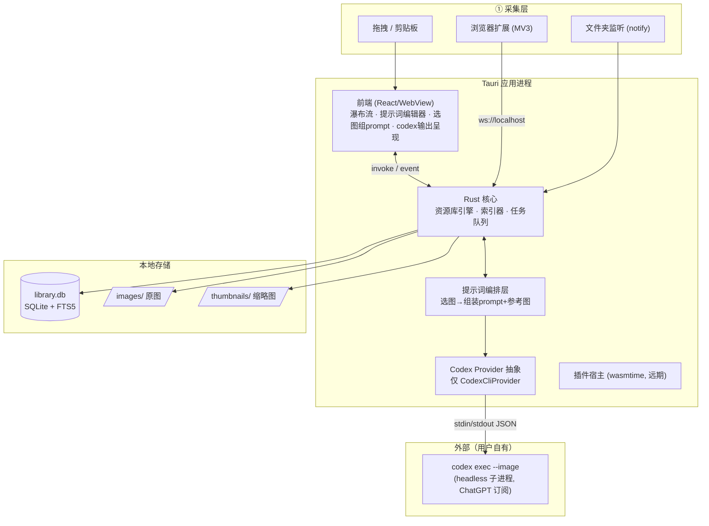
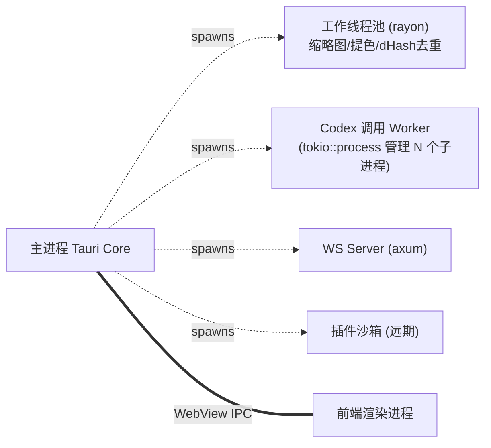
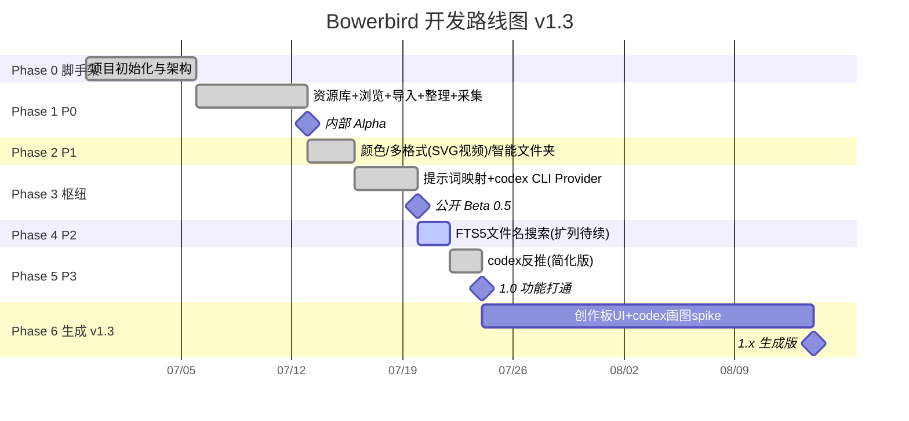

# Bowerbird — 开发计划（AI 编排版）

> **项目代号**：Bowerbird（园丁鸟）
> **定位**：为 AI 图像创作服务的「提示词 + 参考图」素材库与编排工作台。
> **形态**：Tauri 2 本地优先桌面应用 + 浏览器扩展。
> **文档版本**：v1.3 · 2026 年 7 月
>
> **v1.3 变更（2026-07-06，对齐实现现状）**：
> - **生成（⑥）纳入 v1**：覆盖 v1.2「暂不做生成」。生成走 **codex CLI 的 tool-use**（自行调用画图工具），不自建扩散模型；**关键假设待 spike**（codex 能否触发画图并取回产物）。
> - **Provider 收敛为唯一**：`CodexCliProvider`（`codex exec --image`，走 ChatGPT 订阅，绕过 API quota，真正看图）。v1.2 设想的「首期 ClaudeCode、扩展 CodexCLI/Mock」经实测落空 —— **ClaudeCode / Mock / DeepSeek / OpenAI HTTP 四条路径已全部移除**（详见 §5.5、PROJECT.md 踩坑「多模态看图四条路径实测」）。
> - **多模态看图 spike 出结论**：`claude -p` 把图传 CDN 但不传给模型（"unable to view"）；DeepSeek 不接受 `image_url`；OpenAI HTTP 受 `insufficient_quota`。唯一通的是 codex CLI。
> - **核心交互 UI 升级为「创作板」（拟文本编辑器）**：v1.2 的「选图组 prompt 面板（textarea）」升级为拟文本编辑器 —— 用户选缩略图 + 选维度下拉组成中文句子，每个控件背后映射真实 prompt 片段，底部「确认生成」拼完整 prompt + 参考图发 codex（见 §5.4）。
> - **实现偏离登记**：去重用 **自实现 64-bit dHash**（img_hash 与 image 0.25 冲突，非计划 pHash）；FTS5 当前**仅同步 `name`**（tags/prompt_body/annotation/ocr 待做）；Phase 5 拆解分析**简化为仅反推 caption**（OCR/版式/灵感卡不做）；删除 settings 模块 / `codex_health` / in-app apikey（唯一 provider 无需切换）；schema 增 `assets.store_path` 与 `task_queue` 表（§4.2）。
>
> **v1.2 变更（历史）**：
> - **AI 全部外包**给 headless codex（抽象 Provider 接口，首期接 Claude Code `claude -p`，可扩展 Codex CLI），**移除所有自建本地模型**（ONNX/CLIP/candle/mistralrs/tesseract/向量）。
> - **新增核心**：图片 ↔ 提示词映射；核心交互 = 「选图 = 自动组装一段提示词 + 参考图集」。
> - **性能降级**：不追求「万图秒开」，目标改为千图级流畅浏览；重心转向 AI 编排 UX。
> - **检索调整**：去掉 CLIP 语义搜索与 pHash 以图搜图，改用 **FTS5 搜提示词/标签/描述**（pHash 仅保留作采集去重）。
> - ~~**暂不做生成（⑥）**：v1 聚焦分析（⑤）。生成留待后续。~~ → **v1.3 已覆盖，见上。**
> - **优先级按评审结果重排**（见 §1.3 / §6）。

---

## 0. TL;DR（一页摘要）

| 项 | 决策 |
|---|---|
| **桌面框架** | Tauri 2.x（Rust 后端 + 系统 WebView） |
| **前端** | React 18 + TypeScript + Vite + Tailwind + Zustand |
| **数据库** | SQLite（`rusqlite`，bundled，含 FTS5） |
| **图像处理** | `image` + `fast_image_resize` + `psd`/`resvg`/`ffmpeg-next` |
| **颜色提取** | K-Means（LAB 空间） |
| **检索** | FTS5 全文（文件名 / 标签 / **提示词** / 描述 / OCR）+ 颜色筛选；**当前仅同步 `name`** |
| **去重** | **自实现 64-bit dHash**（仅采集去重；img_hash 与 image 0.25 冲突，弃用 pHash crate） |
| **AI（分析 + 生成）** | **唯一 `CodexCliProvider`**（`codex exec --image`，ChatGPT 订阅）；ClaudeCode/Mock/DeepSeek/OpenAI HTTP 已移除 |
| **采集通道** | 浏览器扩展（MV3）↔ 本地 WebSocket（`axum`） |
| **插件系统** | WASM 沙箱（`wasmtime`）—— 远期 |
| **核心数据** | 图片 ↔ 提示词映射；**创作板（拟文本编辑器）**选图选词 = 组 prompt + 参考图 |
| **生成** | codex CLI 的 tool-use 调用画图工具（v1.3 纳入，待 spike） |
| **总工期** | 原 3–4 个月（不含生成）；生成 spike 后再估 |

**一句话路线**：先跑通 `导入 → SQLite → 缩略图 → 瀑布流`（①②）+ 浏览器采集，再做颜色/多格式/智能文件夹（P1）；随后建立**提示词映射体系 + Codex Provider**（核心枢纽，已收敛为 codex CLI 单路线）；用 FTS5 搜提示词（P2）与 codex 拆解分析（P3，简化为反推）收尾，发布 1.0；**最后接入创作板 + codex 画图（⑥）冲刺生成**。

---

## 1. 项目目标与边界

### 1.1 目标
- **新定位**：不是"复现 Eagle"，而是**为 AI 图像创作服务的素材库与编排台**——帮用户把散落的灵感图片，组织成可复用的「提示词 + 参考图」资产，并一键交给 AI。
- **AI 全外包**：理解/分析/生成能力通过调用 **headless codex**（唯一 `CodexCliProvider`）实现，Bowerbird 只做三件事：① 构造 prompt + 参考图 → ② 调用 codex → ③ UI 呈现与入库。**不自建任何本地 AI 模型**（含扩散模型）。
- **核心交互**：**创作板（拟文本编辑器）**——用户选缩略图 + 选维度下拉，所见即一段中文句子；每个控件背后映射真实 prompt 片段，底部「确认生成」拼出完整 prompt + 参考图发 codex。用户全程不写一字提示词。
- **哲学**：素材与提示词 100% 本地（Local-First）；AI 推理与生成经用户自有的 codex CLI（ChatGPT 订阅，可能联网）。

### 1.2 六大工作流（调整后）

| # | 工作流 | 状态 | 说明 |
|---|---|---|---|
| ① | **收集** Collect | ✅ | 浏览器扩展、拖拽、剪贴板、文件夹监听 |
| ② | **浏览** Browse | ✅（降级） | 缩略图瀑布流、多格式预览；目标千图级流畅，不追求万图秒开 |
| ③ | **搜索** Search | ✅（调整） | FTS5 全文（主搜提示词）+ 颜色筛选；去 CLIP、去以图搜图 |
| ④ | **整理** Organize | ✅ | 文件夹、标签、智能文件夹、**提示词映射** |
| ⑤ | **拆解分析** Analyze | ✅ **全走 codex** | VLM 描述/关键词、OCR、版式/构图、灵感拆解卡、关联推荐 |
| ⑥ | **生成** Generate | ✅ **v1.3 纳入** | codex CLI 的 tool-use 调用画图工具；**待 spike 验证**取回产物（路径/格式/落库） |

### 1.3 范围分级（评审确认的优先级）

| 优先级 | 模块 | 现状 |
|---|---|---|
| **P0** — MVP 必备 | 本地资源库引擎、浏览器扩展采集、缩略图浏览（瀑布流）、文件导入（拖拽/剪贴板）、文件夹/标签管理 | ✅ |
| **P1** — 核心体验 | 颜色提取与筛选、多格式预览（PSD/SVG/视频）、智能文件夹 | 🟡 PSD 未做 |
| **P2** — 差异化 | FTS5 全文搜索（搜提示词）、自动标签（codex）、图像放大（可选） | 🟡 FTS5 仅同步 `name` |
| **P3** — 拆解分析（全走 codex） | VLM 描述/关键词、OCR、版式/构图、灵感拆解卡、关联推荐 | 🟡 简化为反推 caption |
| **核心枢纽** | **提示词映射体系 + Codex Provider 接入**（横跨 P1→P3） | ✅ 后端；🟡 创作板 UI 待建 |
| **P4** — 生成（v1.3 新增） | 创作板（拟文本编辑器）+ codex CLI 画图 tool-use | 🔴 待 spike |
| **远期** | WASM 插件、云同步、移动端只读 | — |

### 1.4 明确不做（v1）
- 不自建任何本地 AI 模型（ONNX/CLIP/**本地扩散**/VLM/OCR 全删；**生成亦不自建扩散模型**，由 codex tool-use 调外部画图）。
- 不做 CLIP 语义搜索 / pHash 以图搜图（dHash 仅作采集去重）。
- 不追求万图秒开（千图级流畅即可）。
- 不强制云端账号；不做内置像素级编辑器。
- 不自建 provider 切换 / in-app apikey 配置（v1.3 收敛为唯一 codex CLI，settings 模块已删）。

---

## 2. 技术栈选型

### 2.1 为什么是 Tauri 而非 Electron
（沿用）素材管理 + codex 子进程编排是**重文件 I/O + 频繁进程调用**场景，Rust 后端在缩略图生成、颜色提取、子进程管理上原生高效；Tauri 轻量，适合常驻。代价是 Rust 学习曲线与系统 WebView 一致性——可接受。

### 2.2 前端技术栈（决策点已定：推荐项）
**React 18 + TS + Vite + Tailwind + Zustand**。虚拟滚动 `@tanstack/react-virtual`；图标 Lucide。核心新增 UI：提示词编辑器、选图组 prompt 面板、codex 输出流式呈现。

### 2.3 Rust 后端 Crates 清单（v1.2 精简）

| 用途 | Crate | 说明 |
|---|---|---|
| 异步运行时 | `tokio` | 含 `tokio::process` 管理 codex 子进程 |
| SQLite / 迁移 | `rusqlite`（FTS5）/ `rusqlite_migration` | 元数据、提示词、索引 |
| 图像解码缩放 | `image` + `fast_image_resize` | 缩略图 |
| 多格式 | `psd` / `resvg` / `rawloader` / `ffmpeg-next` | PSD/SVG/RAW/视频预览 |
| 颜色提取 | 自实现 K-Means + `palette` | LAB 空间 |
| 去重哈希 | **自实现 64-bit dHash** | 仅采集去重（`img_hash` 与 `image 0.25` 冲突，弃用） |
| **codex 调用** | `tokio::process::Command` + `serde_json` | spawn `codex exec --image`，stdin 喂指令，解析 `\ncodex\n<answer>\ntokens used` |
| WebSocket / 监听 | `axum` / `notify` | 扩展采集 / 文件夹监听 |
| 基础设施 | `tracing` / `serde` / `thiserror`+`anyhow` | 日志/序列化/错误 |

> **移除**：`ort`、`candle`、`mistralrs`、`tesseract-rs`、`sqlite-vec`（无本地 AI、无向量）、**`img_hash`**（与 `image 0.25` 冲突）。

### 2.4 Codex Provider 抽象层（核心新增）

定义统一 trait，**当前唯一实现 `CodexCliProvider`**（实测后收敛，见 §5.5）：

```rust
#[async_trait]
trait CodexProvider: Send + Sync {
    fn name(&self) -> &'static str;                      // 落库 analyses.provider / prompts.source_model
    /// 单轮：给定 prompt + 参考图，返回结构化结果（批量分析用）
    async fn run(&self, req: CodexRequest) -> Result<CodexResult, AppError>;
    /// 流式：逐 token 推送（交互式拆解 / 实时呈现用），经 event `codex://chunk` 转 Delta/Done/Error
    async fn run_stream(&self, req: CodexRequest, tx: mpsc::Sender<Chunk>) -> Result<(), AppError>;
}

struct CodexRequest {
    instruction: String,           // 任务指令（如"请描述这张图片"）
    reference_images: Vec<PathBuf>,// 参考图本地路径（codex --image 多模态读取）
    context_prompts: Vec<String>,  // 关联的提示词片段
    output_schema: Option<Schema>, // 期望的结构化输出
}
```

| Provider | 实现 | 状态 |
|---|---|---|
| `CodexCliProvider` | `codex exec --skip-git-repo-check --image <path>`，stdin 喂指令，解析 `\ncodex\n<answer>\ntokens used` | ✅ **唯一实现**；走 ChatGPT 订阅（`chatgpt.com/backend-api/codex`，model `gpt-5.5`），绕过 OpenAI API quota，真正看图 |
| ~~`ClaudeCodeProvider`~~ | ~~`claude -p --output-format json`~~ | ❌ **已移除**：`@path`/Read 把图传 CDN 但不传给模型（"unable to view"） |
| ~~`MockProvider`~~ | 本地桩 | ❌ **已移除**：收敛后不再需要切换 |
| ~~DeepSeek / OpenAI HTTP~~ | HTTP API | ❌ **已移除**：DeepSeek 不接受 `image_url`；OpenAI 受 `insufficient_quota` |

> **v1.2 设想「首期 ClaudeCode、扩展 CodexCLI/Mock」已落空**，全链路只走 codex CLI，故**不再有 provider 切换 UI / in-app apikey / `codex_health` / settings 模块**（详见 PROJECT.md 踩坑）。

### 2.5 浏览器扩展（独立子项目）
Manifest V3 + TS + Vite + `@crxjs/vite-plugin`；content script 注入悬浮保存按钮 + DOM 扫描；background 维护与本地 Bowerbird 的 WebSocket。

---

## 3. 系统架构

### 3.1 整体架构图



> **关键变化**：AI 引擎从"本地理解/分析/生成三件套"变成"**Codex Provider + 提示词编排层**"（v1.3 生成回归，但仍外包给 codex）。Bowerbird 不持有任何模型权重，只负责构造请求、管理子进程、解析与呈现输出。

### 3.2 进程与线程模型



> **稳定性原则**：codex 调用走独立 Worker + **持久化任务队列**（SQLite）。单个 codex 子进程崩溃/超时可取消重试，不拖垮主进程与资源库。

---

## 4. 数据模型设计

### 4.1 资源库目录结构

```
my-library/
├── library.db                 # SQLite：元数据/标签/提示词/索引/分析/任务队列
├── .bowerbird/
│   └── thumbnails/            # JPEG 缩略图（按 hash 分桶）
├── images/                    # 原始素材（不修改）<yyyy>/<mm>/<ulid>.<ext>
├── generated/                 # codex 画图产物（v1.3 生成回归；落库策略待 spike）
└── exports/                   # .bowerpack 导出包
```

> 对比 v1.1：**移除 `models/`（无本地模型）**。v1.2 曾移除 `generated/`，**v1.3 因生成回归而恢复**；`config.json` 因 settings 模块删除而移除。

### 4.2 SQLite Schema（核心表）

> **v1.3 对齐实现**：以 `sql/0001_init.sql` 为准。`assets` 增 `store_path`；新增 `task_queue`；新增 `generations`（生成回归）。

```sql
-- 文件夹（含智能文件夹：smart_query 非空）
CREATE TABLE folders (
  id TEXT PRIMARY KEY, name TEXT NOT NULL, parent_id TEXT,
  kind TEXT DEFAULT 'folder', smart_query TEXT, sort TEXT, created_at INTEGER,
  FOREIGN KEY (parent_id) REFERENCES folders(id) ON DELETE CASCADE
);

-- 资产主表
CREATE TABLE assets (
  id          TEXT PRIMARY KEY,
  name        TEXT NOT NULL,
  ext         TEXT,
  origin_path TEXT,                   -- 原始素材路径（导入前）
  store_path  TEXT,                   -- 🆕 库内存储路径（导入后；详情页大图走它）
  thumb_path  TEXT,
  size INTEGER, width INTEGER, height INTEGER, duration REAL,
  phash       TEXT,                   -- 实为 dHash；仅用于采集去重
  colors      TEXT,                   -- JSON 主色
  rating      INTEGER DEFAULT 0,
  source      TEXT DEFAULT 'imported', -- imported | extension | clipboard
  source_url  TEXT, folder_id TEXT,
  created_at INTEGER, file_mtime INTEGER,
  FOREIGN KEY (folder_id) REFERENCES folders(id) ON DELETE SET NULL
);
CREATE INDEX idx_assets_folder  ON assets(folder_id);
CREATE INDEX idx_assets_created ON assets(created_at DESC);
CREATE INDEX idx_assets_phash   ON assets(phash);
CREATE INDEX idx_assets_source  ON assets(source);

CREATE TABLE tags (id TEXT PK, name UNIQUE, color);
CREATE TABLE asset_tags (asset_id, tag_id, PK(asset_id,tag_id), FK...);

-- ============ 提示词体系（核心枢纽，§5.4）============
CREATE TABLE prompts (
  id        TEXT PRIMARY KEY,
  title     TEXT,
  body      TEXT NOT NULL,        -- FTS5 索引主体
  kind      TEXT DEFAULT 'manual',-- manual | generated(codex) | template（创作板维度选项用 template）
  source_model TEXT,              -- 生成它的 codex provider
  created_at INTEGER, updated_at INTEGER
);
-- 图片 ↔ 提示词 多对多
CREATE TABLE asset_prompts (
  asset_id  TEXT NOT NULL,
  prompt_id TEXT NOT NULL,
  role      TEXT DEFAULT 'ref',   -- main(主提示词) | ref(参考) | desc(描述)
  PRIMARY KEY (asset_id, prompt_id),
  FOREIGN KEY (asset_id) REFERENCES assets(id) ON DELETE CASCADE,
  FOREIGN KEY (prompt_id) REFERENCES prompts(id) ON DELETE CASCADE
);

-- 全文检索（文件名 + 标签 + 提示词正文 + 描述 + OCR）
-- ⚠️ v1.3 现状：触发器（0002_fts.sql）仅同步 name；tags/prompt_body/annotation/ocr 待做
CREATE VIRTUAL TABLE library_fts USING fts5(
  asset_id UNINDEXED, name, tags, prompt_body, annotation, ocr,
  tokenize='trigram'
);

-- ============ ⑤ 拆解分析结果（全由 codex 产出）============
-- v1.3 现状：仅 kind=caption（反推）在用；keywords/ocr/layout/inspiration_card 未做
CREATE TABLE analyses (
  id TEXT PRIMARY KEY, asset_id TEXT NOT NULL,
  kind TEXT NOT NULL,             -- caption | keywords | ocr | layout | inspiration_card
  payload TEXT NOT NULL,          -- JSON：codex 输出（caption 形如 {"text":"..."}）
  provider TEXT,                  -- codex-cli
  created_at INTEGER,
  FOREIGN KEY (asset_id) REFERENCES assets(id) ON DELETE CASCADE
);
CREATE INDEX idx_analyses_asset ON analyses(asset_id, kind);

-- ============ 任务队列（codex 调用持久化，§3.2 稳定性原则）============
CREATE TABLE task_queue (
  id TEXT PRIMARY KEY, kind TEXT NOT NULL,
  payload TEXT NOT NULL,                -- JSON 输入
  status TEXT NOT NULL DEFAULT 'queued', -- queued | running | done | failed | cancelled
  attempts INTEGER NOT NULL DEFAULT 0,
  max_attempts INTEGER NOT NULL DEFAULT 3,
  error TEXT, created_at INTEGER NOT NULL,
  started_at INTEGER, finished_at INTEGER, provider TEXT
);
CREATE INDEX idx_tasks_status ON task_queue(status, created_at);

-- ============ ⑥ 生成产物（v1.3 回归，字段待 spike）============
CREATE TABLE generations (
  id TEXT PRIMARY KEY,
  source_asset_id TEXT,            -- 触发创作的参考资产（可空）
  pack_json TEXT,                  -- 创作板组装出的 CreationPack 快照
  prompt TEXT NOT NULL,            -- 发给 codex 的最终 prompt
  result_path TEXT,                -- codex 画图产物落库路径
  provider TEXT, status TEXT, created_at INTEGER
  -- 字段细节待 spike：codex 画图能否取回、格式、落 images/generated/ 还是 BLOB
);
```

> 对比 v1.1：**新增 `prompts` / `asset_prompts`**；**移除 `asset_vec`（无向量）**；FTS5 表纳入 `prompt_body`。对比 v1.2：**`assets.store_path` 显式化**、**新增 `task_queue` 表**（v1.2 仅在 §3.2 提概念未给 schema）、**新增 `generations` 表**（v1.3 生成回归，v1.2 曾移除）。

---

## 5. 功能模块实现方案

### 5.1 ①②④ — 收集 / 浏览 / 整理（P0，性能降级）
- 导入流水线：探测 → 缩略图（fast_image_resize）→ dHash（去重用）→ 提色 → 入库。
- 瀑布流：`@tanstack/react-virtual` 虚拟滚动（保留，但只优化到千图级）。
- 整理：文件夹树 + 标签 + 智能文件夹。

### 5.2 ① — 浏览器扩展采集（P0）
扩展抓 URL → WS → 桌面下载器（UA/Cookie 伪装、防盗链、断点续传、**dHash 去重**）→ 入库。

### 5.3 ③ — 检索（P2，精简）
- **FTS5 全文**：搜文件名 / 标签 / **提示词正文** / 描述 / OCR（中文 `trigram` 起步，可切 `jieba-rs`）。
  - **v1.3 现状**：触发器（`0002_fts.sql`）目前**仅同步 `name`**，搜文件名开箱可用；`tags/prompt_body/annotation/ocr` 的同步待做（P4 剩余）。
- **颜色筛选**：K-Means 主色 + LAB ΔE 距离。
- ~~CLIP 语义搜索~~（删除）、~~pHash 以图搜图~~（删除，dHash 仅去重）。

### 5.4 提示词映射体系 + 创作板（核心枢纽 · v1.3 UI 升级）
连接「素材管理」与「AI 编排」的枢纽。后端 `assemble_pack` 已实现；**前端 UI 在 v1.3 从「textarea 创作包」升级为「创作板（拟文本编辑器）」**。

- **图片 ↔ 提示词映射**：每张图可关联多段提示词（`role`: main / ref / desc），提示词可手动写或由 codex 反推生成。
- **创作板（拟文本编辑器）**：右侧面板呈现一段中文句子，用户**选缩略图 + 选维度下拉**填空，全程不写提示词。例：
  ```
  我想要一张 | 调性 ▾ | 像 [缩略图] 的，｛人物动作｝，｛构图｝，｛色调｝，｛光影｝… 的图片
  ```
  - `| 调性 ▾ |` = **维度下拉**（已选）；`｛人物动作｝…` = **虚线占位项**（待选提示），点击即升级为 `| 人物动作 ▾ | 像 [缩略图] |` 完整子句；`[缩略图]` = 瀑布流选中的图。
  - **所见是文字，所填是提示词**：每个控件背后映射真实 prompt 片段 ——
    ① **维度聚合**：「调性」= 光影 / 色调 / 光比 / 空间感 等子维度打包成一个下拉；
    ② **缩略图** → 该图 codex 反推出的提示词（复用 `analyses(kind=caption)`）；
    ③ **维度下拉选项** → 预置 prompt 片段（存为 `prompts(kind=template)`）。
- **确认生成**：底部按钮 = `assemble_pack` 拼完整 prompt + 参考图集 → 发 codex CLI（优化 / 扩写 / **生成**）。
- **沿用 assemble_pack**：

```rust
// 选图组 prompt 的核心组装（创作板「确认生成」时调用）
fn assemble_pack(selected: &[AssetId]) -> CreationPack {
    let prompts = db.prompt_bodies_for(selected, role=Main);          // 聚合主提示词
    let refs    = selected.iter().map(|id| asset_path(id)).collect(); // 参考图路径
    CreationPack { prompt: merge(prompts), references: refs, .. }
}
```

> 设计稿见 [桌面端UI设计.html](桌面端UI设计.html)。`assemble_pack` 已就绪；前端编辑器控件（chips / 虚线占位 / 维度→prompt 映射表）待新建，现 `PackPanel.tsx` 写好但未挂载。

### 5.5 Codex Provider 集成（核心枢纽）
- 统一 `CodexProvider` trait（见 §2.4）；**唯一实现 `CodexCliProvider`**（`codex exec --image`）。
- **多模态看图（已 spike 出结论）**：拆解分析依赖 codex 能"看图"。v1.2 假设"claude -p 原生看图"实测落空；**四路径实测后 codex CLI 胜出**（走 ChatGPT 订阅绕过 quota）——`claude -p` 传 CDN 不传模型；DeepSeek 不接受 `image_url`；OpenAI HTTP `insufficient_quota`。调用以**本地图片路径**经 `--image` 传入。
- 任务进持久化队列（`task_queue` 表），支持取消 / 重试 / 并发上限；输出流式推前端（event `codex://chunk`）。
- **离线降级**：未配置 / 未登录 codex（`codex login`）时，分析类与生成功能置灰并提示，而非崩溃（不再有 Mock 桩）。

### 5.6 ⑤ — 拆解分析（P3，全走 codex）
每项 = 一个 codex 提示词模板 + 结果入库 + UI 呈现。
> **v1.3 现状**：用户简化为**仅做反推 caption**（固定指令"请描述这张图片"→ `analyses(kind=caption)`，详情页「反推」按钮）；下表 OCR / 版式 / 灵感卡 / 关联推荐留待需要时再做。

| 分析项 | codex 指令（示意） | 产出 → 落库 |
|---|---|---|
| VLM 描述/关键词 | "描述这张图，给出风格/主题关键词" | `analyses(kind=caption/keywords)` + 反哺标签 |
| OCR | "提取图中所有文字" | `analyses(kind=ocr)` + 入 FTS5 |
| 版式/构图 | "分析构图、栅格、视觉重心" | `analyses(kind=layout)` |
| 灵感拆解卡 | "聚合为：配色+构图+风格+关键词卡片" | `analyses(kind=inspiration_card)` |
| 关联推荐 | "给定一组图的关键词，找出可归类的系列" | 基于 FTS5 关键词匹配 + codex 聚类 |

### 5.7 图像放大（P2 可选）
> **张力说明**：超分（Real-ESRGAN）属"图像处理工具"而非"AI 智能分析"，与"AI 不自建"原则处于灰色地带。v1 标注为**可选**，实现方式待定（本地 ort / 外部工具 / WASM 插件），不进入核心路径。

### 5.8 插件系统（远期）
WASM 沙箱（`wasmtime`）+ 受限 Host Function。v1 不做。

### 5.9 ⑥ — 生成（v1.3 新增，待 spike）
覆盖 v1.2「不做生成」。生成走 **codex CLI 的 tool-use**：把创作板组装的完整 prompt + 参考图发给 `codex exec`，由 codex 自行决定调用其内置画图工具产出图像，Bowerbird **不自建扩散模型**。
- **关键假设（未实测前视为未通）**：codex CLI（gpt-5.5 / ChatGPT 订阅）能否在 `codex exec` 流程里触发图像生成、并以可取回的形式（路径 / base64 / 落盘）返回产物。
- **落库**：产物入 `generations` 表 + `images/generated/`（字段与路径策略待 spike 定）。
- **入口**：创作板底部「确认生成」按钮（§5.4）。
- **降级**：spike 不通则该按钮置灰，生成推迟到找到可行 provider。

---

## 6. Roadmap（开发阶段与里程碑）

> **v1.3 状态（2026-07-06）**：Phase 0–5（简化版）**已完成**；Phase 6 生成待 spike。原估工期 3–4 个月（2–3 人，不含生成）；实际 Phase 0–5 突击完成。生成工期待 spike 后再估。



> 注：gantt 日期为示意（实际突击节奏快于原排期）；`done`/`active` 标 v1.3 实际完成度。

### Phase 0 — 脚手架 ✅
`create-tauri-app`（React+TS）；`rusqlite`+迁移（`0001_init` 含全表）；任务队列骨架（`task_queue` 表）；`CodexProvider` trait。**验收**：dev 启动，invoke 回显。✅ 已完成。

### Phase 1 — P0 MVP ✅
本地资源库；缩略图瀑布流（`aspect-ratio` 占位修复抖动）；文件导入（拖拽/剪贴板）；文件夹/标签；**浏览器扩展采集**（含 dHash 去重，WS `127.0.0.1:39871`）。
**交付**：内部 Alpha。**验收**：千图级浏览流畅。✅ 已完成。

### Phase 2 — P1 核心体验 🟡
K-Means 提色（LAB）+ 主色条/颜色筛选；多格式预览（**SVG/视频已做，PSD 未做**）；智能文件夹（`source:`/`ext:`）。✅ 大部分；🟡 PSD 待补。

### Phase 3 — 提示词映射 + Codex Provider ✅（provider 收敛）
`prompts`/`asset_prompts` 数据层；提示词编辑器（main/ref/desc）；**`assemble_pack` 创作包组装**；**唯一 `CodexCliProvider`**（`codex exec --image`，ChatGPT 订阅）接入 + 流式（`codex://chunk`）；创作包导出。
**交付**：公开 Beta 0.5。**验收**：选若干图 → 一键得到 prompt+参考图包。✅ 已完成（v1.2 的 ClaudeCode 设想被 codex CLI 替代）。

### Phase 4 — P2 检索与标签 🟡
FTS5 全文（**当前仅同步 `name`**，`tags/prompt_body/annotation/ocr` 待做）；codex 自动打标（批量，未做）；可选图像放大（待定）。🟡 部分完成。

### Phase 5 — P3 拆解分析 ✅（用户简化为反推）
`analyses` CRUD + **反推 caption**（固定指令"请描述这张图片"，详情页「反推」按钮，codex CLI 看图）。
**交付**：1.0 功能路径打通。**按用户简化**：OCR/版式/灵感卡/关键词模板集不做。✅ 简化版完成。

### Phase 6 — 生成（v1.3 新增）🔑 待 spike
**创作板（拟文本编辑器）UI**（§5.4）+ **codex CLI 画图 tool-use spike** + `generations` 落库。
**交付**：1.x 生成版。**验收**：创作板选图选词 → 确认生成 → codex 产出图像并落库；spike 不通则降级置灰。

> 远期（1.x+）：WASM 插件、云同步、移动端、生成高级形态（多方案 / 对接外部画图）。

---

## 7. 项目代码结构

```
bowerbird/
├── apps/
│   ├── desktop/src-tauri/src/
│   │   ├── commands/          # #[tauri::command]：library / prompt / codex
│   │   ├── core/              # ingest / library / indexer / paths
│   │   ├── media/             # thumb / color / dhash(去重) / probe
│   │   ├── prompt/            # 提示词编排：assemble_pack / templates
│   │   ├── codex/             # CodexProvider trait + codex_cli + types（v1.3 收敛，仅此一个 provider）
│   │   ├── collect/           # WS Server / 文件监听
│   │   ├── db/                # rusqlite + 迁移（0001_init / 0002_fts）
│   │   └── error.rs
│   ├── desktop/src/           # React 前端
│   │   └── components/        # MasonryGrid / Sidebar / Toolbar / AssetDetail / PromptEditor / PackPanel（→ 待重做为创作板）
│   └── extension/             # 浏览器扩展（MV3）
├── packages/shared/           # ts-rs 共享类型
└── docs/
```

> 对比 v1.1：**删除 `ai/`（本地模型层）**；新增 `prompt/`、`codex/`。对比 v1.2：**`codex/` 从「claude_code + codex_cli + mock」收敛为「codex_cli + types」**；删除 `core/settings.rs`；`analysis/` 简化为 `commands/codex.rs` 里的反推命令（未独立模块）；`media/phash.rs` 实为 dHash。

---

## 8. 关键技术难点与应对

| 难点 | 风险 | 应对 |
|---|---|---|
| ~~codex 多模态看图机制~~ ✅ 已解决 | VLM/OCR/版式依赖 codex 读图 | 实测四路径：`claude -p` / DeepSeek / OpenAI HTTP 均不通；**codex CLI（`--image`，ChatGPT 订阅）胜出** |
| **codex 画图能力** 🆕 v1.3 | 生成依赖 codex 能调画图工具 | 待 spike：`codex exec` 能否触发图像生成并取回产物；不通则降级置灰 |
| **codex 子进程管理** 🆕 | 崩溃/超时/僵尸进程 | 独立 Worker + 持久化队列；超时取消 + 重试；并发上限 |
| **流式输出解析** 🆕 | JSON/流格式差异 | Provider 各自适配；前端 event 实时呈现 |
| **codex 依赖外部账号/网络** 🆕 | 与 Local-First 张力 | 明确：素材本地，AI 调用需用户自有 codex（可能联网）；未配置时功能置灰 + Mock 开发 |
| **prompt 工程质量** 🆕 | 分析质量取决于模板 | 沉淀可复用模板集；支持用户自定义；结果可编辑修正 |
| **调用成本/速率** 🆕 | 批量分析耗费 token | 批量队列 + 限流；用户可配置并发与预算提示 |
| 系统 WebView 差异 | 中 | 限定基线 + CI 截图回归 |
| 多格式解码复杂度 | 中 | 先高频格式，按需迭代 |
| 采集稳定性（防盗链） | 中 | 下载器伪装 UA/Referer/Cookie |

---

## 9. 质量与工程实践
- **分支**：main ← develop ← feat/*；每 Phase 一个 tag。
- **测试**：Rust 单元（提色 / dHash 去重 / 提示词 `assemble_pack` 组装 / codex 输出解析）+ `assert_cmd` 集成；前端 Vitest + Playwright E2E；**codex 唯一 provider 走可选集成测试**（需本地 `codex login`，CI 跳过），单元层只测纯函数（不 spawn 子进程）。
- **性能门禁**：CI 跑"千图导入+浏览"基准（不再压 10w）。
- **可观测**：`tracing` 日志；codex 调用记录（provider/耗时/token 估算）；任务队列监控。

---

## 10. 风险登记册

| 风险 | 概率 | 影响 | 缓解 |
|---|---|---|---|
| ~~codex 看图能力不足/传参受阻~~ ✅ 已缓解 | — | — | codex CLI 胜出（见 §8） |
| codex 画图能力不足 🆕 v1.3 | 中 | 高 | 待 spike；不通则生成降级置灰，1.0 不受影响 |
| codex 账号/网络依赖 🆕 | 高 | 中 | 明确边界；Mock 开发；离线时功能置灰而非崩溃 |
| prompt 模板质量不稳 🆕 | 中 | 中 | 模板集迭代 + 用户自定义 + 结果可编辑 |
| 多格式解码超预期 | 中 | 中 | 先高频格式 |
| 采集稳定性 | 中 | 中 | 下载器伪装 + 去重 |
| Eagle 闭源，实现靠推断 | 低 | 低 | 复现公开形态与通用模式，非逆向 |

---

## 11. 参考与依据
前序《Eagle 类创意收集工具实现方式调查报告》；Tauri 2 文档与 `rusqlite` / `axum` / `image` 生态；OpenAI Codex CLI（`codex exec --image`）官方文档。
> **免责**：本计划为原创设计；codex 集成依 Codex CLI 官方能力，多模态看图已实测（§5.5），**画图 tool-use 能力待 spike**（§5.9）。

---

## 12. 下一步行动
1. ~~评审 v1.2 / spike `claude -p` 看图~~ ✅ 已完成（结论：codex CLI 胜出，四路径实测见 §5.5）。
2. **v1.3 待办（按优先级）**：
   - **spike codex 画图**（生成能否取回产物）—— Phase 6 前置，决定生成是否可做。
   - **创作板（拟文本编辑器）UI**：挂载 `PackPanel` 并重做为 chips / 虚线占位 / 维度→prompt 映射；`assemble_pack` 已就绪。
   - **FTS5 扩列**：同步 `tags/prompt_body/annotation/ocr`（P4 剩余）。
   - **底部状态条**：导入 / codex 队列 / 扩展连接 全局可见。
   - 详情页翻页 / 评分 / 加入创作板；PSD 预览。
3. 文档：开发计划与 PROJECT.md 已对齐 v1.3（2026-07-06）。