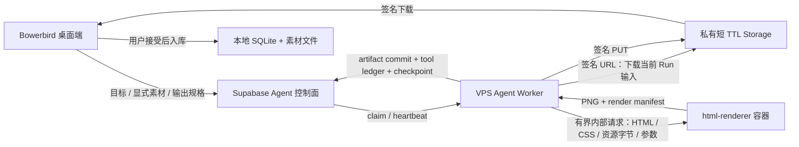

# Bowerbird 受限 HTML 离线排版与截图开发计划

> 版本：v1.2  
> 日期：2026-08-27  
> 状态：决策已冻结；**H0-T1（代码侧）+ H1 已完成并本地测试通过（apps/html-renderer）**；**H2 已完成（本地代码 + 测试；migration `0044` 与 agent-worker Edge 改动已写、待部署远端）**；H0-T2~T5 容器实机验证待 VPS；H3–H6 未开始  
> 适用范围：Bowerbird VPS Worker、Bowerbird Agent Kernel、官方内置 Skill、桌面 Agent 会话  
> 依赖文档：[`PROJECT.md`](../PROJECT.md)、[`AGENT-RUNTIME-PLAN.md`](AGENT-RUNTIME-PLAN.md)

---

## 0. 一页结论

Bowerbird 将新增一套**受限 HTML 离线排版与截图能力**：模型或官方 Skill 可以生成 HTML/CSS 排版文档，由 VPS 上固定版本的 Chromium 在断网、禁用脚本、资源受控的环境中渲染，并输出整页截图或由同一次渲染结果确定性裁出的纵向切片。

该能力的本质是一个**封闭、确定性的渲染工具**，不是浏览器 Agent：

- Chromium 只作为 HTML/CSS 排版引擎，不向模型暴露页面导航、点击、输入、登录、下载或 DevTools。
- 不访问任何网页，不接受任意 URL，不加载公网资源，也没有未来扩展为自由浏览器 Agent 的计划。
- HTML、CSS、图片等输入只能来自当前 Run 明确登记的 artifact；模型不能读取路径、网络、其他 Run 或宿主机文件。
- 支持整页 PNG、视口 PNG，以及基于同一整页像素结果的纵向切片 PNG；切片不通过滚动后重复截图实现。
- 截图完成后不调用 Vision、不自动评分、不自动修订、不自行重渲染；结果是否合意完全由用户判断。
- 能力以 Kernel 白名单工具接入官方内置 Skill；仍不开放用户上传 Skill、任意脚本、shell、MCP 或插件。

推荐部署为同一 VPS 上的独立 `html-renderer` 容器：无公网端口、无外网出口、无 Supabase/模型密钥，只接受 Agent Worker 经 Docker 内部网络发来的有界请求。Agent Worker 继续负责鉴权后的输入下载、tool ledger、artifact 上传、checkpoint 和结算。

---

## 1. 决策与边界

### 1.1 已冻结决策

1. 先实现受限 HTML 离线截图工具，再把它接入独立 HTML 排版能力和官方 Skill。
2. HTML 排版支持整图截图与纵向切片截图。
3. 截图工具必须能进入 Agent Kernel 的全局工具白名单，并由 Skill 的 phase allowlist 进一步收紧。
4. 截图完成即交给用户判断，不运行任何 Vision 检查、视觉评分、自动纠错或自动修订。
5. 不访问网页，不建设自由浏览器 Agent，也不为后续网页导航预留用户可见入口。

### 1.2 目标

- 在 VPS 上稳定、可恢复地把受限 HTML/CSS 渲染为 PNG。
- 同一文档可以输出单张整页截图、单张视口截图或一组无错位的纵向切片。
- 渲染器不依赖模型供应商，可被 Agent Kernel 和不同官方 Skill 复用。
- 新能力复用现有 `call_id + args_hash`、tool ledger、Run workspace、artifact、checkpoint、事件和 TTL 体系。
- 固定 Chromium、字体包和渲染参数，使同一 renderer fingerprint 下的输出可复现、可审计。
- 以第二个真实官方 Skill 验证最小多 Skill 注册机制，但不引入通用 workflow DSL 或 Skill 市场。

### 1.3 明确不做

- 不打开 `http://`、`https://`、`file://` 或用户提供的 URL。
- 不提供 `goto`、搜索、点击、输入、滚动探索、登录、Cookie、下载、上传表单、标签页或会话保持。
- 不读取桌面浏览器登录态，不共享用户浏览器 Profile，不保存 Cookie。
- 不允许 HTML 内执行 JavaScript、WebAssembly、Service Worker、WebSocket、WebRTC 或网络请求。
- 不提供任意 shell、命令字符串、包管理器或用户脚本执行。
- 不允许用户上传、安装、修改或热加载 Skill。
- 不在截图后调用 `understand_image`、其他 Vision provider 或模型自评。
- 不自动根据截图修订 HTML，不建立“生成—看图—修订”的自治循环。
- 不在首版建设独立 HTML 编辑器、网页发布、网页托管、PDF 或视频导出。
- 不保证不同 Chromium/字体版本之间 PNG 字节完全一致；可复现边界限定在相同 renderer fingerprint。

### 1.4 完成定义

以下条件全部满足才算首版完成：

- 合成 HTML fixture 能在 VPS 渲染为尺寸、MIME、SHA-256 均可验证的 PNG。
- 整页截图与切片来自同一次稳定渲染；默认无重叠切片可以按顺序逐像素拼回整页图。
- HTML 中的公网地址、私网地址、重定向、脚本、iframe 和未知资源全部无法产生网络访问或代码执行。
- renderer 容器不持有 Supabase、方舟、DeepSeek、Worker Token 或用户凭据，且没有宿主机端口映射。
- Kernel 只在 Skill 当前 phase 明确允许时执行 `render_html`；非法动作、跨 Run artifact 和参数越界均 fail closed。
- Worker/renderer 任一方重启后，同一 `call_id + args_hash` 不产生重复 artifact 或重复计费。
- 官方 HTML 排版 Skill 可以完成“接收目标与显式素材 → 生成受限 HTML/CSS → 渲染整图/切片 → 桌面展示 → 用户接受或放弃”。
- 从 HTML 形成截图到 Run 结束，Vision 调用数恒为 0，自动修订次数恒为 0。
- 真实 VPS E2E 使用仓库合成素材完成；不使用私人图片或真实网页。

---

## 2. 用户路径与产品语义

### 2.1 首版用户路径

```text
用户输入排版目标 + 显式选择素材 + 选择输出规格
  → 官方 HTML 排版 Skill 形成 HTML/CSS
  → Kernel 校验文档、资源引用和截图参数
  → render_html 执行一次离线渲染
  → 产出整页图 / 视口图 / 纵向切片 + render manifest
  → 桌面会话展示全部用户可见产物
  → 用户自行查看
      → 接受：下载、校验并按同一会话组图入库
      → 放弃：结束 Run，不触发 Vision 或自动修订
```

首版不提供截图后的 Agent 反馈回合。用户若想调整内容或版式，应修改原始目标后发起一次新的 Run；新 Run 有新的输入、hash、调用和结果，不伪装为旧截图的自动修订。

### 2.2 输出模式

`capture.mode` 首版支持三种闭集值：

| 模式 | 输出 | 语义 |
|---|---|---|
| `viewport` | 1 张视口图 | 只截固定视口可见区域，不滚动 |
| `full_page` | 1 张整页图 | 截取文档完整内容高度 |
| `full_page_and_slices` | 1 张整页图 + N 张切片 | 先得到唯一整页像素结果，再按确定性边界裁切 |

首版不提供“只切片但不保留整页渲染依据”的内部执行路径。产品可只向用户展示切片，但 `render_manifest` 必须记录整页尺寸和每个裁切区域。

### 2.3 切片语义

- 首版只支持**从上到下的纵向切片**，不支持横向网格切片或模型自行找内容边界。
- 切片依据 CSS 像素参数换算到设备像素；换算规则、取整规则和最后一片不足高度的行为必须固定。
- 默认 `overlapCssPx = 0`；可配置重叠时，每片的实际 `clip` 必须写入 manifest。
- 切片必须从同一张整页像素图裁出，禁止逐片滚动页面再截图，避免 fixed/sticky 元素重复、懒加载变化和动画错位。
- 页面超过整页像素上限时首版直接返回稳定错误 `render_document_too_large`，不降级为滚动拼接。
- 每片按稳定顺序编号 `slice-0001`、`slice-0002`……；对象 key 不包含用户标题或 HTML 内容。

### 2.4 用户验收语义

- Kernel 和 Skill 只承诺“按冻结输入与参数完成渲染”，不承诺自动判断审美质量。
- 桌面必须展示 renderer fingerprint、输出尺寸、切片数量和失败原因，但不展示浏览器内部日志或 HTML 中的敏感正文。
- 用户动作只有“接受/入库”和“放弃”；不显示“AI 已检查”“质量通过”或类似暗示。
- 接受后，整页图与切片使用同一 `generation_session_id=conversation_id` 组图入库，并以 artifact role 区分主截图与切片。

---

## 3. 总体架构



### 3.1 组件职责

| 组件 | 职责 | 明确不负责 |
|---|---|---|
| 桌面端 | 收集目标与显式素材、选择截图规格、展示整图/切片、用户接受或放弃、下载校验与入库 | 执行 Chromium、自动看图、替用户判断质量 |
| Agent 控制面 | 所有权、FeaturePolicy、Run 状态、签名 URL、artifact/usage/TTL | 运行浏览器、保存长期 HTML 内容 |
| Agent Worker | Skill/Kernel、参数校验、稳定 call id、下载输入、调用 renderer、上传产物、事件/checkpoint | 把浏览器能力直接暴露给模型 |
| `html-renderer` | 在离线沙箱中解析受限 HTML/CSS、加载白名单资源、稳定截图和裁切 | 鉴权、数据库、Supabase、模型调用、网页访问、Skill 逻辑 |
| 官方 HTML Skill | 根据用户目标生成符合契约的 HTML/CSS 和一次渲染动作 | Vision 检查、自动修订、动态增加工具、自由浏览 |

### 3.2 为什么使用独立 renderer 容器

- Chromium 是原生多进程高风险解析器，不应与持有 Worker Token 的 Agent Worker 共享同一进程边界。
- 浏览器内存、PIDs、`/dev/shm` 与字体依赖可单独限制，不挤占当前生成/理解/Agent/视觉设定四循环的 Worker 配额。
- renderer 不需要任何业务 secret；即使 HTML/CSS 触发浏览器漏洞，能接触的也只有单次请求提供的短期字节。
- 后续更新 Chromium 安全版本时可以独立构建、测试和回滚，不改变 Kernel 业务镜像。

两个容器只连接到 Docker `internal: true` 网络；renderer 不映射宿主机端口。Agent Worker 通过固定内部地址调用，模型无法控制 host、path、method 或 headers。

### 3.3 Renderer 运行模型

- 单个 renderer 服务进程管理固定并发槽；首台 2C4G VPS 默认并发 1。
- 每次调用新建独立 BrowserContext、临时目录和页面，完成后立即关闭并删除。
- Chromium 以非 root 用户运行；优先保留 Chromium sandbox，不以 `--no-sandbox` 作为默认捷径。
- 根文件系统只读；仅 `/tmp` 和单次渲染目录使用有容量上限的 tmpfs。
- renderer 无业务 secret、无 Docker socket、无宿主机目录挂载、无公网 DNS/出口。
- 容器设置 CPU、内存、PIDs、文件描述符、执行时间和输出总字节上限；超过即稳定失败，不拖垮主 Worker。

---

## 4. 输入、输出与工具契约

### 4.1 HTML 文档契约

首版文档由以下受限输入组成：

- 一份 UTF-8 HTML 文本。
- 可内联的 CSS；允许 `<style>` 和 `style` 属性。
- 当前 Run artifact manifest 中明确登记的图片资源。
- 固定的内置字体族；首版不接受任意字体文件。
- 固定 viewport、device scale factor、背景和 capture 参数。

HTML 不接受本地路径、文件名或 URL。素材在文档中使用不可猜测语义的占位引用，例如 `asset:reference-1`；Agent Worker 在调用 renderer 前根据当前 Run manifest 编译成一次性资源表。renderer 对任何不在资源表中的请求直接 abort。

### 4.2 `render_html` v1 输入

```ts
type RenderHtmlInputV1 = {
  schemaVersion: 1;
  htmlArtifactId: string;
  resourceArtifactIds: string[];
  viewport: {
    widthCssPx: number;
    heightCssPx: number;
    deviceScaleFactor: 1 | 2;
  };
  capture: {
    mode: "viewport" | "full_page" | "full_page_and_slices";
    sliceHeightCssPx?: number;
    overlapCssPx?: number;
  };
  background: "opaque" | "transparent";
};
```

约束：

- `runId`、路径、URL、header、Cookie、浏览器参数和命令行不得出现在模型可提交的 schema 中。
- `resourceArtifactIds` 必须全部属于当前 Run，且 MIME/大小/SHA-256 已由 Worker 验证。
- 所有整数使用服务端闭集范围；未知字段 `additionalProperties: false`。
- 具体数值上限在 H0 spike 后冻结。初始目标：HTML ≤ 2 MiB、资源总量 ≤ 20 MiB、设备像素总量 ≤ 64 MP、切片 ≤ 32、单次渲染 ≤ 30 秒。
- 透明背景只对 PNG 生效；首版输出格式固定 PNG，不接受任意编码器参数。

### 4.3 `render_html` v1 输出

```ts
type RenderHtmlResultV1 = {
  schemaVersion: 1;
  rendererFingerprint: string;
  sourceHtmlSha256: string;
  argsHash: string;
  document: {
    widthCssPx: number;
    heightCssPx: number;
    widthDevicePx: number;
    heightDevicePx: number;
  };
  outputs: Array<{
    artifactId: string;
    role: "viewport_screenshot" | "full_page_screenshot" | "slice_screenshot";
    index?: number;
    clipDevicePx: { x: number; y: number; width: number; height: number };
    mime: "image/png";
    bytes: number;
    sha256: string;
  }>;
};
```

`rendererFingerprint` 至少绑定：renderer 代码版本、Chromium 版本、Playwright 版本、Linux 基础镜像、字体包 hash、默认样式版本和截图编码参数。它是历史可追溯信息，不用来放松输入校验。

### 4.4 Artifact 角色

新 Skill 使用以下角色：

- `html_document`：模型生成并经 Kernel 校验的 HTML/CSS，私有短 TTL。
- `render_manifest`：结构化渲染参数、fingerprint、尺寸、clip 与输出 hash。
- `viewport_screenshot`：视口截图。
- `full_page_screenshot`：整页截图。
- `slice_screenshot`：按 index 排序的纵向切片。

数据库若以自由文本存 role，则只扩展 Edge/Worker/Desktop 的闭集校验；若存在数据库 enum/check constraint，必须以 migration 显式扩展。不得为了该能力另建长期云端图库。

---

## 5. 离线渲染与安全策略

### 5.1 双层离线保证

离线不能只靠 prompt 或请求拦截，必须同时具备：

1. **容器层**：renderer 容器没有公网出口，只连接 Docker 内部网络。
2. **浏览器层**：Playwright 拦截全部请求，只 fulfill 当前调用资源表中的虚拟 origin；其余请求全部 abort。

renderer 不接触签名 URL。Agent Worker 先下载并验证当前 Run 资源，再通过有界内部请求传入字节；renderer 返回 PNG 和 manifest 后，由 Worker 上传私有 Storage。

### 5.2 HTML/CSS 限制

提交 renderer 前由确定性 sanitizer/validator 拒绝：

- `<script>`、事件处理属性、`javascript:`、`data:text/html`。
- `<iframe>`、`frame`、`object`、`embed`、`portal`、`applet`。
- `<base>`、`meta refresh`、表单提交和自动下载。
- `@import`、公网 `url()`、未知 scheme、绝对/相对文件路径。
- 超出允许数量、嵌套深度、文本长度、样式长度和资源数量的文档。

浏览器同时设置封闭 CSP，关闭 JavaScript、下载、权限、剪贴板、通知、定位、摄像头、麦克风、Service Worker 和弹窗。sanitizer 是输入质量与减面措施，容器断网和浏览器拦截才是最终能力边界。

### 5.3 稳定渲染条件

截图前必须确定性完成：

1. 注入版本固定的 reset/default stylesheet。
2. 绑定所有资源占位引用并验证资源加载成功。
3. 等待 DOM ready 与 `document.fonts.ready`。
4. 关闭 CSS animation、transition、caret 和闪烁效果。
5. 等待两次 animation frame，确认文档宽高在短窗口内稳定。
6. 校验 scroll width/height、设备像素总量和最大切片数。
7. 执行唯一一次 viewport 或 full-page rasterization。
8. 需要切片时在 Worker/renderer 的确定性图片裁切层从整页 PNG 裁出，不重新加载或滚动页面。

包含无法完成的图片、字体或布局稳定条件时返回明确错误，不带着缺图占位继续假装成功。

### 5.4 路径与多租户隔离

- 输入只以 artifact id 表达，模型和 Skill 看不到容器路径。
- 内部临时路径由 `run_id + call_id` 派生并校验，禁止用户文本参与路径拼接。
- 一次调用结束即清除 BrowserContext、临时 HTML、资源和 PNG；异常退出由启动时 orphan cleanup 兜底。
- renderer 请求包含 Worker 派生的短期内部认证值或进程级共享 secret；该 secret 仅用于容器间鉴别，不授予任何控制面权限。
- 不允许一个 renderer 请求引用多个 Run；Worker 在发送前和接收后都复核 `run_id/call_id/args_hash`。

---

## 6. Agent Kernel 与 Skill 接入

### 6.1 Kernel 工具接入

在 `GLOBAL_TOOL_REGISTRY` 增加 `render_html`，类型建议为有 artifact 副作用但无外部 provider 计费的受限工具。它仍完整经过：

```text
schema validate
  → GlobalKernelPolicy ∩ SkillPolicy ∩ RunStatePolicy ∩ FeaturePolicy
  → derive call_id + args_hash
  → tool_prepare
  → renderer execute / recover existing artifact
  → validate PNG + manifest + hashes
  → artifact commit
  → tool_complete
  → checkpoint
```

规则：

- Skill manifest 只能在特定 phase 的 `allowedActions` 中加入 `render_html`，不能用 Skill 指令动态开启。
- 同一 `call_id + args_hash` 已完成时直接复用原 artifact；参数变化必须形成新 logical slot 或新 Run。
- renderer 调用属于可安全重算的确定性计算；连接在提交后丢失时，先查 tool/artifact ledger，缺失时才以同一 call id 重算。
- 任何输出在 commit 前都重新验证 PNG signature、MIME、尺寸、总像素、字节数和 SHA-256。
- `render_html` 不自动调用 `understand_image`，两者之间不存在隐式链路。

### 6.2 最小 SkillRegistry

当前单 Skill 的专用 loader 应演进为最小显式注册表：

```ts
type BuiltinSkillRegistration = {
  id: string;
  version: string;
  loadBundle(): LoadedSkillBundle;
  manifest: SkillManifest;
  runner: BuiltinSkillRunner;
};

const BUILTIN_SKILLS = {
  "bowerbird-controlled-image-edit": controlledImageEditRegistration,
  "bowerbird-html-layout-render": htmlLayoutRenderRegistration,
} as const;
```

该注册表只枚举随 Worker 镜像发布的官方 Skill，不扫描目录、不接受路径、不下载包、不热加载，也不演进为插件协议。每个 Skill 继续校验 `SKILL.md + references + manifest` 的 bundle hash。

### 6.3 第二个官方 Skill

建议标识：`bowerbird-html-layout-render`。

输入：

- 用户排版目标文本。
- 用户为本次 Run 显式选择的 0–N 张图片 artifact。
- 输出模式、viewport、device scale factor、切片高度和背景。
- 可选的项目视觉设定胶囊；仍低于本次明确目标，且只影响未指定的视觉选择。

首版 phase graph：

```text
prepare_inputs
  → compose_html_document
  → render_once
  → awaiting_user_review
      → accept → exporting → succeeded
      → discard → cancelled
```

约束：

- `compose_html_document` 只能提交受限 HTML/CSS artifact，不能提交 JavaScript、URL、路径或命令。
- `render_once` 最多调用一次 `render_html`；该一次调用可以同时产生整页图和全部切片。
- 不进入 `diagnose_feedback`，manifest 中不允许 `understand_image`、`inspect_generated_image` 或等价 Vision action。
- `awaiting_user_review` 只等待用户接受或放弃；Kernel 不因等待自行推进。
- 用户放弃时按已产生的模型/算力 usage 正常结算，但不新增调用。
- 若未来允许用户文字要求重排，应另行决策新的显式 revision phase；本计划不预留自治修订循环。

### 6.4 FeaturePolicy

复用现有字段：

- `can_use_agent_runs`
- `allowed_agent_skills`
- `max_parallel_agent_runs`
- `agent_budget_options`

`bowerbird-html-layout-render` 必须同时出现在服务端签名 FeaturePolicy、Edge allowlist、Worker BuiltinSkillRegistry 和桌面可见入口中才可启动。任何一层缺失都 fail closed。POC 先 test-only；正式档位和积分若有变化，先更新定价文档。

---

## 7. 控制面、数据与计量

### 7.1 优先复用现有 Agent Run

首版不新建 `html_render_jobs` 队列。HTML 排版是官方 Skill 的一个 Agent Run，复用：

- `agent_runs`
- `agent_events`
- `agent_tool_calls`
- `agent_artifacts`
- `agent_usage_items`
- approval/accept/cancel、lease、checkpoint、TTL 和原子结算

renderer 是 Worker 内部确定性工具服务，不成为新的用户身份或控制面主体。

### 7.2 数据生命周期

| 数据 | 云端位置 | 正常清理 | 长期权威 |
|---|---|---|---|
| 用户目标、HTML、资源 | private Run workspace | 本地确认后立即清理，最迟 24h | 否 |
| render manifest | private artifact/checkpoint | Run 完成后按 Agent TTL | 本地 Run 历史可保留安全摘要 |
| 整图与切片 | private artifact | 下载确认后清理，最迟 7d | 用户接受后本地素材库 |
| fingerprint、尺寸、时延、usage、hash | 控制面技术记录 | 按运维/账务策略 | 是，不含 HTML 正文和图片内容 |

日志不得记录 HTML/CSS 正文、用户文本、图片内容、原文件名、对象 URL、renderer 内部请求体或本地路径。

### 7.3 计量边界

- renderer 记录可信计算量：渲染次数、设备像素数、切片数、耗时、峰值内存和输出字节数。
- 首版可将渲染本身定价为 0 积分，但模型生成 HTML 的文本回合仍按 Agent 账本结算；最终策略由定价文档决定。
- 即使渲染暂不收费，也必须写 tool ledger 和技术 usage，便于容量保护和未来测算。
- 重放同一成功 `call_id` 不重复计量；真正重算时区分 attempt 与用户可计费调用。

---

## 8. 桌面体验

### 8.1 入口

首版通过官方 HTML 排版 Skill 入口启动，不把“Chromium”“Playwright”“浏览器”作为用户侧功能名。建议用户侧名称为“HTML 排版截图”或“版式排图”。

输出规格使用结构化控件，不让用户写浏览器参数：

- 画布宽高/常用预设。
- 1× / 2× 清晰度。
- 视口截图 / 整页截图 / 整页并切片。
- 切片高度和重叠像素（仅切片模式出现）。
- 不透明/透明背景。

### 8.2 会话展示

- 复用生成会话详情外壳和时间线，不新增第二套 Agent 窗口。
- 先展示排版目标与输入素材，再展示“正在离线排版”“正在生成截图”等稳定事件。
- 结果区展示整图和按 index 排序的切片；切片标明序号和像素范围。
- 支持单图查看和整组入库；入库保持同一会话分组和 artifact role。
- 错误只展示稳定用户文案，例如文档过大、资源不支持、布局未稳定、渲染服务繁忙；不泄露 sanitizer 细节或容器信息。
- 不展示 Vision 分数、自动建议、自动修订按钮或“AI 检查通过”。

### 8.3 恢复

- 桌面关闭或断网后可通过现有 Agent Run 恢复时间线和已提交 artifact。
- `awaiting_user_review` 不占 Worker 租约。
- 已下载未入库、已入库和已放弃状态要幂等；重复打开会话不得重复写素材。
- 云端产物过期但本地已入库时继续展示本地副本；两边都不存在时显示明确过期状态，不重新渲染。

---

## 9. 分阶段任务卡

### H0 — 契约与 Chromium 沙箱 spike

> 状态（2026-08-27）：T1 代码侧完成——`apps/html-renderer` 的 Dockerfile（node:24-bookworm-slim + playwright 1.62.1 钉版 Chromium + Noto CJK 字体 + 非 root + build-info 烙印）、`compose.renderer.yml`（internal 网络、无端口、read-only rootfs、cap_drop ALL、资源/PID/日志上限、healthcheck）、`.env.renderer.example` 与 renderer fingerprint 机制均已落库。T2–T5 需 Linux Docker/VPS，本机（Windows、无 Docker）无法执行，**未验证**。

**目标**：在改控制面前验证当前 VPS 能稳定运行真正断网、非 root 的 Chromium，并冻结 v1 边界。

- H0-T1：用固定版本 Playwright/Chromium + 中文字体构建最小 renderer 镜像，记录完整 fingerprint。
- H0-T2：验证非 root、只读 rootfs、drop capabilities、无公网出口、无 host port 下可完成 HTML → PNG。
- H0-T3：用 20 个合成 fixture 测量中文字体、flex/grid、长图、透明背景、图片资源、2× DPR、峰值内存、PIDs、`/dev/shm` 和时延。
- H0-T4：冻结 HTML/资源/像素/切片/时限上限以及稳定错误码；验证 2C4G VPS 并发 1 时不影响现有 Worker 心跳。
- H0-T5：验证 Chromium sandbox；如果只能依赖 `--no-sandbox` 或需要把 Docker socket/广泛 capabilities 交给 renderer，则停止并重新评估部署方式。

验收：renderer 在断网容器中连续完成 100 次合成渲染，无孤儿 Chromium 进程、无超限、无 Worker 心跳丢失。

### H1 — 独立离线 Renderer

> 状态（2026-08-27）：**T1–T5 代码完成，本地测试全过**（`apps/html-renderer`，`node --test` 54/54 + `tsc --noEmit` 干净；agent-worker 回归 158/158 不受影响）。
> 实现冻结的关键规则：
> - 切片（§2.3）：css→device 恒整数（dsf∈{1,2}）；`第 i 片 y = i×(片高−重叠)`；**本片覆盖到文档底部即停止**（overlap>0 不产冗余尾巴片）；overlap=0 时各片高度之和恰等于整页高（e2e 已做逐像素复原断言）。
> - sanitizer（§5.2）白名单集合与 `asset:<key>` 资源闭集落在 `src/sanitizer.ts`；`url(#`、CSS 反斜杠转义、注释、非 @media/@supports at-rule、loading/srcset/事件属性等均拒绝。
> - 浏览器层（§5.1）：全请求拦截只放行两个虚拟 origin（`src/route-policy.ts`）；`javaScriptEnabled:false` + 封闭 CSP + reducedMotion；无自定义字体，故不依赖 `document.fonts.ready`；布局稳定用 CDP `Page.getLayoutMetrics` 三次采样（不依赖页面 JS）。
> - PNG：自研纯 stdlib 编解码/裁切（`src/png.ts`，bit depth 8、非隔行、colorType 0/2/4/6，逐 chunk CRC 校验；编码固定 filter 0 + zlib level 6）。
> - 服务（H1-T1/T5）：内部 HTTP + Bearer 共享 secret（timing-safe）+ 并发 1/等待 1 队列 + 请求体上限 + `/healthz`；日志仅 requestId/时长/字节/稳定码；启动 orphan cleanup + 优雅退出。
> 局限（待 H0/H5 容器级补证）：断网、非 root、只读 rootfs、sandbox、容量与 100 次连跑属容器/部署层验证；本地 e2e 在 Windows + 回退 Chromium（见 PROJECT.md 踩坑）实跑，生产容器内为钉版 revision。

**目标**：完成不依赖 Kernel/Skill 的确定性内部渲染服务。

- H1-T1：实现内部请求/响应 schema、大小限制、内部鉴别和 concurrency=1 队列。
- H1-T2：实现 HTML sanitizer、资源占位绑定、全部请求拦截、封闭 CSP 和 JavaScript/权限关闭。
- H1-T3：实现字体/布局稳定等待、viewport/full-page 截图、PNG 校验和 renderer fingerprint。
- H1-T4：实现基于唯一整页 PNG 的纵向切片、clip manifest、边界取整和最后一片规则。
- H1-T5：实现临时目录清理、context 超时、进程回收、启动 orphan cleanup、健康检查和无内容日志。

验收：整页图可由默认无重叠切片逐像素复原；恶意 HTML fixture 无网络、脚本、文件或跨请求访问能力。

### H2 — Kernel 工具与 durable artifact

> 状态（2026-08-27）：**T1–T5 代码完成，本地全绿**（agent-worker **172/172** + tsc，新增 14 测试；html-renderer 57/57）。
> - **T1 契约**：`apps/agent-worker/src/contracts/render-html.ts`（模型可提交输入闭集 + wire 镜像 + `RenderHtmlResultV1`）；`GLOBAL_TOOL_REGISTRY` 新增 `render_html`（kind `renderer`，argumentSchema 无 URL/路径/命令字段）；费率 0 积分。
> - **T3 门控**：PolicyEngine 通用规则——`render_html` 仅当 Skill manifest 当前 phase 的 `allowedActions` 显式包含才放行（现役 controlled-image-edit 全 phase 拒绝，fail closed）；跨 Run 守卫/预算/幂等 call_id 复用沿用既有管线。
> - **T2/T4 执行器**：`src/providers/renderer/html-render-executor.ts`——workspace 读 html_document/资源（归属闭集，跨 Run 在 renderer 之前被拒）→ 内部请求（Bearer 共享 secret）→ 复核回显字段 + PNG 签名/IHDR 尺寸/sha/字节 → 上传 manifest + 全部 PNG（同 call 多输出）→ 技术 usage。恢复语义按 §6.1：succeeded 从 manifest artifact 重建（hash 复核）；提交后丢失/崩溃先查 ledger，缺失时**同 call id 确定性重算**（内容寻址幂等，不重复计量）；可重试错误单次有界重试后 outcome_unknown 停车。测试覆盖 kill-after-render/跨进程重算/renderer 连杀/稳定 400 终态/echo 不符 fail closed。
> - **T5 控制面**：`agent_artifacts` 新 5 角色；保留表级 `(run_id, object_key)` 幂等唯一性，仅对 4 类 renderer 多输出角色放宽 `(run_id, source_call_id)`，legacy 与 html_document 仍是一 call 一产物（**migration `0044` 已写待部署**）；Edge `agent-worker` 支持 `outputName`/role 精确配对与 `render_html` 工具归属校验（prepare/幂等/get）、role 专属 mime/限额/TTL（html_document=text/html≤2MiB、render_manifest=json、截图=png）、text/html 严格 UTF-8 内容校验；usage CHECK 新增 kind `html_render` / provider `renderer`（可选计价块默认 0 积分，向后兼容旧费率行）——**Edge/迁移部署与 `agent_runtime.sql` 远端重跑待执行**。
> - 消费循环（cloud-agent main）与 Skill/桌面接线归 H3/H4；`RENDERER_URL`/`RENDER_INTERNAL_TOKEN` env 在 H0 部署时注入 Worker 容器。

**目标**：把 renderer 接入现有 Agent 工具生命周期，而不赋予模型浏览器能力。

- H2-T1：新增 `RenderHtmlInputV1/ResultV1`、artifact roles、schema validators 和 `render_html` 全局工具定义。
- H2-T2：实现 `HtmlRenderExecutor`：下载/验证当前 Run 输入 → 调 renderer → 复核 PNG/manifest → 上传/commit artifact。
- H2-T3：接入 PolicyEngine、ToolDispatcher、预算/次数、`call_id + args_hash`、prepare/complete 和 checkpoint。
- H2-T4：实现连接中断、Worker kill、renderer kill、重复 claim 和已完成 artifact 恢复测试。
- H2-T5：扩展控制面/Edge 的 artifact role、输入深选和输出总量校验；必要时增加 migration。

验收：模型构造 URL、路径、跨 Run artifact、额外字段或越界参数均不能到达 renderer；恢复不产生重复本地资产或重复计费。

### H3 — 最小多 Skill 注册与 HTML 排版 Skill

**目标**：用第二个真实 Skill 完成最小注册机制，不建设通用 Skill 平台。

- H3-T1：把单 Skill 专用加载演进为显式 `BuiltinSkillRegistry`，保留 bundle hash、版本和 snapshot 兼容校验。
- H3-T2：新增 `bowerbird-html-layout-render/{skill.json,SKILL.md,references,manifest,schemas,phase-graph,evals}`。
- H3-T3：实现 HTML/CSS 生成 action 和严格 validator；引用图片只能来自当前 Run 的显式 artifact manifest。
- H3-T4：实现 `compose → render_once → awaiting_user_review → accept/discard` phase graph。
- H3-T5：加入确定性断言：每 Run 最多一次 render；Vision action 不在 allowlist；用户等待期间无自动推进。
- H3-T6：同步 FeaturePolicy/Edge/Worker/桌面四层 skill allowlist，POC 默认 test-only。

验收：同一 Kernel 可按钉死版本运行两个官方 Skill；HTML Skill 的 Vision 调用数和自动 revision 数在全部 eval 中恒为 0。

### H4 — 桌面会话与本地入库

**目标**：让用户无需理解 HTML renderer 即可发起、查看和保存结果。

- H4-T1：增加 HTML 排版 Skill 入口、结构化输出规格和显式素材选择。
- H4-T2：复用 Agent 会话时间线展示 compose/render/awaiting review 事件。
- H4-T3：实现整页图和切片组查看、序号/尺寸展示、下载 SHA-256/MIME/尺寸校验。
- H4-T4：接受后按 `conversation_id + artifact role + slice index` 幂等组图入库；放弃不入库。
- H4-T5：实现重启恢复、云端过期、本地已入库、部分下载失败和重复接受场景。

验收：用户可完整完成一次整页+切片任务；界面没有 Vision、自评、自动修订或网页访问入口。

### H5 — 安全、容量与生产 E2E

**目标**：达到 test-only VPS 小流量标准。

- H5-T1：加入恶意 HTML/CSS/资源 fixture：公网、localhost、私网、云元数据、DNS、重定向、iframe、脚本、事件属性、CSS import、超大 data URI、解压炸弹图片。
- H5-T2：验证容器无 secret、无公网出口、无 host port、无宿主挂载；扫描镜像并固定 Chromium 安全更新流程。
- H5-T3：做双 Worker/单 renderer 竞争、租约过期、renderer 重启、Worker 重启、磁盘/内存/进程上限故障注入。
- H5-T4：建立无内容监控：队列深度、渲染时延、超限率、错误码、峰值资源、孤儿进程、artifact/TTL 清理。
- H5-T5：用合成中文长页完成真实 Supabase/VPS/桌面 E2E，人工确认整图和切片内容连续。

验收：安全测试无一次外网连接或脚本执行；生产 E2E 的 tool/artifact/usage/TTL 可审计且 Vision usage 为 0。

### H6 — 小名单观察与发布决策

**目标**：以真实负载确认 VPS 容量、输出稳定性和用户价值。

- H6-T1：只对测试名单开启 `bowerbird-html-layout-render`。
- H6-T2：观察 P50/P95 时延、峰值内存、平均像素/切片数、失败分类和主 Worker 心跳。
- H6-T3：确认用户能理解整图/切片和“由用户判断”的交互，不产生自动质检预期。
- H6-T4：根据实际计算成本决定 renderer 是否收费；涉及档位/积分时先更新定价文档。
- H6-T5：满足容量和安全阈值后再决定是否扩大开放；不把扩大开放与网页访问能力绑定。

验收：观察期无安全边界突破、无现有云任务 SLO 回退、无不可清理产物；否则保持 test-only。

---

## 10. 测试矩阵

| 层 | 必测内容 |
|---|---|
| HTML validator | 禁止标签/属性/scheme、资源闭集、大小/深度/数量、未知字段 |
| Renderer unit | viewport/full-page、DPR、透明背景、字体 ready、稳定布局、PNG 元数据 |
| Slicing | 取整、最后一片、重叠、顺序、整图复原、超大文档拒绝 |
| Offline security | 公网/私网/localhost/元数据/DNS/重定向/iframe/script/CSS import 全阻断 |
| Container | 非 root、只读 rootfs、无 secret/host port/公网出口、caps/PIDs/memory/tmpfs |
| Kernel policy | phase allowlist、跨 Run、审批/状态、次数/预算、args hash、非法工具拒绝 |
| Durable replay | prepare 后崩溃、渲染中崩溃、响应丢失、完成后旧 checkpoint、重复 claim |
| Skill | bundle hash、版本固定、HTML schema、一次 render、Vision=0、revision=0 |
| Control plane | JWT/Worker Token、artifact 所有权、签名 URL、role/schema、TTL/结算 |
| Desktop | 参数控件、时间线、整图/切片、下载校验、接受/放弃、恢复、幂等入库 |
| Capacity | 并发 1、双 Worker 竞争、现有四循环心跳、峰值资源、过载拒绝 |
| E2E | 合成 HTML/图片 → VPS renderer → artifact → 桌面展示/入库，全程无网页/Vision |

合成 fixture 至少覆盖：中文海报、图文长页、flex/grid、多列、长单词、透明 PNG、缺失资源、超长页面、fixed/sticky 元素、动画 CSS、恶意 URL、脚本注入和 2× DPR。

---

## 11. 稳定错误码

首版至少定义：

| 错误码 | 含义 | 是否可重试 |
|---|---|---|
| `render_input_invalid` | HTML/参数 schema 不合法 | 否，修改输入 |
| `render_html_unsafe` | 命中禁止标签、属性、scheme 或资源 | 否，修改输入 |
| `render_resource_invalid` | 当前 Run 资源缺失、MIME/hash/大小不合法 | 否或重新上传 |
| `render_document_too_large` | 文档尺寸、设备像素或切片数超限 | 否，缩小规格 |
| `render_layout_unstable` | 字体/资源/布局未在时限内稳定 | 可有限重试一次 |
| `render_timeout` | renderer 超时 | 可在同 call id 下有限重试 |
| `render_capacity_busy` | renderer 并发槽已满 | 可排队/稍后重试 |
| `render_output_invalid` | PNG/manifest/hash/尺寸复核失败 | 否，安全失败 |
| `render_service_unavailable` | renderer 健康异常 | 可重试，不重复计费 |

错误详情只进入受限运维日志；模型和用户只接收稳定码与安全文案。

---

## 12. 风险与止损条件

| 风险 | 缓解 | 止损条件 |
|---|---|---|
| Chromium 漏洞扩大租户风险 | 独立无 secret/无外网容器、非 root、sandbox、安全更新、短生命周期 context | 只能靠关闭 sandbox/开放广泛 capabilities 才能运行时暂停上线 |
| 浏览器抢占现有 Worker 资源 | 独立容器、并发 1、硬资源上限、过载拒绝、心跳监控 | 现有生成/理解/Agent SLO 明显回退则迁独立 VPS 或保持关闭 |
| HTML 通过 CSS/资源发起外连 | 容器断网 + 全请求拦截 + sanitizer + CSP | 任一安全测试出现外网连接即阻塞发布 |
| 超长页面导致 OOM | 设备像素/高度/切片/输出字节硬上限，拒绝滚动拼接降级 | 无法在 2C4G 单并发稳定完成目标规格则收紧上限 |
| 字体/浏览器升级导致排版漂移 | 固定 fingerprint、合成视觉基线、显式版本迁移 | 无法解释历史输出环境时不扩大开放 |
| 切片重复或缺行 | 单次整页 raster 后裁切、clip manifest、像素复原测试 | 切片不能稳定复原整图时不交付切片模式 |
| Skill 把工具扩成浏览器能力 | 模型 schema 无 URL/导航/命令，Global/Skill/Run/Feature 四层交集 | 出现可表达导航或任意网络参数的 contract 变更即拒绝合并 |
| 无 Vision 导致模型排版瑕疵 | 明确产品语义由用户判断，提供可追溯整图/切片 | 不以质量问题为理由偷偷加入自动看图或修订；需要时另行决策 |
| 多 Skill 抽象过度 | 只做显式内置注册表和两个真实 Skill，不做扫描/DSL/市场 | 新抽象不能由两个现有 Skill 的共同需求证明则删除 |

---

## 13. 执行顺序与发布门槛

```text
H0 契约/沙箱 spike
  → H1 独立 renderer
  → H2 Kernel 工具与 artifact
  → H3 SkillRegistry + HTML Skill
  → H4 桌面会话
  → H5 安全/容量/真实 E2E
  → H6 test-only 观察与发布决策
```

H0 是硬前置：未证明非 root、断网、资源受限 Chromium 可用前，不修改公开 FeaturePolicy。H1 可独立开发测试；H2 之后才能把能力称为 Kernel 工具；H3 完成后才算“能接入 Skill”；H4/H5 完成后才可进入真实用户小名单。

每完成一个 Phase：

1. 运行该 Phase 的定向测试和已有 Agent Worker 全量回归。
2. 更新本文件对应任务状态和实际测试基线。
3. 若形成阶段/里程碑、关键约定或踩坑，按仓库规则同步更新 `PROJECT.md`。
4. 涉及 VPS 镜像、FeaturePolicy 或 Edge 时，记录部署版本、renderer fingerprint 和回滚方式。
5. 不以“本地能截图”代替 VPS 断网容器、Kernel policy、桌面恢复和真实 E2E 验收。

---

## 14. 首版交付清单

> 2026-08-27：前四项与「稳定错误码」已在 `apps/html-renderer` 完成（本地测试）；带 ※ 的条目尚缺 VPS 容器级验证；其余属 H2–H6。

- [x] `html-renderer` Dockerfile、内部服务、compose 网络/资源约束和健康检查。※镜像未在 VPS 实机构建/断网验证（H0-T2/T5）
- [x] 固定 Chromium/Playwright/字体版本及 renderer fingerprint。※构建期烙印 build-info 需实际构建后记录首个 fingerprint
- [x] HTML sanitizer、资源占位编译、离线请求拦截和 CSP。※容器断网为部署层承诺，未实证
- [x] viewport/full-page PNG 与纵向切片实现。（e2e：无重叠切片逐像素复原整页）
- [x] `RenderHtmlInputV1/ResultV1`、artifact roles 和稳定错误码。（2026-08-27 H2：模型侧输入/结果契约 + 5 artifact 角色 + §11 错误码全链路实现；DB role CHECK 扩展见 migration `0044`，待部署）
- [x] Kernel `render_html` 工具、PolicyEngine/ToolDispatcher/ledger/checkpoint 接入。（2026-08-27 H2：registry + phase 门控 + durable executor/恢复测试；Skill runner 内的 checkpoint 消费随 H3）
- [ ] 最小 `BuiltinSkillRegistry`。
- [ ] 官方 `bowerbird-html-layout-render` Skill、phase graph、schema 和 eval。
- [ ] FeaturePolicy/Edge/Worker/Desktop 四层 allowlist。
- [ ] 桌面输出规格、时间线、整图/切片查看和幂等入库。
- [ ] 离线安全、切片复原、崩溃恢复、容量和 TTL 测试。（代码级单测/e2e 已过；容器与控制面级属 H5）
- [ ] 合成素材真实 VPS E2E，证明网页访问次数为 0、Vision 调用次数为 0。
- [ ] test-only 观察报告与公开发布/计费决策。
