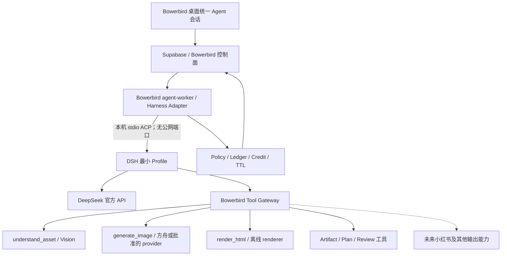

# Bowerbird 通用云端 Agent Harness 专项计划

> 版本：v1.8
> 日期：2026-08-29
> 状态：**U0 完成；U1 技术入口已通过；U2 已完成真实 DSH ACP checkpoint 重建、首批控制面工具、服务端权威计划估算、真实 claim→`list_run_assets` 元数据接线，以及首个方舟 `understand_asset` durable tool 与父进程 `UnifiedPlanningToolBridge`。全新本地 Supabase 已通过 migration `0047`–`0049`、34 项数据库断言及真实 Edge 停车/重放/批准后 fresh claim E2E；agent-worker 本地基线 206/206。尚缺受信 DSH 插件→父进程 Bridge 的本机传输、统一 processor、真实 Vision fixture smoke、VPS 接入和 DSH 模型实际 usage wire，也未获生产部署授权。npm ACP 发布物缺少 `session/list/resume/close` 与客户端工具回调，按 Bowerbird checkpoint 重建及父进程能力桥边界继续推进，不等待新版停工。**
> 适用范围：Bowerbird Cloud Agent、VPS Worker、官方能力工具、项目视觉设定、HTML 长图及后续小红书等内容工作流
> 前置文档：[`PROJECT.md`](../PROJECT.md)、[`AGENT-RUNTIME-PLAN.md`](AGENT-RUNTIME-PLAN.md)、[`HTML-RENDER-PLAN.md`](HTML-RENDER-PLAN.md)、[`研究报告-服务器化CLI与API化改造可行性.md`](研究报告-服务器化CLI与API化改造可行性.md)

---

## 0. 一页结论

Bowerbird 后续不再为 HTML 长图、小红书或其他内容形态分别建设一套 Agent、状态机和 Runner。产品只保留**一个云端 Bowerbird Agent**；视觉理解、图片生成、HTML 排版截图、内容结构化和未来渠道输出都是这个 Agent 可调用的受控能力。

本专项采用以下架构方向：

- 以 **DeepSeek Harness（DSH）+ DeepSeek 官方 API**作为通用 Agent loop 的首选候选，先隔离验证，达标后再渐进迁移。
- DSH 只负责模型循环、会话上下文、工具选择、流式事件、压缩、取消和恢复等通用 Harness 职责。
- Bowerbird 继续拥有账号、权益、积分、Run 状态、计划审批、Policy、幂等 Tool Ledger、Artifact、TTL 和结算；这些业务权威不得迁入 DSH。
- 能力通过 Bowerbird Tool Gateway 暴露；DSH 默认的 shell、文件写入、网页、终端、子 Agent、任意 MCP 和插件安装全部关闭。
- HTML 长图和小红书在产品上是同一 Agent 的能力；内部可拆成“输出配方/Skill + 确定性工具”，但不得再拥有独立 Agent loop。
- 项目视觉设定以冻结、带 hash、只读的 `VisualProfileCapsule` 进入同一 Agent 上下文，供所有能力共享；本次明确任务始终优先。
- 现有受控图像编辑和 HTML Runner 在迁移验收前继续稳定运行；新方向不以一次性重写替换已验证生产链路。

本专项要消除的不是“代码重复”这么简单，而是**认知层重复**：如果每增加一种内容能力都重新实现规划、澄清、审批、上下文、视觉读取、生成、恢复和反馈，最终会出现多个互不理解、质量边界各异的 Agent。统一 Harness 后，新增能力的正常形式应是新增工具或输出配方，而不是新增 Agent。

---

## 1. 专项成立的前因后果

### 1.1 已经发生的事实

1. `bowerbird-controlled-image-edit` 首版证明了 Bowerbird 的控制面、计划审批、工具账本、短期工作区、积分结算和恢复机制可在真实 Supabase/VPS/DeepSeek/方舟链路工作。
2. Codex + Bowerbird Agent 的真实 E2E 也证明：两个都具备思考和对话能力的 Agent 叠加，会重复规划并显著增加耗时。因此两者已暂时互斥。
3. HTML renderer 专项成功交付了安全、确定性的离线渲染工具，但首版 HTML Skill 被刻意限制为一次文本合成、一次渲染、不看图、不生图、不自检。
4. 用户用真实产品图和完整产品推文测试后，结果只是“原图 + 类文档长文”，没有形成预期的信息架构、视觉节奏、缺图判断和补图生成。
5. 这不是 renderer 失败。renderer 准确执行了输入；根因是上游所谓“HTML 排版能力”同时承担了 Agent、规划器和排版器，却没有产品图视觉信息、视觉设定、图片生成工具及多轮观察修订能力。
6. 用户再次明确产品预期：HTML 长图、视觉受控、小红书等本质上都是接入同一云端 Agent 的工具或能力，不应各自发展成新的 Agent 产品。

### 1.2 根因

现有实现以“一个 Skill 对应一个 Run Processor/状态机”为自然扩展单位。这个方式适合验证单个受限能力，却会产生以下结构性问题：

- 每个新能力重新实现模型回合、上下文拼装、澄清、审批、恢复和反馈。
- 图片、视觉设定和生成能力是否可用，由各 Skill 自己决定，导致同一批素材在不同入口中被不同程度地理解。
- Agent 无法跨能力组合动作。例如先理解产品图，再补一张场景图，再排 HTML，最后改写为小红书图文。
- 用户面对的是多个入口和多个“半 Agent”，而不是一个理解目标并选择工具的创作 Agent。
- 测试、计量和安全策略不断复制，增加漂移与重复造轮子的概率。

### 1.3 DSH 调研带来的结论

截至 2026-08-28：

- DSH 是 MIT 许可的开源通用 Agent Harness，模型适配、工具、会话、持久化、审批、沙箱、上下文和 Agent loop 都以插件组合。
- DSH 的 ACP 自动化面适合由程序驱动，支持会话创建/恢复/关闭、取消、语义事件、图片 prompt 和一次性工具权限。
- DSH 已提供 DeepSeek 官方 API adapter；最新官方实现覆盖 thinking、工具调用、Files API、图片输入与缓存计量。
- DeepSeek 官方 API 当前提供文本/推理模型及实验性视觉模型 `deepseek-v4-flash-vision-exp`；视觉模型支持图片与工具调用。
- DSH 仍处于 developer preview，官方明确会有破坏性变化；文档与发布包也可能短期不同步。

因此，**“DSH + DeepSeek API”技术可行且方向匹配，但只能先作为版本钉死、可回滚的 Harness 候选；不能未经 Spike 直接替换生产 Runtime。**

---

## 2. 不可回退的架构约定

### 2.1 一个 Agent，多种能力

Bowerbird 用户侧只有一个云端 Agent 会话面。它可以根据目标调用不同能力，但能力本身不拥有第二套自由推理循环。

允许：

- 新增一个确定性工具；
- 新增一个只包含领域方法、输出 schema 和工具选择指导的官方输出配方/Skill；
- 为现有工具增加受控参数或 provider；
- 为特定高风险动作增加新的 Policy/审批规则。

默认禁止：

- 为一种内容格式新建独立 Agent loop；
- 为一种渠道复制一套 Run/Conversation/Approval/Ledger；
- 让一个 Agent 再调用 Codex、Claude Code 或另一个 DSH Agent 完成同一层规划；
- 以“Skill”为名引入隐藏的自由循环或不受控工具链。

如果未来确需第二 Agent，设计必须明确证明其承担不同信任域或不同所有权边界，并经过新的架构决策；“开发方便”不是理由。

### 2.2 Harness 可替换，控制面不可让渡

DSH 是实现通用 Agent loop 的候选，不是 Bowerbird 的业务权威，也不是新的云端后端。

以下事实源始终属于 Bowerbird：

- `agent_runs` 及状态机；
- 用户、Entitlement、并发和预算；
- 计划 proposal、批准 hash、拒绝与过期；
- `call_id + args_hash` 幂等 Tool Ledger；
- usage、credit hold/confirm/rollback；
- Artifact 归属、hash、MIME、可见性和 TTL；
- 本地素材库及长期项目历史。

DSH 的 session log 可以保存模型上下文和执行事件，但不得成为积分、审批、Artifact 或 Run 终态的唯一来源。两个系统不应重复拥有同一种业务事实：DSH 事件投影到 Bowerbird display events，业务状态仍由 Bowerbird 提交。

### 2.3 官方 API，不服务器共享订阅 CLI

- DeepSeek 走官方 API key，由受信 VPS 运行时持有。
- 方舟/Seedream 等生成 provider 继续走官方 API。
- 不把共享 Codex/即梦订阅登录态放到 VPS 服务多用户。
- 本机 CLI 只保留直接生成、历史兼容或明确批准的本机执行边界，不再承担云端 Agent 的第二层思考。

### 2.4 视觉设定是共享上下文，不是某个输出格式的私有功能

`VisualProfileCapsule` 在 Run 创建时冻结 `profile_id/version/hash`，按以下优先级进入通用 Agent：

```text
系统安全与当前 phase
  > 用户本次明确目标与明确素材职责
  > 已批准计划与预算
  > 项目视觉设定 capsule
  > 历史偏好与旧对话摘要
```

HTML、小红书、直接生成或其他能力都读取同一冻结 capsule；任何能力不得静默修改或回写项目视觉设定。

---

## 3. 目标架构



### 3.1 推荐进程边界

- Bowerbird Worker 作为父控制器，通过 **ACP stdio** 启动和驱动 DSH；ACP 不绑定公网端口。
- DSH 子进程只获得最小环境：DeepSeek API 凭据、隔离的 `DSH_HOME`、当前 Run 的只读/临时工作目录；不获得 Supabase service role、数据库连接或其他 provider secret。
- Bowerbird Tool Gateway 首版可以是 loopback/internal HTTP MCP，也可以是静态 DSH 工具插件；无论传输为何，工具执行端必须再次校验 Run、phase、批准 hash、call id 和 args hash。
- 一个 DSH 进程可承载多个隔离 session，但每个 Run 只允许一个当前 in-flight prompt；容量和并发仍由 Bowerbird Worker 分配。

### 3.2 为什么首选 ACP，而不是 Web UI 或 SDK JSON-RPC

- Web UI 是 DSH 自带产品界面，与 Bowerbird 桌面和控制面重复，不接入。
- ACP 是面向受信自动化控制器的标准接口，覆盖取消、恢复、关闭、图片和权限，适合 Worker 驱动。
- SDK JSON-RPC 当前缺少逐 prompt 结果和单 session cancel/close 等关键语义，不作为首选生产边界。
- ACP 自身不认证，必须保持本机 stdio；如果未来跨主机，需由 Bowerbird 自己增加有认证的控制通道，不能直接暴露 ACP。

---

## 4. 职责矩阵

| 能力 | DSH | Bowerbird | 明确边界 |
|---|---|---|---|
| 模型多轮 loop | 主责 | 观察/中止 | Bowerbird 可随时取消，不改写模型隐藏思维 |
| 模型/provider 适配 | 主责 | 选择、预算、计量复核 | 首批 DeepSeek 官方 API |
| 会话上下文/压缩 | 主责 | 提供可信分层输入 | 安全、审批、预算块不可由模型摘要改写 |
| 工具 schema 与选择 | 注册/呈现 | 定义业务契约 | 只暴露当前 phase 允许的 Bowerbird 工具 |
| 工具执行 | 不直接持业务 secret | 主责 | Gateway 权威校验后调用 provider/renderer |
| 工具审批 | 可请求一次性权限 | 主责 | 业务计划审批走 Supabase 停车，不等同于 ACP permission |
| Run 状态/恢复 | session 辅助 | 唯一权威 | DSH 丢失时可由 Bowerbird checkpoint 重建 |
| 幂等/扣费 | 不作为权威 | 唯一权威 | 相同 call 不重复生成或扣费 |
| Artifact/TTL | 仅引用 | 唯一权威 | 不允许跨 Run 或任意路径读取 |
| 用户 UI/历史 | 不使用 DSH UI | 唯一产品面 | 统一 Agent 时间线，隐藏模型私有思维链 |

---

## 5. 能力模型：Tool、Skill 与输出配方

### 5.1 术语

- **Agent**：唯一的通用云端创作主体，负责理解目标、选择能力、编排步骤和与用户交互。
- **Tool**：有严格输入/输出 schema、预算、权限和副作用边界的动作。
- **Skill / 输出配方**：告诉同一 Agent 如何完成某类成果的领域方法、质量 rubric、推荐工具顺序和最终 schema；不是新的 Agent。
- **Renderer/provider**：确定性执行器或外部官方 API，不参与业务决策。

### 5.2 首批通用工具候选

| 工具 | 作用 | 是否有副作用 | 权威执行方 |
|---|---|---:|---|
| `list_run_assets` | 返回当前 Run 素材清单、caption、尺寸和角色 | 否 | Bowerbird |
| `understand_asset` | 对明确资产做结构化视觉理解 | 有成本、无产物写入或产生私有诊断 artifact | Vision provider + Ledger |
| `submit_plan` | 提交结构化计划并停车等待审批 | 写计划 | Bowerbird 控制面 |
| `generate_image` | 按批准步骤生成缺失素材或编辑图 | 是 | 方舟/批准的 provider |
| `compose_html` | 产出受限 HTML/CSS 文档 artifact | 是 | Agent + Bowerbird artifact commit |
| `render_html` | 将已登记 HTML/素材离线渲染为 PNG/切片 | 是 | 现有 html-renderer |
| `inspect_artifact` | 对明确结果做有界视觉检查 | 有成本 | Vision provider；受 phase/次数限制 |
| `finalize_output` | 声明最终成果与可见 Artifact | 写终态候选 | Bowerbird 控制面 |

工具名和 schema 在 U1/U2 Spike 后冻结；表中名称不是生产兼容承诺。

### 5.3 HTML 长图应如何落位

HTML 长图不再等于“调用一次模型生成 HTML”。完整能力应由同一 Agent按需组合：

```text
理解产品目标与视觉设定
  → 查看必要的产品/品牌素材
  → 设计信息架构与版面节奏
  → 判断缺失的视觉素材
  → 提交包含成本的计划并等待批准
  → 按批准计划生成缺图
  → compose_html
  → render_html
  → 有界视觉检查/必要时提出修订
  → 用户接受并入库
```

现有 `bowerbird-html-layout-render` 仍保持“一次 compose + 一次 render、无 Vision”的已验证边界，直到 U3 新纵切通过。不得直接在旧 Runner 中不断追加 Vision、生图和修订循环；这些能力应在通用 Harness 内实现。

### 5.4 小红书应如何复用

未来小红书专项首先复用同一 Agent、视觉设定、Tool Gateway、审批、账本和 Artifact 图，只新增：

- 渠道内容结构/字数/封面/组图规则；
- 小红书输出配方与结构化 schema；
- 如确有必要的确定性导出或发布工具。

若开发小红书能力时出现新的独立 Agent Runner、第二套会话表或第二套审批状态机，视为违反本专项，必须先停下重新评审。

---

## 6. DSH 接入约束

### 6.1 版本与供应链

- 只使用精确版本或精确 commit，提交 lockfile 和镜像 digest；禁止生产使用浮动 `latest`。
- U1 必须核对实际 npm 包，而不是只按 GitHub `master` 文档判断功能。
- DSH 升级必须跑兼容矩阵、会话恢复、取消、工具 schema、图片和计量回归；不能随普通依赖批量升级。
- 保留 MIT LICENSE 与第三方 notices。
- 首版不 fork DSH；若必须长期维护 core patch 才能满足边界，触发止损评审。

### 6.2 最小 Profile

生产候选 Profile 默认只包含：

- Agent loop；
- DeepSeek adapter；
- session persistence/compaction；
- ACP server；
- Bowerbird 官方工具和 policy hooks；
- 必需的无内容 telemetry。

必须移除或关闭：

- Bash、PowerShell、PTY、任意 subprocess；
- 任意文件写入、代码编辑和宿主文件搜索；
- Web fetch/browser；
- 任意 MCP 动态挂载；
- 社区插件安装、热加载；
- 子 Agent、Agent team、定时任务；
- DSH Web UI。

### 6.3 计划审批桥

DSH Plan Mode 不是 Bowerbird 商业审批。通用 Agent 必须调用 `submit_plan(plan)`：

1. Gateway 校验 schema、预算、素材归属和 phase。
2. Bowerbird 生成 proposal hash，写 Supabase，Run 进入 `awaiting_plan_approval`。
3. 当前 DSH turn 以明确 terminal reason 结束并释放 Worker 租约。
4. 用户批准后，Bowerbird 恢复相同 session 或用 checkpoint 重建，并注入签名批准事实。
5. 后续高成本工具必须携带/派生同一 approved plan hash；计划改变则重新审批。

ACP 的 `session/request_permission` 只用于进程内一次性工具许可或测试控制，不代替这套跨设备、可恢复的计划审批。

---

## 7. DeepSeek 模型策略

### 7.1 首批候选

- 主规划候选：`deepseek-v4-pro`，用于复杂结构、工具编排和质量优先任务。
- 低成本/低延迟候选：`deepseek-v4-flash`。
- 视觉候选：`deepseek-v4-flash-vision-exp`，只在实际版本验证图片与工具调用稳定后启用。

模型名称会变化，生产配置必须数据驱动；文档中的型号只是 2026-08-28 调研快照。

### 7.2 必测的两种视觉路线

U1 用同一真实案例 A/B：

1. **Vision 主模型**：视觉模型直接接收产品图并完成规划与工具调用。
2. **Pro 主模型 + `understand_asset`**：主 Agent 按需调用独立视觉工具，拿结构化视觉结果后继续规划。

选择标准不是“模型更新”，而是：产品图理解、文字/Logo 保真、工具遵循、上下文稳定、成本、延迟和失败可恢复性。即便采用第二条路线，产品上仍是一个 Agent；辅助视觉模型是工具后端，不是第二个用户侧 Agent。

### 7.3 不由 DSH 自动解决的问题

DSH 能减少通用基础设施开发，但不会自动提高创意质量。以下仍需 Bowerbird 自己定义和评测：

- 信息架构与视觉叙事 rubric；
- 产品/品牌内容不可篡改约束；
- 缺图判断和生成策略；
- 项目视觉设定优先级；
- HTML/小红书等输出配方；
- 视觉检查次数、成本和终止条件；
- 用户何时必须审批。

---

## 8. 状态、幂等和恢复

### 8.1 双层状态但单一业务事实源

- DSH session：模型消息、tool call/result、上下文压缩、Agent turn 状态。
- Bowerbird Run：业务 phase、审批、预算、Artifact、usage、积分和终态。

两者通过稳定映射绑定：

```text
conversation_id / run_id
  ↔ dsh_session_id
  ↔ checkpoint_version
  ↔ current_turn_id
```

映射写入 Bowerbird 控制面；DSH session id 不作为客户端可伪造输入。

### 8.2 工具调用不变量

- `call_id` 继续由 `run_id + phase + logical_slot + revision_index` 确定性派生。
- Gateway 对参数计算规范化 `args_hash`。
- 同 call id + 同 hash 返回既有结果，不重复执行或扣费。
- 同 call id + 不同 hash 默认拒绝；合法修订必须使用新 revision/slot。
- DSH retry 不能绕过 Tool Ledger；provider outcome unknown 不自动重做有成本动作。
- 任何工具只能读取当前 Run 已登记且当前 phase 允许的 Artifact。

### 8.3 恢复优先级

1. 若所钉 DSH/ACP 发布物支持恢复，且 DSH session 与 Bowerbird checkpoint 都完整，可恢复同一 session，但仍以 Bowerbird checkpoint 校验业务状态。
2. 对当前 `@deepseek-ai/dsh-acp@0.1.1-rc.2`，每个进程只使用 connection-scoped fresh session；Worker/DSH 重启时以 Bowerbird 的结构化 checkpoint、已完成工具结果和必要对话摘要创建新 session。缺少 `list/resume/close` 不阻塞隔离开发，也不得伪装成已支持原 session 恢复。
3. 若 Bowerbird 对某个有成本 call 的结果不确定，保持 `outcome_unknown`，不因 DSH 丢失而重做。
4. 恢复不得重新申请已确认 usage，也不得复用已失效的批准 hash。

---

## 9. 安全与隐私边界

- DSH ACP 只通过父子进程 stdio连接，默认无公网入站。
- DSH 不持 Supabase service role、支付密钥、方舟密钥或 renderer token；DeepSeek key 按最小环境注入。
- Tool Gateway 是唯一业务副作用出口，所有请求再次做身份、Run、phase、审批、预算和 schema 校验。
- 任何 prompt、Skill、图片 OCR、网页正文或模型结果都按不可信数据处理，不能提升工具权限。
- Run 工作区短期、隔离、容量受限；输入/中间/最终产物沿用现有 TTL 和用户可见性规则。
- 不开放用户安装 DSH plugin、MCP、Skill 或任意代码。
- 日志只记录无内容标识、状态、时延、usage、稳定错误码和版本；不记录正文、图片、签名 URL、API key 或隐藏思维链。
- DeepSeek/DSH 新增的 Files API 只允许上传当前 Run 已授权图片，记录 provider file id、hash 和过期策略；Run 清理时尽力删除远端临时文件。

---

## 10. 分阶段任务卡

### U0：决策与调研归档

状态：**完成（2026-08-28）**

- [x] 明确一个云端 Agent、多种能力的产品边界。
- [x] 明确 DSH 只接管通用 Harness，不接管 Bowerbird 控制面。
- [x] 调研 DSH plugin/profile、工具 policy、ACP、DeepSeek adapter、视觉与许可。
- [x] 建立本专项并与旧 Runtime/HTML 文档交叉引用。
- [x] 在 `PROJECT.md` 和 `AGENTS.md` 固化避免重复造轮子的规则。

### U1：隔离 DSH + DeepSeek Spike

目标：只证明 Harness 候选的真实能力，不修改生产入口、数据库和计费。

- [x] 锁定实际 npm 发布版本，记录 Node、包版本、lockfile 和许可证；正常路径使用 npm/npx，不克隆仓库。镜像 digest 留到首次 U2 容器候选。
- [x] 构造最小 ACP Profile，证明默认 coding/web/subagent 工具均未加载。
- [x] 通过 stdio 实测 initialize/new/prompt/cancel，并对真实在途 prompt 得到 `cancelled`；同时实测 `list/resume/close` 在 rc.2 为 `-32601`，采用 Bowerbird checkpoint → fresh session 重建边界，不等待新版。
- [x] 使用 DeepSeek 官方 API 完成同 session 双轮文本 tool loop、结构化参数、thinking 关闭与错误归一化；usage 由 adapter/ProviderResult 采集，已确认当前 ACP wire 不承载 usage。
- [x] 验证 adapter 不映射 `tool_choice`：唯一 scoped tool 在两轮真实调用中均收敛并返回不同不可猜证明。U2 仍须实现结果校验 + 有界纠正，并在真实业务 eval 中判定是否触发“频繁退化为自由文本”止损。
- [x] 回放现有 DeepSeek 中文引号/非严格 JSON tool arguments fixture：adapter 原样输出非严格 arguments，确认其不会替 Bowerbird 做参数修复或放宽校验，Tool Gateway 仍须 fail closed。
- [x] 使用真实图片验证 Vision 模型 ACP inline base64 输入与多轮历史；128×128 fixture 正确识别，第二轮无图仍保持上一图上下文。16×16 fixture 曾把鸟误判为猫，作为低分辨率质量风险保留。Files API 仅在 inline/base64 达到限制或真实案例需要时再测，不预先引入。
- [ ] A/B “Vision 主模型”与“Pro + understand tool”。
- [x] 验证子进程只获得白名单环境，无法读取 Supabase/provider 业务 secret。
- [x] 输出兼容性报告，不改 FeaturePolicy，不部署生产 VPS。

验收：取消可收敛；Run 可由 Bowerbird checkpoint 重建且不重复副作用；工具 schema 不漂移；图片链路可用；无默认高危工具；版本可复现。任一核心项只能依赖未发布 `master` 或长期 core patch 时暂停采用。

**U1 技术入口结论（2026-08-28）：通过，允许进入 U2 隔离开发，不授权生产替换。** 隔离 Spike 位于 [`spikes/unified-agent-harness-u1/`](../spikes/unified-agent-harness-u1/)，离线测试 9/9。Profile 精确钉死 DSH/ACP/base/DeepSeek adapter/tools `0.1.1-rc.2` 与 ACP SDK `0.25.1`，组合配置审计确认 shell、PowerShell、文件、Web、Skill、子 Agent、workflow、凭据扫描和遥测均关闭；DSH 子进程默认不获得业务 secret。经用户授权复用本机 Bowerbird Cloud DeepSeek key 的真实 smoke 已完成同 session 双轮确定性 tool loop、在途取消、Vision inline base64 和无图续轮历史，全部按预期收口。rc.2 的 `session/list/resume/close` 与 ACP usage/工具事件仍缺失，但 Bowerbird 原本就是 Run/checkpoint/Tool Ledger 唯一业务权威，因此当前采用 connection-scoped fresh session + checkpoint 重建，不再把未发布 `master` 或新版 npm 当作继续开发前提。U2 必须证明重建幂等和有界纠正；失败时再触发止损。Vision 主模型与 Pro + understand tool 的真实案例 A/B 仍是模型选型项，不阻塞控制面接口开发。

### U2：Bowerbird Harness Adapter 与 Tool Gateway

目标：让 DSH 在不拥有业务权威的前提下调用现有能力。

- [x] 定义 `HarnessAdapter/HarnessSession`，使当前自研 Kernel 与 DSH 经窄端口在测试中并存；Kernel 不直接依赖 DSH npm 包。
- [x] 定义本地 Tool Gateway 首层合同：绑定 run/lease/phase、由可信 plan slot 派生 call id、闭集参数 validator、最终 allowlist 交集与稳定拒绝码；Worker Token/HTTP 认证继续复用现有控制面，待真实 transport 接线时验证。
- [x] 首批本地控制面工具合同：`list_run_assets` 只读当前 Run 闭集 manifest、`submit_plan` 校验素材归属/依赖/步数/预算并返回 `awaiting_plan_approval` terminal reason；两者均经 scoped Gateway，模型不能自报 Run 或 call id。
- [x] `submit_plan` 的 Worker→Edge transport 与 migration `0047` 本地代码完成：模型不能提交积分；Edge 复核闭集计划、Run 素材归属、proposal/args hash，并按可信 Policy v1、Run provider 与版本化 `service_costs` 计算模型/Vision/生图/renderer 权威估算；稳定 source call 落审批表。
- [x] 在全新本地 Supabase 应用 `0047`–`0049`：migration `0001`–`0049` reset 通过，`agent_runtime.sql` 34/34；真实 Edge E2E 已验证计划落库、服务端估算、相同调用重放、漂移/已结束拒绝、停车释放租约、可信图片尺寸登记与批准后 fresh claim。预算拒绝另由共享估算与 Edge/Worker 合同测试覆盖；仍未部署生产。
- [x] `list_run_assets` 已接实际 claim artifact manifest：Edge 在原有上传字节校验中解析 PNG/JPEG/WebP 尺寸，migration `0049` 保存可信宽高，claim 只返回元数据；Worker 稳定排序、映射 input/reference/generated 并生成 manifest hash，不暴露 URL/路径，旧 artifact 缺尺寸时 fail closed。
- [x] 首个 provider 工具 `understand_asset` 本地代码完成：模型只提交当前 Run 的 `assetId + focus`；父进程从 claim 注入可信 artifact sha256 并绑定 `args_hash`，经 `RunWorkspace` 校验下载、方舟 Vision 结构化结果校验、私有 diagnostic artifact、usage ledger 与 durable replay/reconcile 闭环。
- [x] 父进程 `UnifiedPlanningToolBridge` 已把 `list_run_assets`、`understand_asset`、`submit_plan` 收口到同一 scoped Gateway；Run/lease/phase/allowlist/revision/stable logical slot 均由父进程注入，模型不能自报。
- [ ] 增加受信 Bowerbird DSH 插件→父进程 Bridge 的最小本机 RPC，以每 Run 短期 capability 授权；DSH 子进程不得获得 Worker Token、方舟 key、Supabase/service role 或其他业务 secret。
- [ ] 接入图片生成、HTML compose/render、结果完成等其余真实业务工具；在插件 transport、统一 processor 与真实 fixture smoke 完成前，不把 `understand_asset` 标记为 DSH 端到端完成。
- [x] Gateway 已复用现有 `deriveCallId` 与 `DurableToolDispatcher` 的 argsHash、prepare/submitted/complete、restore/reconcile/outcome_unknown，不另造副作用账本；PolicyEngine/usage/Artifact/TTL 在接首批真实工具时继续复用现有实现。
- [x] Harness 合同只接收 committed content；当前 rc.2 不把 ACP 未提供的工具事件或隐藏思维链伪造进 display events。
- [x] 完成真实本地停车审批、Worker 释放租约、响应丢失重放、批准后恢复及身份漂移 fail closed；fresh claim 收到新租约、原 checkpoint、approved plan hash 与 planned tool count。生产/VPS 版本失配与实际 usage 仍留后续纵切。

验收：相同 call 重放不重复副作用/扣费；跨 Run、未批准、超预算、未注册工具全部拒绝；DSH 崩溃后可由 Bowerbird 恢复。

**U2 进展（2026-08-28–29，本地隔离）**：`apps/agent-worker/src/harness/` 已加入 DSH ACP fresh-session Adapter、Bowerbird checkpoint 首轮重建上下文和 scoped Gateway；Spike 侧已用真实 ACP SDK + DSH 子进程实现窄 `DshAcpPort`，经现有 Cloud DeepSeek 配置验证全新 session 能从 checkpoint 读回既有 `artifact-existing` 并以 `end_turn` 收束。Gateway 同时支持复用既有 `DurableToolDispatcher` 的 provider 分支与受限控制面分支；`list_run_assets` 不接受模型提供的 runId，现已由真实 claim 构造闭集 manifest：Edge 在既有上传校验的同一次字节读取中解析 PNG/JPEG/WebP 头，migration `0049` 持久化服务端可信宽高，claim 返回宽高但不新增内容下载，Worker 过滤非图片、稳定排序、映射 input/reference/generated 并生成 hash，旧图片缺尺寸则明确失败。首个 provider 工具 `understand_asset` 只接受当前 Run 的 `assetId + focus`，由父进程注入 claim 中可信 artifact sha256 并把它纳入 `args_hash`，随后复用 `RunWorkspace` 下载验 hash、方舟 Vision JSON 合同、私有 diagnostic artifact、现有 usage ledger 与 durable prepare/submitted/complete/restore/reconcile；相同调用重放不会再次请求 provider 或重复计量。新增 `UnifiedPlanningToolBridge` 把 `list_run_assets`、`understand_asset`、`submit_plan` 放进同一 Gateway，并由父进程注入 Run/lease/phase/allowlist/revision 与按稳定素材顺序、focus 派生的 logical slot。对 rc.2 实际调用路径的审计同时确认：ACP `sessionUpdate` 只返回 committed message，DSH 注册工具在子进程插件内执行，ACP client 不提供父进程工具调用 callback；因此下一层必须是受信 Bowerbird 插件经短期每 Run 本机 capability 把仅 `toolName + arguments` 转发给父进程 Bridge，不能把 ACP 文本事件伪装成控制通道，也不能向子进程发 Worker Token/provider key。`submit_plan` 继续由 Edge 独立复核闭集 schema、素材归属、`proposalHash/argsHash`、Cost Policy v1 与剩余预算；migration `0047`–`0049`、全新库 reset、数据库 **34/34** 和真实 Edge 停车/fresh claim E2E 基线保持有效。最终回归：agent-worker **206/206** + TypeScript；既有 Edge Deno check、共享图片元数据/计价计划 **8/8**、数据库 **34/34**、U1 离线 **9/9** 与真实 Adapter smoke 继续通过。**未完成/未部署**：尚缺 DSH 插件→父进程本机 transport、统一 processor 与真实 Vision fixture smoke，也未接生图/HTML/完成工具；rc.2 ACP 不给 usage wire，DSH 模型回合实际计量必须在生产候选前补齐，权威计划估算不能替代 usage ledger；migration/Edge/VPS/FeaturePolicy 均未部署。

### U3：真实“产品图 + 产品推文 → HTML 长图”纵切

目标：用本专项成立时暴露问题的真实类型案例证明质量边界，而不是只证明能调用工具。

- [ ] Agent 能查看产品图并区分产品、Logo、文案与风格素材。
- [ ] 注入冻结 `VisualProfileCapsule`，展示其实际影响与来源 hash。
- [ ] 生成结构化信息架构和视觉计划，列明现有图、缺图、生成图及预计成本。
- [ ] 用户批准后才生成缺失图片。
- [ ] 复用现有 `render_html`，不修改 renderer 的断网/sanitizer/sandbox 契约。
- [ ] 允许预算内有界视觉检查；任何新增生成或成本增加重新审批。
- [ ] 输出整页/切片并沿用现有入库、TTL、manifest 与幂等语义。
- [ ] 与旧 HTML 一次 compose 基线做盲评和耗时/成本对比。

验收：不再出现“原图 + 整段 Doc 文案”作为默认成功；结果具有清晰信息层级、视觉节奏、合理图片槽位，品牌/产品事实不被篡改，用户认为相对旧专项有实质提升。

### U4：现有能力渐进迁移与兼容

- [ ] 先通过 feature flag 让 test-only Run 可选 `legacy_kernel` 或 `dsh`。
- [ ] 比较 controlled image edit 的策略正确率、结构化成功率、耗时、成本和恢复行为。
- [ ] 只有在同一 eval 和真实 E2E 不退化时，才迁移其模型 loop；原业务 Policy/审批/Ledger 不动。
- [ ] HTML 旧 Runner 继续作为稳定回退，直到新纵切观察期完成。
- [ ] 历史 Run 始终按创建时 runtime/version 恢复，不强行升级会话。

验收：旧历史、图片、审批、结算和恢复无回归；可按 Run 回退旧 Kernel；没有双 Agent 规划。

### U5：小红书作为首次“零新 Harness”复用证明

- [ ] 只新增小红书输出配方、schema 和必要确定性工具。
- [ ] 复用同一 Agent 会话、视觉 capsule、计划审批、Tool Gateway、Ledger、Artifact 和反馈机制。
- [ ] 不新建独立 Agent 进程、Agent Run 表、审批表、积分链路或历史 UI。
- [ ] 用跨能力任务验证同一会话可先生成/排版，再派生小红书内容。

验收：新能力的架构 diff 主要集中在领域配方和工具；若必须复制通用 Harness 代码，则 U5 不通过。

### U6：小名单观察与生产决策

- [ ] test-only 小名单观察取消率、失败率、p50/p95 时延、模型/工具成本、重复 call、恢复和人工质量。
- [ ] 完成 DSH 升级/回滚 runbook、镜像扫描、SBOM/许可证与依赖变更审计。
- [ ] 明确公开档位、预算和计费；未经用户授权不扩大开放。
- [ ] 达标后再决定 DSH 成为默认 Harness、继续双栈，或停止采用。

---

## 11. 验收矩阵

### 11.1 功能

- 同一 Agent 可组合视觉理解、生成、HTML 渲染和后续渠道能力。
- Agent 会依据内容和视觉设定设计结构，而不是把输入机械拼接。
- 图片、文字、视觉设定和用户反馈在同一会话中可追踪。
- 审批前不产生高成本副作用；审批后只执行批准计划。

### 11.2 可靠性

- prompt cancel、session close、Worker crash、DSH crash、网络中断和 provider outcome unknown 均有确定性终态。
- session 恢复不重复模型外部副作用。
- 历史 Run 绑定 runtime/model/skill/tool schema 版本。
- DSH 不可用时 test-only 路径明确失败或回退，不污染 legacy 生产路径。

### 11.3 安全

- DSH 无公网监听、无任意 shell/web/fs/subagent/plugin 能力。
- Tool Gateway 对所有模型调用 fail closed。
- 跨 Run、路径注入、URL 注入、未批准调用、预算溢出和 prompt injection 回归全绿。
- secret 隔离、日志无内容和短 TTL 行为与现有 Cloud 基线一致。

### 11.4 质量与成本

- 使用本专项成立时的真实产品长图案例作为永久回归 fixture。
- 同时记录结构正确率、视觉盲评、事实保真、生成调用数、模型 token、总时延和实际积分。
- DSH 的收益必须体现在能力组合、质量或维护成本，不以“换了框架”本身算通过。
- 不依赖 1M context 粗暴堆积历史；压缩与上下文选择仍须有界、可审计。

### 11.5 防重复造轮子检查

任何新 Agent/内容能力 PR 在编码前必须回答：

1. 它能否作为现有 Agent 的 Tool？
2. 如果不能，能否作为输出配方/Skill + 现有 Tool 组合？
3. 是否复用了统一会话、视觉设定、审批、Policy、Ledger、Artifact、TTL 和计量？
4. 是否正在新增第二套模型 loop、Run Processor、审批状态机或历史 UI？
5. 如果答案是“是”，其不同信任域/所有权边界是什么，哪一条正式决策批准了例外？

没有明确例外决策时，停下设计，不进入实现。

---

## 12. 风险与止损条件

| 风险 | 缓解 | 止损条件 |
|---|---|---|
| DSH developer preview 频繁破坏兼容 | 精确钉版、Adapter 隔离、双栈、升级矩阵 | 关键能力只能追 `master` 或每次升级需大面积 core patch |
| DSH 默认编码工具扩大攻击面 | 最小 Profile、无默认工具、Gateway 二次授权 | 无法证明 shell/web/fs/subagent 未加载 |
| 双状态源导致恢复冲突 | Bowerbird 业务权威、明确映射与重建规则 | DSH session 成为审批/扣费/Artifact 唯一来源 |
| DeepSeek 视觉实验模型不稳定 | 主模型+视觉工具 A/B、保留方舟 Vision | 图片/工具组合无法稳定通过真实 fixture |
| DSH adapter 不提供现有 Kernel 的强制 `tool_choice=required` | scoped schema、结构化结果校验、有界纠正回合、真实 eval | 必需 action 频繁退化为自由文本或只能长期维护 core patch |
| Agent 自由循环导致成本失控 | 计划审批、每工具预算、turn/step/time 上限 | 无法在 Kernel 外部可靠中止或限制副作用 |
| 通用化反而增加复杂度 | U1/U2 小纵切、禁止一次性重写 | 为接 DSH 必须重写控制面或已验证 renderer |
| 质量仍停留在机械排版 | 真实案例盲评、视觉检查和缺图生成 | U3 对旧一次 compose 无实质质量提升 |
| 又为新渠道另造 Agent | 强制开工检查、U5 复用验收 | 新渠道需要第二套 Harness 才能交付 |

---

## 13. 与现有专项的关系

### 13.1 `AGENT-RUNTIME-PLAN.md`

- 继续作为已上线 Bowerbird Agent Kernel、控制面、受控图像编辑、项目视觉设定、计量、TTL 和恢复的实现权威。
- 其中“一种官方 Skill 对应受限 phase graph/processor”的现状保持兼容，但不再作为未来内容能力的默认扩展模式。
- 本专项通过 U2/U4 渐进复用和迁移，不推倒 A0–A8 的已验证业务不变量。

### 13.2 `HTML-RENDER-PLAN.md`

- 继续作为离线 renderer、安全容器、HTML/CSS 契约、整页/切片和 manifest 的实现权威。
- 其“无 Vision、一次 render、用户判断”是旧 HTML Skill 的冻结首版边界，不是通用 Agent 的永久产品上限。
- 新的视觉理解、缺图生成、视觉设定和有界修订只在 U3 通用 Agent 纵切中实现；不得把 renderer 变成浏览器 Agent。

### 13.3 未来渠道专项

未来可创建“小红书输出配方”等领域文档，但不得再创建新的通用 Harness 计划。若领域文档与本专项冲突，以 `PROJECT.md` 的关键约定及本专项的一个 Agent/Tool Gateway 边界为准。

---

## 14. 新会话交接摘要

1. 用户已于 2026-08-28 确认“一个云端 Agent + 多个工具/能力”的产品方向。
2. DSH + DeepSeek 官方 API 已完成文档层可行性调研；技术可行，但 DSH 仍为 developer preview，尚未批准生产替换。
3. U1 技术入口和 U2 本地控制面闭环已通过：全新本地库已应用 `0047`–`0049`，停车、重放、释放租约、真实 claim artifact manifest、可信图片尺寸与批准后 fresh-session 恢复均已实测；首个 `understand_asset` durable tool 与父进程 `UnifiedPlanningToolBridge` 已通过本地合同、幂等与安全测试。下一任务是实现受信 DSH 插件→每 Run 短期本机 capability→父进程 Bridge，组装统一 processor 并先做本地 fake E2E，再在另行授权后做真实 Vision fixture smoke；ACP 不会自动把工具调用回调给父进程。其后再纵切生图/HTML/完成工具，并为 DSH 模型回合补实际 usage 计量；不是继续增强旧 HTML Runner，也不是重写 Supabase/积分/Artifact。
4. U2 沿用精确版本、最小 ACP Profile、本机 stdio和无高危默认工具；当前 rc.2 采用 connection-scoped fresh session，由 Bowerbird checkpoint 重建，不依赖 ACP `resume`。
5. 现有 dirty worktree 与生产部署属于已完成 HTML 专项，必须保留；U2 当前只做本地/隔离控制面 transport，不改 FeaturePolicy、不部署生产、不接真实 provider 副作用工具，除非任务另行授权。
6. 未来小红书等能力必须复用同一 Agent、视觉设定、审批、Tool Gateway、Ledger 和会话；若准备新增独立 Runner，先停止并重新阅读本文件 §2 与 §11.5。

---

## 15. 调研来源快照（2026-08-28）

### DeepSeek / DSH 官方来源

- [DeepSeek Harness 官方仓库：developer preview、MIT、快速开始](https://github.com/deepseek-ai/deepseek-harness)
- [DSH Architecture：插件、Profile、Web/Headless/SDK/ACP 组合](https://github.com/deepseek-ai/deepseek-harness/blob/master/docs/architecture.md)
- [DSH Core：append-only session、Agent loop、持久化与恢复](https://github.com/deepseek-ai/deepseek-harness/blob/master/docs/subsystems/core.md)
- [DSH Tools：schema 白名单、pre-execute allow/deny/ask、timeout 与不可改写参数](https://github.com/deepseek-ai/deepseek-harness/blob/master/docs/subsystems/tools.md)
- [DSH Extension Cookbook：工具、policy hook、Skill、MCP、Plan Mode](https://github.com/deepseek-ai/deepseek-harness/blob/master/docs/cookbook/extension-cookbook.md)
- [DSH ACP：自动化、多会话、恢复、关闭、取消、图片与权限](https://github.com/deepseek-ai/deepseek-harness/blob/master/packages/acp/acp/README.md)
- [DSH SDK server：stdio JSON-RPC 及当前限制](https://github.com/deepseek-ai/deepseek-harness/blob/master/packages/sdk/server/README.md)
- [DSH DeepSeek adapter：thinking、工具、图片、Files API、usage](https://github.com/deepseek-ai/deepseek-harness/blob/master/packages/llm/llm-deepseek/README.md)
- [DeepSeek API Tool Calls](https://api-docs.deepseek.com/guides/tool_calls/)
- [DeepSeek API Vision](https://api-docs.deepseek.com/guides/vision/)
- [DeepSeek API Models & Pricing](https://api-docs.deepseek.com/quick_start/pricing/)

> 注意：DSH 官方 `master` 文档与 npm RC 包可能短期不同步。所有实现判断以 U1 钉死版本的代码、dump config 和真实 smoke 为准，本节链接只作为调研依据，不替代版本验收。
