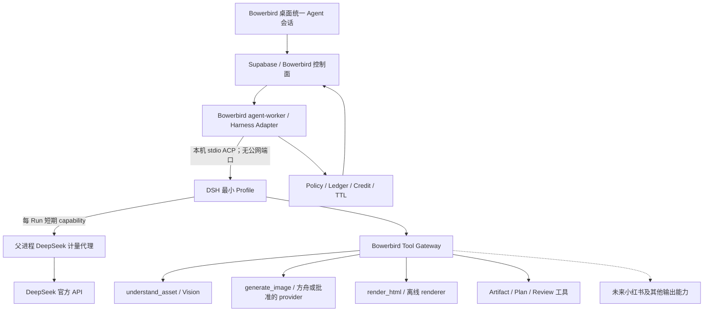

# Bowerbird 通用云端 Agent Harness 专项计划

> 版本：v1.51
> 日期：2026-09-01
> 状态：**U0/U1 完成，U2 本地代码纵切收口；U3 真实计划、HTML 四工具执行与旧基线盲评已全部收口。新链路 Run `run-u3-html-4e835643-146f-4f52-b3b4-8b6eab275fef` 真实完成 `compose_html → render_html → inspect_artifact → finalize_output`：DeepSeek 4 回合（18,434 input / 2,020 output tokens）、方舟 Vision 1 次、renderer 1 次，总耗时 50,499 ms，实际 5 credits，输出 1080×4320 整页 + 4 切片。旧 `bowerbird-html-layout-render` 同素材基线以 1 个 DeepSeek 回合（1,935 input / 795 output）、5,947 ms、1 credit 生成 HTML，但因 3 处 CSS 注释被 renderer 权威拒绝，因此运行结果仍记失败。为进行纯视觉对照，仅删除这 3 处视觉语义不变的注释并本地渲染 1080×2387 样本，不产生 provider usage，不伪装为旧链路成功。A/B 映射用 commitment `bf560f7d…697b1` 预先封存；用户在不知映射时选择 A，揭盲后 A 为新 U3，因此“相对旧专项有实质质量提升”的 U3 人工验收通过。回归为 agent-worker 259/259 + TypeScript、DSH Profile 18/18、html-renderer 71 项（64 pass / 7 本机缺管理 Playwright Chromium skip）+ TypeScript；旧候选镜像 `sha256:b238d6ef…1864` 已过期，本机无 Deno，未部署 FeaturePolicy、migration `0047`–`0049`、Edge 或 VPS。**
> U4 当前：**test-only 双 runtime 全门槛完成（U4 完成）**：远端 migration `0050`、`agent-run` v42、`agent-worker` v46 与 VPS controlled-image DSH 已上线，普通账号/HTML 保持 legacy。真实 18-case 同 eval 的策略正确率 legacy/DSH 均为 77.8%、结构化成功率均为 100%；同一真实图片 case 的 legacy Run `165ad0af-fdbe-4879-80e9-879b4706b121` 与 DSH Run `95ea1bb3-4c08-49f0-aa5b-9243f7261ff7` 又分别通过真实 Worker kill/restart、两个执行 lease、唯一 Ark side effect/final artifact、终态与积分对账。actual paired no-regression PASS：legacy 239,100 ms/7 credits，DSH 236,424 ms/8 credits；人工图像对照无明显 DSH 退化。最终 Worker 镜像 `sha256:c436892f…e16dec`（165,781,303 bytes，用户 `node`），test-only claim grace 已恢复默认 0，安全/资源约束与四消费循环无漂移，最终健康/队列全绿。U4 只证明 test-only 双栈可用，不把 DSH 公开设为默认；下一步为 U5“零新 Harness”小红书复用。**
> U5 当前：**最小“零新 Harness”架构证明完成（未部署、无真实 provider 调用）**。统一计划只增加 `compose_xiaohongshu` 步骤；执行在同一 Bowerbird Run/批准链与同一短生命周期内容执行 session 中复用 `compose_html → render_html → [inspect_artifact] → compose_xiaohongshu → finalize_output`。新增内容限定为保守内部草稿配方/schema、父进程绑定图片顺序的 deterministic compiler/durable tool，以及仅多一个工具的 DSH content profile；仍由现有 `UnifiedPlanningRunProcessor`、Tool Gateway、Ledger、Artifact 与结果反馈停车机制掌权，没有新增 Agent Runner、Run/审批/计费表、migration 或历史 UI。Worker **289/289** + TypeScript、DSH Profile **21/21**，Edge 相关文件 TypeScript 语法检查通过；本轮未登录/发布小红书，未调用 DeepSeek、方舟或 Seedream，未产生费用。U5 只证明复用猜想，不宣称渠道规则、产品 UI 或发布链已完成；下一步 U6。
> U6 当前：**观察与运维/供应链证据已完成，样本仍不足，保持 test-only**。无内容 reporter 按 runtime 聚合失败/取消、p50/p95、积分/provider cost、tool retry/`outcome_unknown`、call/usage identity 重复，并且只从显式 paired 文件读取质量与 crash/re-claim，绝不从普通 claim 次数推断 recovery。U4 上线后窗口（2026-09-01 07:30Z 起）为 legacy 5 / DSH 2 个 terminal Run；call/usage 无重复、终态积分均对账。paired 18-case + 双 runtime 真实 recovery 文件给出两侧策略 77.8%、结构化 100%、recovery 100%，但线上 DSH 仅 2 条且含取消探针，远不足以做公开判断。包含 U5 的最终本地候选为 `sha256:3e9efd…dfa0dd`（165,800,960 bytes，用户 `node`）；断网只读探针全绿。Trivy `0.70.0@sha256:be1190…a41e` 以候选 tar、`network none`、无 Docker socket 完成漏洞与 secret 扫描；删除运行时 package managers、将全部 `js-yaml 4.2.0` 收敛到 `4.3.1` 后，Node HIGH 从 7 降到 0、secret 为 0。仍有当前官方 Debian 基础层 4 CRITICAL / 18 HIGH，均无 FixedVersion、未获明确接受，因此只允许 test-only，不扩大开放。SPDX inventory 为 448 个唯一包、189 个 DSH 包、缺失 license 声明 0，lock SHA-256 `6e714f14…fd19`。公开档位、预算/计费和默认 runtime 决策均未开始；本轮未部署、未调用 provider、未产生费用。
> 适用范围：Bowerbird Cloud Agent、VPS Worker、官方能力工具、项目视觉设定、HTML 长图及后续小红书等内容工作流
> 前置文档：[`PROJECT.md`](../PROJECT.md)、[`AGENT-RUNTIME-PLAN.md`](AGENT-RUNTIME-PLAN.md)、[`HTML-RENDER-PLAN.md`](HTML-RENDER-PLAN.md)、[`研究报告-服务器化CLI与API化改造可行性.md`](研究报告-服务器化CLI与API化改造可行性.md)

---

## 0. 一页结论

Bowerbird 后续不再为 HTML 长图、小红书或其他内容形态分别建设一套 Agent、状态机和 Runner。产品只保留**一个云端 Bowerbird Agent**；视觉理解、图片生成、HTML 排版截图、内容结构化和未来渠道输出都是这个 Agent 可调用的受控能力。

本专项采用以下架构方向：

- 以 **DeepSeek Harness（DSH）+ DeepSeek 官方 API**作为通用 Agent loop 的首选候选，先隔离验证，达标后再渐进迁移。
- DSH 只负责模型循环、会话上下文、工具选择、流式事件、压缩、取消和恢复等通用 Harness 职责。
- Bowerbird 继续拥有账号、权益、积分、Run 状态、计划审批、Policy、幂等 Tool Ledger、Artifact、TTL 和结算；这些业务权威不得迁入 DSH。
- 能力通过 Bowerbird Tool Gateway 暴露；DSH 默认的 shell、文件写入、网页、终端、子 Agent、任意 MCP 和插件安装全部关闭。
- HTML 长图和小红书在产品上是同一 Agent 的能力；内部可拆成“输出配方/Skill + 确定性工具”，但不得再拥有独立 Agent loop。
- 项目视觉设定以冻结、带 hash、只读的 `VisualProfileCapsule` 进入同一 Agent 上下文，供所有能力共享；本次明确任务始终优先。
- 现有受控图像编辑和 HTML Runner 在迁移验收前继续稳定运行；新方向不以一次性重写替换已验证生产链路。

本专项要消除的不是“代码重复”这么简单，而是**认知层重复**：如果每增加一种内容能力都重新实现规划、澄清、审批、上下文、视觉读取、生成、恢复和反馈，最终会出现多个互不理解、质量边界各异的 Agent。统一 Harness 后，新增能力的正常形式应是新增工具或输出配方，而不是新增 Agent。

---

## 1. 专项成立的前因后果

### 1.1 已经发生的事实

1. `bowerbird-controlled-image-edit` 首版证明了 Bowerbird 的控制面、计划审批、工具账本、短期工作区、积分结算和恢复机制可在真实 Supabase/VPS/DeepSeek/方舟链路工作。
2. Codex + Bowerbird Agent 的真实 E2E 也证明：两个都具备思考和对话能力的 Agent 叠加，会重复规划并显著增加耗时。因此两者已暂时互斥。
3. HTML renderer 专项成功交付了安全、确定性的离线渲染工具，但首版 HTML Skill 被刻意限制为一次文本合成、一次渲染、不看图、不生图、不自检。
4. 用户用真实产品图和完整产品推文测试后，结果只是“原图 + 类文档长文”，没有形成预期的信息架构、视觉节奏、缺图判断和补图生成。
5. 这不是 renderer 失败。renderer 准确执行了输入；根因是上游所谓“HTML 排版能力”同时承担了 Agent、规划器和排版器，却没有产品图视觉信息、视觉设定、图片生成工具及多轮观察修订能力。
6. 用户再次明确产品预期：HTML 长图、视觉受控、小红书等本质上都是接入同一云端 Agent 的工具或能力，不应各自发展成新的 Agent 产品。

### 1.2 根因

现有实现以“一个 Skill 对应一个 Run Processor/状态机”为自然扩展单位。这个方式适合验证单个受限能力，却会产生以下结构性问题：

- 每个新能力重新实现模型回合、上下文拼装、澄清、审批、恢复和反馈。
- 图片、视觉设定和生成能力是否可用，由各 Skill 自己决定，导致同一批素材在不同入口中被不同程度地理解。
- Agent 无法跨能力组合动作。例如先理解产品图，再补一张场景图，再排 HTML，最后改写为小红书图文。
- 用户面对的是多个入口和多个“半 Agent”，而不是一个理解目标并选择工具的创作 Agent。
- 测试、计量和安全策略不断复制，增加漂移与重复造轮子的概率。

### 1.3 DSH 调研带来的结论

截至 2026-08-28：

- DSH 是 MIT 许可的开源通用 Agent Harness，模型适配、工具、会话、持久化、审批、沙箱、上下文和 Agent loop 都以插件组合。
- DSH 的 ACP 自动化面适合由程序驱动，支持会话创建/恢复/关闭、取消、语义事件、图片 prompt 和一次性工具权限。
- DSH 已提供 DeepSeek 官方 API adapter；最新官方实现覆盖 thinking、工具调用、Files API、图片输入与缓存计量。
- DeepSeek 官方 API 当前提供文本/推理模型及实验性视觉模型 `deepseek-v4-flash-vision-exp`；视觉模型支持图片与工具调用。
- 上一条只保留为 2026-08-28 调研事实；Bowerbird 产品路线不启用 DeepSeek 视觉模型。DeepSeek/DSH 只做文本 Agent loop，图片理解和结果检查统一通过 Tool Gateway 调用现有火山方舟 Vision。
- DSH 仍处于 developer preview，官方明确会有破坏性变化；文档与发布包也可能短期不同步。

因此，**“DSH + DeepSeek API”技术可行且方向匹配，但只能先作为版本钉死、可回滚的 Harness 候选；不能未经 Spike 直接替换生产 Runtime。**

---

## 2. 不可回退的架构约定

### 2.1 一个 Agent，多种能力

Bowerbird 用户侧只有一个云端 Agent 会话面。它可以根据目标调用不同能力，但能力本身不拥有第二套自由推理循环。

允许：

- 新增一个确定性工具；
- 新增一个只包含领域方法、输出 schema 和工具选择指导的官方输出配方/Skill；
- 为现有工具增加受控参数或 provider；
- 为特定高风险动作增加新的 Policy/审批规则。

默认禁止：

- 为一种内容格式新建独立 Agent loop；
- 为一种渠道复制一套 Run/Conversation/Approval/Ledger；
- 让一个 Agent 再调用 Codex、Claude Code 或另一个 DSH Agent 完成同一层规划；
- 以“Skill”为名引入隐藏的自由循环或不受控工具链。

如果未来确需第二 Agent，设计必须明确证明其承担不同信任域或不同所有权边界，并经过新的架构决策；“开发方便”不是理由。

### 2.2 Harness 可替换，控制面不可让渡

DSH 是实现通用 Agent loop 的候选，不是 Bowerbird 的业务权威，也不是新的云端后端。

以下事实源始终属于 Bowerbird：

- `agent_runs` 及状态机；
- 用户、Entitlement、并发和预算；
- 计划 proposal、批准 hash、拒绝与过期；
- `call_id + args_hash` 幂等 Tool Ledger；
- usage、credit hold/confirm/rollback；
- Artifact 归属、hash、MIME、可见性和 TTL；
- 本地素材库及长期项目历史。

DSH 的 session log 可以保存模型上下文和执行事件，但不得成为积分、审批、Artifact 或 Run 终态的唯一来源。两个系统不应重复拥有同一种业务事实：DSH 事件投影到 Bowerbird display events，业务状态仍由 Bowerbird 提交。

### 2.3 官方 API，不服务器共享订阅 CLI

- DeepSeek 走官方 API key，由受信 VPS 运行时持有。
- 方舟/Seedream 等生成 provider 继续走官方 API。
- 不把共享 Codex/即梦订阅登录态放到 VPS 服务多用户。
- 本机 CLI 只保留直接生成、历史兼容或明确批准的本机执行边界，不再承担云端 Agent 的第二层思考。

### 2.4 视觉设定是共享上下文，不是某个输出格式的私有功能

`VisualProfileCapsule` 在 Run 创建时冻结 `profile_id/version/hash`，按以下优先级进入通用 Agent：

```text
系统安全与当前 phase
  > 用户本次明确目标与明确素材职责
  > 已批准计划与预算
  > 项目视觉设定 capsule
  > 历史偏好与旧对话摘要
```

HTML、小红书、直接生成或其他能力都读取同一冻结 capsule；任何能力不得静默修改或回写项目视觉设定。

---

## 3. 目标架构



### 3.1 推荐进程边界

- Bowerbird Worker 作为父控制器，通过 **ACP stdio** 启动和驱动 DSH；ACP 不绑定公网端口。
- DSH 子进程只获得最小环境：每 Run 的 DeepSeek 代理 capability/loopback endpoint、隔离的 `DSH_HOME`、当前 Run 的只读/临时工作目录；真实 DeepSeek key/base/model、Supabase service role、数据库连接及其他 provider secret 全部留在父进程。
- Bowerbird Tool Gateway 首版可以是 loopback/internal HTTP MCP，也可以是静态 DSH 工具插件；无论传输为何，工具执行端必须再次校验 Run、phase、批准 hash、call id 和 args hash。
- 一个 DSH 进程可承载多个隔离 session，但每个 Run 只允许一个当前 in-flight prompt；容量和并发仍由 Bowerbird Worker 分配。

### 3.2 为什么首选 ACP，而不是 Web UI 或 SDK JSON-RPC

- Web UI 是 DSH 自带产品界面，与 Bowerbird 桌面和控制面重复，不接入。
- ACP 是面向受信自动化控制器的标准接口，覆盖取消、恢复、关闭、图片和权限，适合 Worker 驱动。
- SDK JSON-RPC 当前缺少逐 prompt 结果和单 session cancel/close 等关键语义，不作为首选生产边界。
- ACP 自身不认证，必须保持本机 stdio；如果未来跨主机，需由 Bowerbird 自己增加有认证的控制通道，不能直接暴露 ACP。

---

## 4. 职责矩阵

| 能力 | DSH | Bowerbird | 明确边界 |
|---|---|---|---|
| 模型多轮 loop | 主责 | 观察/中止 | Bowerbird 可随时取消，不改写模型隐藏思维 |
| 模型/provider 适配 | 主责 | 选择、预算、计量复核 | 首批 DeepSeek 官方 API |
| 会话上下文/压缩 | 主责 | 提供可信分层输入 | 安全、审批、预算块不可由模型摘要改写 |
| 工具 schema 与选择 | 注册/呈现 | 定义业务契约 | 只暴露当前 phase 允许的 Bowerbird 工具 |
| 工具执行 | 不直接持业务 secret | 主责 | Gateway 权威校验后调用 provider/renderer |
| 工具审批 | 可请求一次性权限 | 主责 | 业务计划审批走 Supabase 停车，不等同于 ACP permission |
| Run 状态/恢复 | session 辅助 | 唯一权威 | DSH 丢失时可由 Bowerbird checkpoint 重建 |
| 幂等/扣费 | 不作为权威 | 唯一权威 | 相同 call 不重复生成或扣费 |
| Artifact/TTL | 仅引用 | 唯一权威 | 不允许跨 Run 或任意路径读取 |
| 用户 UI/历史 | 不使用 DSH UI | 唯一产品面 | 统一 Agent 时间线，隐藏模型私有思维链 |

---

## 5. 能力模型：Tool、Skill 与输出配方

### 5.1 术语

- **Agent**：唯一的通用云端创作主体，负责理解目标、选择能力、编排步骤和与用户交互。
- **Tool**：有严格输入/输出 schema、预算、权限和副作用边界的动作。
- **Skill / 输出配方**：告诉同一 Agent 如何完成某类成果的领域方法、质量 rubric、推荐工具顺序和最终 schema；不是新的 Agent。
- **Renderer/provider**：确定性执行器或外部官方 API，不参与业务决策。

### 5.2 首批通用工具候选

| 工具 | 作用 | 是否有副作用 | 权威执行方 |
|---|---|---:|---|
| `list_run_assets` | 返回当前 Run 素材清单、caption、尺寸和角色 | 否 | Bowerbird |
| `understand_asset` | 对明确资产做结构化视觉理解 | 有成本、无产物写入或产生私有诊断 artifact | Vision provider + Ledger |
| `submit_plan` | 提交结构化计划并停车等待审批 | 写计划 | Bowerbird 控制面 |
| `generate_image` | 按批准步骤生成缺失素材或编辑图 | 是 | 方舟/批准的 provider |
| `compose_html` | 产出受限 HTML/CSS 文档 artifact | 是 | Agent + Bowerbird artifact commit |
| `render_html` | 将已登记 HTML/素材离线渲染为 PNG/切片 | 是 | 现有 html-renderer |
| `inspect_artifact` | 对父进程选定的当前结果做有界视觉检查；模型参数只能为 `{}` | 有成本 | 火山方舟 Vision + Ledger；批准计划可选且最多一次 |
| `finalize_output` | 确认由父进程选定的最终成果与可见 Artifact；模型参数只能为 `{}` | 写终态候选 | Bowerbird 控制面；checkpoint/反馈协议仍是终态权威 |

工具名和 schema 在 U1/U2 Spike 后冻结；表中名称不是生产兼容承诺。

### 5.3 HTML 长图应如何落位

HTML 长图不再等于“调用一次模型生成 HTML”。完整能力应由同一 Agent按需组合：

```text
理解产品目标与视觉设定
  → 查看必要的产品/品牌素材
  → 设计信息架构与版面节奏
  → 判断缺失的视觉素材
  → 提交包含成本的计划并等待批准
  → 按批准计划生成缺图
  → compose_html
  → render_html
  → 有界视觉检查/必要时提出修订
  → 用户接受并入库
```

现有 `bowerbird-html-layout-render` 仍保持“一次 compose + 一次 render、无 Vision”的已验证边界，直到 U3 新纵切通过。不得直接在旧 Runner 中不断追加 Vision、生图和修订循环；这些能力应在通用 Harness 内实现。

### 5.4 小红书应如何复用

未来小红书专项首先复用同一 Agent、视觉设定、Tool Gateway、审批、账本和 Artifact 图，只新增：

- 渠道内容结构/字数/封面/组图规则；
- 小红书输出配方与结构化 schema；
- 如确有必要的确定性导出或发布工具。

若开发小红书能力时出现新的独立 Agent Runner、第二套会话表或第二套审批状态机，视为违反本专项，必须先停下重新评审。

---

## 6. DSH 接入约束

### 6.1 版本与供应链

- 只使用精确版本或精确 commit，提交 lockfile 和镜像 digest；禁止生产使用浮动 `latest`。
- U1 必须核对实际 npm 包，而不是只按 GitHub `master` 文档判断功能。
- DSH 升级必须跑兼容矩阵、会话恢复、取消、工具 schema、图片和计量回归；不能随普通依赖批量升级。
- 保留 MIT LICENSE 与第三方 notices。
- 首版不 fork DSH；若必须长期维护 core patch 才能满足边界，触发止损评审。

### 6.2 最小 Profile

生产候选 Profile 默认只包含：

- Agent loop；
- DeepSeek adapter；
- session persistence/compaction；
- ACP server；
- Bowerbird 官方工具和 policy hooks；
- 必需的无内容 telemetry。

必须移除或关闭：

- Bash、PowerShell、PTY、任意 subprocess；
- 任意文件写入、代码编辑和宿主文件搜索；
- Web fetch/browser；
- 任意 MCP 动态挂载；
- 社区插件安装、热加载；
- 子 Agent、Agent team、定时任务；
- DSH Web UI。

### 6.3 计划审批桥

DSH Plan Mode 不是 Bowerbird 商业审批。通用 Agent 必须调用 `submit_plan(plan)`：

1. Gateway 校验 schema、预算、素材归属和 phase。
2. Bowerbird 生成 proposal hash，写 Supabase，Run 进入 `awaiting_plan_approval`。
3. 当前 DSH turn 以明确 terminal reason 结束并释放 Worker 租约。
4. 用户批准后，Bowerbird 恢复相同 session 或用 checkpoint 重建，并注入签名批准事实。
5. 后续高成本工具必须携带/派生同一 approved plan hash；计划改变则重新审批。

ACP 的 `session/request_permission` 只用于进程内一次性工具许可或测试控制，不代替这套跨设备、可恢复的计划审批。

---

## 7. DeepSeek 模型策略

### 7.1 首批候选

- 主规划候选：`deepseek-v4-pro`，用于复杂结构、工具编排和质量优先任务。
- 低成本/低延迟候选：`deepseek-v4-flash`。
- 视觉执行方：Bowerbird 现有火山方舟 Vision，由 `understand_asset` / `inspect_artifact` 等受控工具调用；DeepSeek 模型不得接收图片。

模型名称会变化，生产配置必须数据驱动；文档中的型号只是 2026-08-28 调研快照。

### 7.2 固定视觉路线

统一采用 **DeepSeek 文本主 Agent + 火山方舟 Vision 工具**：主 Agent 先读取当前 Run 的可信素材清单，按需调用 `understand_asset` / `inspect_artifact`，再使用结构化视觉事实继续规划。DeepSeek 计量代理必须拒绝任何图片内容，避免形成第二条视觉路径。

U1 曾验证 DeepSeek 实验性 Vision 的 ACP 图片能力，只作为兼容性历史证据，不进入 Bowerbird 产品选型、生产配置或后续 A/B。产品评测聚焦方舟 Vision 的产品图理解、文字/Logo 保真、上下文稳定、成本、延迟和失败可恢复性；辅助视觉模型是工具后端，不是第二个用户侧 Agent。

### 7.3 不由 DSH 自动解决的问题

DSH 能减少通用基础设施开发，但不会自动提高创意质量。以下仍需 Bowerbird 自己定义和评测：

- 信息架构与视觉叙事 rubric；
- 产品/品牌内容不可篡改约束；
- 缺图判断和生成策略；
- 项目视觉设定优先级；
- HTML/小红书等输出配方；
- 视觉检查次数、成本和终止条件；
- 用户何时必须审批。

---

## 8. 状态、幂等和恢复

### 8.1 双层状态但单一业务事实源

- DSH session：模型消息、tool call/result、上下文压缩、Agent turn 状态。
- Bowerbird Run：业务 phase、审批、预算、Artifact、usage、积分和终态。

两者通过稳定映射绑定：

```text
conversation_id / run_id
  ↔ dsh_session_id
  ↔ checkpoint_version
  ↔ current_turn_id
```

映射写入 Bowerbird 控制面；DSH session id 不作为客户端可伪造输入。

### 8.2 工具调用不变量

- `call_id` 继续由 `run_id + phase + logical_slot + revision_index` 确定性派生。
- Gateway 对参数计算规范化 `args_hash`。
- 同 call id + 同 hash 返回既有结果，不重复执行或扣费。
- 同 call id + 不同 hash 默认拒绝；合法修订必须使用新 revision/slot。
- DSH retry 不能绕过 Tool Ledger；provider outcome unknown 不自动重做有成本动作。
- 任何工具只能读取当前 Run 已登记且当前 phase 允许的 Artifact。

### 8.3 恢复优先级

1. 若所钉 DSH/ACP 发布物支持恢复，且 DSH session 与 Bowerbird checkpoint 都完整，可恢复同一 session，但仍以 Bowerbird checkpoint 校验业务状态。
2. 对当前 `@deepseek-ai/dsh-acp@0.1.1-rc.2`，每个进程只使用 connection-scoped fresh session；Worker/DSH 重启时以 Bowerbird 的结构化 checkpoint、已完成工具结果和必要对话摘要创建新 session。缺少 `list/resume/close` 不阻塞隔离开发，也不得伪装成已支持原 session 恢复。
3. 若 Bowerbird 对某个有成本 call 的结果不确定，保持 `outcome_unknown`，不因 DSH 丢失而重做。
4. 恢复不得重新申请已确认 usage，也不得复用已失效的批准 hash。

---

## 9. 安全与隐私边界

- DSH ACP 只通过父子进程 stdio连接，默认无公网入站。
- DSH 不持 Supabase service role、支付密钥、方舟密钥、renderer token 或真实 DeepSeek key；它只持每 Run 短期 capability，经父进程计量代理访问 DeepSeek。
- Tool Gateway 是唯一业务副作用出口，所有请求再次做身份、Run、phase、审批、预算和 schema 校验。
- 任何 prompt、Skill、图片 OCR、网页正文或模型结果都按不可信数据处理，不能提升工具权限。
- Run 工作区短期、隔离、容量受限；输入/中间/最终产物沿用现有 TTL 和用户可见性规则。
- 不开放用户安装 DSH plugin、MCP、Skill 或任意代码。
- 日志只记录无内容标识、状态、时延、usage、稳定错误码和版本；不记录正文、图片、签名 URL、API key 或隐藏思维链。
- DeepSeek/DSH 新增的 Files API 只允许上传当前 Run 已授权图片，记录 provider file id、hash 和过期策略；Run 清理时尽力删除远端临时文件。

---

## 10. 分阶段任务卡

### U0：决策与调研归档

状态：**完成（2026-08-28）**

- [x] 明确一个云端 Agent、多种能力的产品边界。
- [x] 明确 DSH 只接管通用 Harness，不接管 Bowerbird 控制面。
- [x] 调研 DSH plugin/profile、工具 policy、ACP、DeepSeek adapter、视觉与许可。
- [x] 建立本专项并与旧 Runtime/HTML 文档交叉引用。
- [x] 在 `PROJECT.md` 和 `AGENTS.md` 固化避免重复造轮子的规则。

### U1：隔离 DSH + DeepSeek Spike

目标：只证明 Harness 候选的真实能力，不修改生产入口、数据库和计费。

- [x] 锁定实际 npm 发布版本，记录 Node、包版本、lockfile 和许可证；正常路径使用 npm/npx，不克隆仓库。镜像 digest 留到首次 U2 容器候选。
- [x] 构造最小 ACP Profile，证明默认 coding/web/subagent 工具均未加载。
- [x] 通过 stdio 实测 initialize/new/prompt/cancel，并对真实在途 prompt 得到 `cancelled`；同时实测 `list/resume/close` 在 rc.2 为 `-32601`，采用 Bowerbird checkpoint → fresh session 重建边界，不等待新版。
- [x] 使用 DeepSeek 官方 API 完成同 session 双轮文本 tool loop、结构化参数、thinking 关闭与错误归一化；usage 由 adapter/ProviderResult 采集，已确认当前 ACP wire 不承载 usage。
- [x] 验证 adapter 不映射 `tool_choice`：唯一 scoped tool 在两轮真实调用中均收敛并返回不同不可猜证明。U2 仍须实现结果校验 + 有界纠正，并在真实业务 eval 中判定是否触发“频繁退化为自由文本”止损。
- [x] 回放现有 DeepSeek 中文引号/非严格 JSON tool arguments fixture：adapter 原样输出非严格 arguments，确认其不会替 Bowerbird 做参数修复或放宽校验，Tool Gateway 仍须 fail closed。
- [x] 历史 Spike 曾用真实图片验证 DeepSeek 实验性 Vision 的 ACP inline base64 与多轮历史；该结果只保留为兼容性记录，按 2026-08-30 用户决策不进入产品路径。
- [x] 产品视觉路线固定为“DeepSeek 文本 Agent + Bowerbird 火山方舟 Vision 工具”，取消 DeepSeek Vision 主模型 A/B；代理拒绝图片输入已有回归。
- [x] 验证子进程只获得白名单环境，无法读取 Supabase/provider 业务 secret。
- [x] 输出兼容性报告，不改 FeaturePolicy，不部署生产 VPS。

验收：取消可收敛；Run 可由 Bowerbird checkpoint 重建且不重复副作用；工具 schema 不漂移；图片链路可用；无默认高危工具；版本可复现。任一核心项只能依赖未发布 `master` 或长期 core patch 时暂停采用。

**U1 技术入口结论（2026-08-28；视觉路线于 2026-08-30 收口）：通过，允许进入 U2 隔离开发，不授权生产替换。** 隔离 Spike 位于 [`spikes/unified-agent-harness-u1/`](../spikes/unified-agent-harness-u1/)，离线测试 9/9。Profile 精确钉死 DSH/ACP/base/DeepSeek adapter/tools `0.1.1-rc.2` 与 ACP SDK `0.25.1`，组合配置审计确认 shell、PowerShell、文件、Web、Skill、子 Agent、workflow、凭据扫描和遥测均关闭；DSH 子进程默认不获得业务 secret。经用户授权复用本机 Bowerbird Cloud DeepSeek key 的真实 smoke 已完成同 session 双轮确定性文本 tool loop 与在途取消；当时完成的 DeepSeek Vision inline base64/无图续轮只保留为兼容性历史，不进入产品路径。rc.2 的 `session/list/resume/close` 与 ACP usage/工具事件仍缺失，但 Bowerbird 原本就是 Run/checkpoint/Tool Ledger 唯一业务权威，因此当前采用 connection-scoped fresh session + checkpoint 重建，不再把未发布 `master` 或新版 npm 当作继续开发前提。U2 必须证明重建幂等和有界纠正；失败时再触发止损。产品视觉路线固定为 DeepSeek 文本 Agent 按需调用 Bowerbird 现有火山方舟 Vision 工具，不再进行 DeepSeek Vision 主模型 A/B。

### U2：Bowerbird Harness Adapter 与 Tool Gateway

目标：让 DSH 在不拥有业务权威的前提下调用现有能力。

- [x] 定义 `HarnessAdapter/HarnessSession`，使当前自研 Kernel 与 DSH 经窄端口在测试中并存；Kernel 不直接依赖 DSH npm 包。
- [x] 定义本地 Tool Gateway 首层合同：绑定 run/lease/phase、由可信 plan slot 派生 call id、闭集参数 validator、最终 allowlist 交集与稳定拒绝码；Worker Token/HTTP 认证继续复用现有控制面，待真实 transport 接线时验证。
- [x] 首批本地控制面工具合同：`list_run_assets` 只读当前 Run 闭集 manifest、`submit_plan` 校验素材归属/依赖/步数/预算并返回 `awaiting_plan_approval` terminal reason；两者均经 scoped Gateway，模型不能自报 Run 或 call id。
- [x] `submit_plan` 的 Worker→Edge transport 与 migration `0047` 本地代码完成：模型不能提交积分；Edge 复核闭集计划、Run 素材归属、proposal/args hash，并按可信 Policy v1、Run provider 与版本化 `service_costs` 计算模型/Vision/生图/renderer 权威估算；稳定 source call 落审批表。
- [x] 在全新本地 Supabase 应用 `0047`–`0049`：migration `0001`–`0049` reset 通过，`agent_runtime.sql` 34/34；真实 Edge E2E 已验证计划落库、服务端估算、相同调用重放、漂移/已结束拒绝、停车释放租约、可信图片尺寸登记与批准后 fresh claim。预算拒绝另由共享估算与 Edge/Worker 合同测试覆盖；仍未部署生产。
- [x] `list_run_assets` 已接实际 claim artifact manifest：Edge 在原有上传字节校验中解析 PNG/JPEG/WebP 尺寸，migration `0049` 保存可信宽高，claim 只返回元数据；Worker 稳定排序、映射 input/reference/generated 并生成 manifest hash，不暴露 URL/路径，旧 artifact 缺尺寸时 fail closed。
- [x] 首个 provider 工具 `understand_asset` 本地代码完成：模型只提交当前 Run 的 `assetId + focus`；父进程从 claim 注入可信 artifact sha256 并绑定 `args_hash`，经 `RunWorkspace` 校验下载、方舟 Vision 结构化结果校验、私有 diagnostic artifact、usage ledger 与 durable replay/reconcile 闭环。
- [x] 父进程 `UnifiedPlanningToolBridge` 已把 `list_run_assets`、`understand_asset`、`submit_plan` 收口到同一 scoped Gateway；Run/lease/phase/allowlist/revision/stable logical slot 均由父进程注入，模型不能自报。
- [x] 增加受信 Bowerbird DSH 插件→父进程 Bridge 的最小本机 RPC：只绑定 `127.0.0.1` 随机端口，以每 Run 32-byte 随机 capability 授权，64 KiB 请求上限、常量时间鉴权、关闭即失效；DSH 子进程只得到 endpoint + capability，不获得 Worker Token、方舟 key、Supabase/service role 或其他业务 secret。
- [x] `UnifiedPlanningHarnessRunner` 已统一管理 capability server、fresh DSH session 与确定性关闭；真实钉版 DSH/ACP + 受信插件 + 假 DeepSeek SSE + 父进程 Gateway 的全本地 E2E 已完成 `list_run_assets → submit_plan → end_turn`，不访问公网、不调用真实 provider。
- [x] 正式 Worker 增加静态 `bowerbird-unified-agent@0.1.0`、hash 钉版指令、planning processor 与唯一 Skill dispatcher 分支；processor 在启动 DSH 前先保存身份/输入绑定 checkpoint，只有 `submit_plan` 权威停车且 DSH `end_turn` 才成功。现役主入口未注入部署 adapter 时稳定拒绝，不会因代码存在而暗开生产能力。
- [x] 正式 processor + 真实 DSH/DeepSeek + 真实方舟 Vision fixture 已完成 `list_run_assets → understand_asset → submit_plan → end_turn`；验证 checkpoint、单次 Vision usage、私有 diagnostic artifact、durable complete、权威审批停车与方舟 secret 不进入 DSH 子进程。
- [x] DSH Profile/ACP 已打入本地部署候选；基础镜像按 digest 钉定、依赖 frozen-lockfile 安装，每 DSH 进程使用 32 MiB tmpfs 下的独立临时 `DSH_HOME`，只复制轻量配置并链接只读依赖。同一非 root、只读、无网络、cap-drop ALL 容器连续两次 DSH 配置启动通过。
- [x] 临时 `DSH_HOME` 生命周期已接入正式 `NodeDshAcpPort`；候选容器已完成真实 ACP initialize/new-session/cancel/dispose，退出后 runtime root 清空。子进程环境为精确 allowlist：默认无 provider；启用模型时只增加父进程代理的 64 位 capability 与 loopback base URL，真实 DeepSeek/方舟/Worker/Supabase secret 均不下发。
- [x] Worker 唯一入口已增加精确 `true` 的显式配置闸门并注入正式 ACP port；未配置、`false` 或畸形值分别保持禁用/启动拒绝。候选容器已从该入口创建正式 processor，完成 checkpoint、`list_run_assets → submit_plan → end_turn`、闭集工具面、当前 Run 素材回传、父进程审批停车和清理验证。
- [x] 父进程 DeepSeek 计量代理已接入正式入口：一 Run 一实例、只监听 loopback、请求/响应有界；模型回合复用 `DurableToolDispatcher`，真实 SSE/usage 先落私有 diagnostic artifact，再落现有 usage ledger；相同请求恢复不重复上游，usage 缺失或结果不确定按最小计量停车。候选容器以真实 DSH + 本机 provider fixture 验证两个 durable model call 与精确 usage，真实 key 未进入子进程。
- [x] 用户手动执行的单回合 adapter smoke、两轮真实工具 loop + 在途取消及完整正式 smoke 均通过；最终真实摘要为 3 个 DeepSeek 文本 usage / diagnostic、1 个火山方舟 Vision usage、4 个 durable succeeded call，结构化 observation、权威 approval 与 DeepSeek/方舟 secret 父进程隔离全部有效。
- [x] 批准后首个 `generate_image` 执行纵切已接入：只从控制面签名对象恢复精确批准计划；Gateway 绑定批准 hash 与父进程派生 call id，模型不能改 prompt/素材/角色/身份；复用现有 Seedream durable executor，支持多步依赖、唯一 final artifact、checkpoint 与结果反馈停车，未支持的计划形状在任何 provider 副作用前拒绝。
- [x] 本地 Supabase/Edge 批准后执行 E2E 已通过：批准停车/重放/漂移拒绝、签名计划恢复、现有 Ark executor Mock Seedream durable call、唯一 final artifact、单次 image usage、结果停车、用户接受与 succeeded 全链成立；生产 HTTPS 校验保持不变，本地 HTTP storage 只在脚本 fetch 层使用测试别名。
- [x] `generate_image` 关键崩溃点故障注入已通过：provider 返回图片后、durable complete 前进程死亡时，新进程只从当前 Run 的确定性 call-id 输出路径重建并复核图片，不二次调用 Seedream；artifact 已完成但执行 checkpoint 保存失败时，重建派生相同 call id、恢复同一 durable 结果并重新停车，不重复上游、上传或 usage。
- [x] HTML 执行 session 的最小 DSH 工具面已隔离：独立钉死 patch 只注册 `compose_html` / `render_html` / `inspect_artifact` / `finalize_output`，与规划 session 的三工具 patch 分离；正式 ACP port 可显式选择 `html-execution`，runtime home 与候选构建只复制闭集 patch/plugin，未增加环境变量或业务 secret。
- [x] HTML 父进程纵切已接正式 processor：批准 plan shape/资源顺序先于任何副作用校验；compose durable artifact、render 参数、可选一次 inspect 的图片/SHA/目标和 finalize 的 primary/visible Artifact 均由父进程绑定；模型除 compose 外只能提交 `{}`。执行结果保存 checkpoint 并停车，故障注入重放不重复上传、renderer 或 Vision。
- [x] HTML 四步组合 E2E 已通过：真实钉版 DSH/ACP + 本地假 DeepSeek SSE 经独立 Profile 调用父进程 bridge，`compose_html` durable 提交 HTML，`render_html` 走现有 renderer HTTP wire，`inspect_artifact` 复用 Mock Ark Vision durable 链，`finalize_output` 返回父进程选定成果后 `end_turn`；renderer/Vision 各调用一次。
- [x] 统一 input 已接闭集 `htmlOutput`（viewport/capture/background）：旧输入规范化冻结安全默认，新输入复用 renderer 数值边界；checkpoint 是批准后执行的唯一规格源，模型与部署配置不能改写。
- [x] 接入可选一次的 `inspect_artifact` 与父进程权威 `finalize_output`；检查只读本 Run 新鲜渲染截图，复用火山方舟 Vision diagnostic/usage/durable ledger，完成工具不直接写业务终态。真实 provider Run 与生产授权完成前，不把统一 Agent 标记为已上线。
- [x] Gateway 已复用现有 `deriveCallId` 与 `DurableToolDispatcher` 的 argsHash、prepare/submitted/complete、restore/reconcile/outcome_unknown，不另造副作用账本；PolicyEngine/usage/Artifact/TTL 在接首批真实工具时继续复用现有实现。
- [x] Harness 合同只接收 committed content；当前 rc.2 不把 ACP 未提供的工具事件或隐藏思维链伪造进 display events。
- [x] 完成真实本地停车审批、Worker 释放租约、响应丢失重放、批准后恢复及身份漂移 fail closed；fresh claim 收到新租约、原 checkpoint、approved plan hash 与 planned tool count。生产/VPS 版本失配仍留后续纵切。

验收：相同 call 重放不重复副作用/扣费；跨 Run、未批准、超预算、未注册工具全部拒绝；DSH 崩溃后可由 Bowerbird 恢复。

**U2 进展（2026-08-28–29，本地隔离）**：`apps/agent-worker/src/harness/` 已加入 DSH ACP fresh-session Adapter、Bowerbird checkpoint 首轮重建上下文和 scoped Gateway；Spike 侧已用真实 ACP SDK + DSH 子进程实现窄 `DshAcpPort`，经现有 Cloud DeepSeek 配置验证全新 session 能从 checkpoint 读回既有 `artifact-existing` 并以 `end_turn` 收束。Gateway 同时支持复用既有 `DurableToolDispatcher` 的 provider 分支与受限控制面分支；`list_run_assets` 不接受模型提供的 runId，现已由真实 claim 构造闭集 manifest：Edge 在既有上传校验的同一次字节读取中解析 PNG/JPEG/WebP 头，migration `0049` 持久化服务端可信宽高，claim 返回宽高但不新增内容下载，Worker 过滤非图片、稳定排序、映射 input/reference/generated 并生成 hash，旧图片缺尺寸则明确失败。首个 provider 工具 `understand_asset` 只接受当前 Run 的 `assetId + focus`，由父进程注入 claim 中可信 artifact sha256 并把它纳入 `args_hash`，随后复用 `RunWorkspace` 下载验 hash、方舟 Vision JSON 合同、私有 diagnostic artifact、现有 usage ledger 与 durable prepare/submitted/complete/restore/reconcile；相同调用重放不会再次请求 provider 或重复计量。新增 `UnifiedPlanningToolBridge` 把 `list_run_assets`、`understand_asset`、`submit_plan` 放进同一 Gateway，并由父进程注入 Run/lease/phase/allowlist/revision 与按稳定素材顺序、focus 派生的 logical slot。对 rc.2 实际调用路径的审计同时确认：ACP `sessionUpdate` 只返回 committed message，DSH 注册工具在子进程插件内执行，ACP client 不提供父进程工具调用 callback；因此下一层必须是受信 Bowerbird 插件经短期每 Run 本机 capability 把仅 `toolName + arguments` 转发给父进程 Bridge，不能把 ACP 文本事件伪装成控制通道，也不能向子进程发 Worker Token/provider key。`submit_plan` 继续由 Edge 独立复核闭集 schema、素材归属、`proposalHash/argsHash`、Cost Policy v1 与剩余预算；migration `0047`–`0049`、全新库 reset、数据库 **34/34** 和真实 Edge 停车/fresh claim E2E 基线保持有效。最终回归：agent-worker **206/206** + TypeScript；既有 Edge Deno check、共享图片元数据/计价计划 **8/8**、数据库 **34/34**、U1 离线 **9/9** 与真实 Adapter smoke 继续通过。**未完成/未部署**：尚缺 DSH 插件→父进程本机 transport、统一 processor 与真实 Vision fixture smoke，也未接生图/HTML/完成工具；rc.2 ACP 不给 usage wire，DSH 模型回合实际计量必须在生产候选前补齐，权威计划估算不能替代 usage ledger；migration/Edge/VPS/FeaturePolicy 均未部署。

**U2 本机能力桥与正式 dispatch 增量（2026-08-29；覆盖上段“尚缺 transport/processor”的旧快照）**：新增 loopback server，仅监听 `127.0.0.1` 随机端口；每实例生成 32-byte capability，Authorization 常量时间比较，请求 wrapper 精确闭集且最多 64 KiB，错误只回稳定码，父进程 `callId` 不返回模型，关闭连接时 capability 立即作废。受信 `bowerbird-planning-tools` DSH 插件只注册 `list_run_assets / understand_asset / submit_plan`，只读取 endpoint/capability 两个专用环境变量，转发模型 name+arguments 和取消信号；`submit_plan` 获权威停车结果后使用 DSH `concludeTurn()`。`UnifiedPlanningHarnessRunner` 统一持有 server、fresh session 与 teardown。真实 `@deepseek-ai/dsh-acp@0.1.1-rc.2` 已无 provider 启动加载插件；另以本机假 DeepSeek SSE 驱动真实 DSH 两轮工具循环，完整经过插件 HTTP → 父进程 Planning Bridge → scoped Gateway → 控制面 fake port，成功 `list_run_assets → submit_plan → end_turn`，并验证 DSH 请求只暴露三工具、tool result 含当前素材、Run/lease/call identity 全由父进程派生。正式 Worker 侧新增静态 hash 钉版 `bowerbird-unified-agent@0.1.0`、`UnifiedPlanningRunProcessor` 和唯一 dispatcher 分支：新 Run 先冻结输入并保存 checkpoint，随后才开 DSH；只有父进程观察到 `submit_plan` 停车且回合为 `end_turn` 才返回成功，已批准但尚无执行工具的 Run明确拒绝。现役主入口不注入 DSH 部署 adapter，误入统一 Skill 时 `agent_skill_runner_unavailable`，保持生产关闭。最终回归：agent-worker **216/216** + TypeScript，U1/U2 Profile **12/12**。**仍未完成/未部署**：`understand_asset` 尚未经正式 processor + 真实 DSH turn 调用真实方舟 fixture；DSH Profile/ACP 依赖尚未打入部署候选，生图/HTML/完成工具和 DSH 模型实际 usage wire 未接；migration/Edge/VPS/FeaturePolicy 均未部署。

**U2 正式真实 Vision 增量（2026-08-30；覆盖上段“尚缺真实方舟 fixture”的旧快照）**：新增显式双闸门 smoke，只有命令行传入 `--allow-real-vision` 且父进程具备现有 Cloud DeepSeek/方舟配置时才运行。它复用正式 `UnifiedPlanningRunProcessor`、真实 `DshAcpHarnessAdapter`、受信 DSH 插件、loopback capability 与 `UnifiedPlanningToolBridge`，以仓库 `128x128.png` fixture 完成 `list_run_assets → understand_asset → submit_plan → end_turn`。结果确认 checkpoint 已保存、结构化 observation 合同有效、私有 diagnostic artifact 已保存、Vision usage 恰为 1、durable succeeded 恰为 1、权威 approval 已停车，且 `ARK_API_KEY` 只留在父进程、未下发 DSH 子进程；输出只含布尔/计数摘要，不打印模型内容或 secret。最终回归：agent-worker **216/216** + TypeScript，U1/U2 Profile **13/13**。本次没有部署或修改 FeaturePolicy。试跑同时发现 DSH 启动会在 Profile `node_modules` 内执行 pnpm 软链接自愈；只读开发沙箱会在 `unlink` 阶段失败，因此部署候选必须把需要自愈的有界 Profile 链接树放入可写 tmpfs/启动副本，或在镜像构建期预组装并证明运行期零写入，不能为此放宽 Worker 根文件系统。DSH Profile/ACP 打包、其余工具、VPS 接入和 DSH 模型实际 usage wire 仍未完成。

**U2 只读部署候选增量（2026-08-30；覆盖上段“尚缺 Profile/ACP 打包”的旧快照）**：新增独立 `Dockerfile.unified-harness-candidate` 与 compose 验证服务，不改现役 `Dockerfile.generation`。Node `24-bookworm-slim` 钉定 public ECR digest `sha256:ba849c60…095a71e`，pnpm `11.10.0` 按修正后的 frozen lock 安装 449 个包并通过 506 条供应链策略检查。实证排除了“镜像构建期预自愈”方案：rc.2 第二次启动会先命中自己生成的 fallback，把 `dsh-code-runtime` 目标计算成 fallback 自身并尝试重写；即使只给 fallback tmpfs，DSH 仍会无条件重写 Profile `cordis.yml`。最终方案把 Profile 配置复制到每进程唯一的临时 `DSH_HOME`，只以目录链接复用只读依赖，退出后只删除该临时 child。候选镜像 `sha256:1ef65b22…12d5e`（约 153 MiB）已在同一容器内连续两次通过 DSH 配置启动：用户 `node`、rootfs read-only、`/dsh-runtime` 32 MiB tmpfs、`network_mode:none`、`cap_drop:ALL`、危险工具禁用且规划插件存在。最终回归：agent-worker **218/218** + TypeScript，U1/U2 Profile **13/13**。这只证明依赖打包与只读启动合同；正式 ACP port 尚未使用该临时 home，现役主入口仍 fail closed，未部署生产。

**U2 正式 ACP 容器增量（2026-08-30；覆盖上段“正式 ACP port 尚未使用临时 home”的旧快照）**：新增正式 `NodeDshAcpPort`，每次连接创建独立临时 `DSH_HOME`，以闭集环境启动钉版 DSH/ACP，并实现 initialize/new-session/prompt/cancel、只接收 committed text、超时和确定性 dispose；只有显式 provider 模式能获得 DeepSeek key/base URL，方舟、Worker、Supabase 等业务 secret 始终不进入子进程。候选镜像通过两次配置启动后，继续使用该正式 port 完成真实 ACP initialize/new-session/cancel/dispose，最终 `/dsh-runtime` 清空；安全边界仍为用户 `node`、rootfs read-only、32 MiB tmpfs、`network_mode:none`、`cap_drop:ALL`。首次 live ACP 启动暴露 Linux 专属约束：DSH 在没有 `hmr` service 时会自动补入 Cordis HMR，而当前插件需要 Node `--expose-internals`；正式 port 因此只对镜像内钉版受信 DSH/插件添加该 Node 启动标志，模型仍无 shell/fs/web/动态插件能力。当前候选镜像 `sha256:57a312ca…35a0cad`（160,667,232 bytes，约 153 MiB）。最终回归：agent-worker **221/221** + TypeScript，U1/U2 Profile **13/13**。现役主入口仍未注入该 port并保持 fail closed；未部署生产或修改 FeaturePolicy。

**U2 正式入口与 processor 容器增量（2026-08-30；覆盖上段“现役主入口仍未注入”的旧快照）**：Worker 唯一入口新增 `BOWERBIRD_UNIFIED_AGENT_DSH_ENABLED` 部署闸门，只有精确 `true` 且 Profile template/runtime root 齐全时才构造正式 `UnifiedPlanningRunProcessor → DshAcpHarnessAdapter → NodeDshAcpPort`；未配置/`false` 保持原有 `agent_skill_runner_unavailable`，其他值或缺配置启动即拒绝。候选探针在 `network_mode:none` 内启动本机假 DeepSeek，通过该正式入口执行 processor：先保存 checkpoint 和 planning event，再由真实 DSH/受信插件仅暴露 `list_run_assets / understand_asset / submit_plan`，两轮模型夹具读取当前 Run 素材并提交计划，父进程完成权威审批停车，最后关闭 ACP、capability server 和临时 home。候选镜像 `sha256:63d634b9…83ca63c`（160,670,342 bytes，约 153 MiB）；agent-worker **224/224** + TypeScript，U1/U2 Profile **13/13**。部署环境未设置该闸门，未调用公网或真实 provider，未部署 migration/Edge/VPS/FeaturePolicy。

**U2 父进程模型计量代理增量（2026-08-30；覆盖上段“模型实际 usage 未接”的旧快照）**：新增每 Run 独占的 `MeteredDeepSeekProxy`，仅监听 `127.0.0.1`，DSH 子进程只获得随机 32-byte capability 及 loopback base URL；真实 DeepSeek key/base/model 始终由父进程持有。代理只接受有界的 `POST /chat/completions`、钉定模型、流式纯文本消息和单一 in-flight 请求；生产 upstream 强制 HTTPS。每次请求按 Run/phase/规范化请求派生稳定 call id，复用现有 `DurableToolDispatcher` 执行 `model_turn`：完整 SSE 与 provider usage 保存为私有 diagnostic artifact，精确 prompt/completion token 写入 usage ledger；相同请求恢复只重放 artifact，上游不再调用；SSE 缺 `[DONE]`、usage 缺失或传输结果不确定时记最小 usage 并停车为 `outcome_unknown`。正式 ACP SDK 也改为从不可变 Profile 直接加载，避免依赖 Worker 包解析；dispose 同时识别 exit code 与 signal code，修复信号结束被误报卡死。最新候选镜像 `sha256:b02ff28f…d8ba931`（160,677,670 bytes）在非 root、rootfs read-only、network none、cap-drop ALL 下完成两个真实 DSH 模型回合、两个 durable succeeded model call、精确 12/4 + 12/4 token usage、闭集工具与审批停车，真实 DeepSeek key 保持在父进程，runtime home 全部清理。回归：agent-worker **228/228** + TypeScript，U1/U2 Profile **13/13**。用户先后授权两次真实-provider smoke，两次均在首个模型回合收到 HTTP 502；第二次已运行保留上游 4xx/5xx 状态的版本，仍无法仅凭 DSH 的状态判断是实际上游 502，还是代理的流完整性/usage/大小校验失败。现停止自动重跑，最低成本手动诊断与成功标志见 Spike README。部署闸门关闭，未改 FeaturePolicy，未部署 migration/Edge/VPS。

**U2 真实 502 手动收敛与 SSE 修复增量（2026-08-30；覆盖上段“仍无法判断”的旧快照）**：用户按手动诊断路径先完成单回合 `adapter-smoke`，得到 `sessionCreated/rebuiltFromCheckpoint/completedArtifactObserved=true` 与 `end_turn`；随后完成 `network-smoke`，两个真实工具回合均 `proofObserved=true`，在途取消为 `cancelled`，stderr 为空。由此排除 DeepSeek key/模型/余额基础访问、网络出口、DSH/ACP 和原生 tool loop。离线适配器契约同时确认 DSH 已发送 `stream_options.include_usage=true`，不是 usage 未请求。最终在代理解析器中复现：真实 SSE 可合法以 `data: [DONE]` 直接结束，而旧代码强制要求其后再有空行，因而把 200 成功流记为 `deepseek_stream_incomplete` 并向 DSH 返回 502。解析现以精确 `[DONE]` 行及其后仅允许空行作为终止条件，既接受无尾换行/单尾换行，也拒绝终止行后数据；新增专项回归。agent-worker **229/229** + TypeScript、Profile **13/13**，候选镜像 `sha256:c00907b3…c8fde3e`（160,677,835 bytes）无网络复跑全绿。修复后的完整真实计量 smoke 尚未执行，仍需用户手动决定。

**U2 正式 smoke 复测与安全诊断增量（2026-08-30；覆盖上段“尚未执行”）**：用户手动运行修复后的 `formal-vision-smoke`，仍在首个 DeepSeek 文本回合收到 DSH HTTP 502，尚未进入方舟 Vision；因此 SSE 行尾缺陷虽真实存在且已修复，但不能再宣称是本次 502 的唯一根因。正式 smoke 现从父进程 durable call 记录提取且只输出 `toolName/status/safeErrorCode`、模型/Vision usage 与 diagnostic 阶段计数、已成功 durable call 数，不包含 key、prompt、模型正文或 provider 响应正文；下一次手动运行可稳定区分 `deepseek_http_<status>`、`deepseek_stream_incomplete`、`deepseek_stream_invalid`、`deepseek_usage_missing`、`deepseek_response_invalid` 等边界。视觉路线同时按用户决策固定为现有火山方舟 Vision 工具，DeepSeek/DSH 仅做文本规划；代理图片输入拒绝回归继续有效。Profile **13/13**；没有自动重跑真实 API，也没有部署生产。

**U2 第三文本回合定位与 durable 诊断修正（2026-08-30；覆盖上段“首回合/未进入 Vision”判断）**：诊断版真实输出为 `modelDiagnostics=2`、`visionUsage=1`、视觉 observation 合同有效、`durableSucceededCalls=3`、审批尚未保存，证明列素材和请求视觉的两个 DeepSeek 文本回合、一次火山方舟 Vision 均已 durable succeeded，502 实际发生在收到视觉事实后用于 `submit_plan` 的第三个 DeepSeek 文本回合。`modelUsage=8` 不是八次不同模型调用，而是 smoke fake control 对同一 outcome-unknown call 的 DSH 重试重复累加；真实 ledger 按 call id 幂等。更关键的是 `DurableToolDispatcher` 在 reconcile 不到结果时会把第一次保存的具体 safe code 覆盖为 `provider_outcome_unknown`，使诊断再次退化。现已在 `PreparedToolCall` 暴露既有 `safeErrorCode`，failed/outcome-unknown replay 保留首次码；代理把 HTTP 200 后 `response.text()` 读取失败显式归一为 `deepseek_transport_unknown` 并最小计量；formal fake usage 改为按 `kind + callId` 幂等，成功断言修正为 3 个 DeepSeek 文本回合、1 个方舟 Vision、4 个 durable succeeded call。回归：agent-worker **231/231** + TypeScript、Profile **13/13**；新候选镜像 `sha256:b84e9a7e…206d8`（160,678,162 bytes）在非 root、只读、无网络、cap-drop ALL 下通过。没有自动调用真实 provider或部署生产；下一次手动失败应直接显示首次具体 safe code。

**U2 大 SSE 耐久化修复与视觉单路径收口（2026-08-31；覆盖上段“待取得具体码”）**：用户手动重跑后，第三个 DeepSeek 文本回合的首次保真码为 `deepseek_response_invalid`；同时 `modelUsage=3`、`modelDiagnostics=2`、`visionUsage=1`、`durableSucceededCalls=3`，验证 usage 幂等与阶段定位修复生效。旧码只说明 HTTP 200 后正文为空或 UTF-8 SSE 超过 60 KiB，不能从该次摘要进一步区分；但第三回合包含视觉事实且前两回合正常，响应大小是优先候选。代理现把正文上限与 diagnostic artifact 上限解耦：完整 SSE 最多 512 KiB，空正文和超限分别返回 `deepseek_response_empty` / `deepseek_response_too_large`；成功流以 schema v2 的 gzip+base64、原始字节数和 SHA-256 写入最多 64 KiB 的私有 JSON artifact，恢复时以 512 KiB 上限解压，逐项复核长度/hash/UTF-8/SSE `[DONE]`/usage/provider request id。超过 64 KiB 的本地 SSE 已证明首次响应与 durable replay 逐字节一致且只调用一次上游；压缩后 artifact 仍小于 64 KiB；空正文与超过 512 KiB 也各有独立回归并保持首次 safe code。现役 Profile 同时删除 DeepSeek Vision 模型声明、专用 patch、`smoke:vision` 和脚本，历史 ACP 图片结果只留在兼容性报告。回归：agent-worker **234/234** + TypeScript、Profile **13/13**；候选镜像 `sha256:fb9f6a6d…26a110`（161,398,940 bytes，用户 `node`）在非 root、只读、无网络、cap-drop ALL 下完成正式两回合 fixture、durable usage、闭集工具、审批停车和清理。未自动调用真实 provider，未部署生产；下一步只需用户再运行一次正式纵切确认真实第三回合。

**U2 真实 3+1 验收与批准计划恢复合同（2026-08-31；覆盖上段“待真实确认”）**：用户手动运行正式纵切得到 `ok=true`、`modelUsage/modelDiagnostics=3`、`modelInputTokens=4910`、`modelOutputTokens=538`、`visionUsage=1`、`durableSucceededCalls=4`、`approvalSaved=true`，结构化视觉事实和 DeepSeek/方舟 secret 父进程隔离均有效；真实新计量纵切至此通过。随后审查批准后执行入口发现 fresh claim 只有 hash/步骤数、没有批准计划正文，若直接接生图将迫使 Worker 猜计划或信任 DSH 重述。Edge claim 现只查询当前 Run、`approved` 状态、精确 proposal hash 且内容未删除的审批对象，返回短期签名 URL/hash/步骤数；Worker 以 64 KiB 上限下载，复核对象 SHA-256、闭集 plan schema、canonical hash 与步骤数。批准计划缺失、URL 非 HTTPS、hash/计数/正文漂移全部 fail closed。本地 Supabase 重放 `test-unified-agent-approval-local.mjs` 已通过停车、租约释放、幂等重放、漂移拒绝、批准、fresh claim、计划签名 URL 与正文 hash；不调用模型/provider。回归：agent-worker **236/236** + TypeScript，Profile **13/13**；候选 `sha256:7ac2b761…176503`（161,400,059 bytes，用户 `node`）无网络只读复跑全绿。未部署生产；下一步才把现有 Seedream durable executor 绑定到批准计划当前 `generate_image` 步骤。

**U2 批准后 Seedream 执行纵切（2026-08-31）**：`UnifiedPlanningRunProcessor` 的批准分支现先恢复并复核控制面签名计划，再只接受由 `generate_image` 组成且所有付费分支最终汇入唯一 `finalize_output` 的首个执行子集；unsupported tool、游离生成分支、缺失输入、批准 hash/计划/checkpoint 漂移都会在首个 provider 副作用前失败。每个生图定义把批准计划中的 goal、输入 artifact、依赖、父 artifact、stage/final 角色和批准 hash 固定在父进程，模型侧参数必须严格为 `{}`；Gateway 只接受与定义精确相等的批准 hash，并按计划槽派生 call id。实际 provider 继续复用既有 Ark Seedream `ApprovedStepExecutor → DurableToolDispatcher`，因此 Artifact 上传、image usage、restore/reconcile/outcome_unknown 不另造账本；每步完成写 checkpoint/event，唯一最终图停车等待用户接受，retry 暂不开放。Worker 回归 **238/238** + TypeScript；候选 `sha256:72e2cda4…09dd63`（161,404,737 bytes，用户 `node`）在只读根文件系统、无网络、cap-drop ALL 下通过正式入口探针。未调用真实 Seedream、未部署生产；下一步补本地控制面+Mock/真实 Seedream 的批准后故障注入 E2E，再扩展 HTML/检查/完成工具。

**U2 批准后本地控制面执行 E2E（2026-08-31）**：扩展 `test-unified-agent-approval-local.mjs`，在全新本地库 `0001`–`0049` 与本地 Edge Functions 上创建测试 Run、冻结合法统一 checkpoint、登记带可信 1×1 尺寸的当前 Run fixture、提交包含一次 `generate_image` 的计划并验证服务端权威估算、停车/释放租约、相同调用重放、同 call 漂移拒绝、用户批准和 fresh claim 签名计划恢复。随后由正式 `UnifiedPlanningRunProcessor` + 现有 Ark executor 的 mock 模式完成 durable `generate_image`、唯一 `final_result`、单条 Ark `image_generation` usage、checkpoint/event 与 `awaiting_result_feedback` 停车；用户 accept 后再次 claim 并进入 `succeeded`，终态结算 5 分。输出为 `UNIFIED_AGENT_APPROVED_EXECUTION_LOCAL_OK`，未访问模型或真实 provider。生产批准计划仍强制 HTTPS；本地 storage 的 HTTP URL只在脚本自定义 fetch 中经固定测试 hostname 映射，没有放宽 Worker 校验。下一步补 provider/Artifact/checkpoint 崩溃点故障注入并接 HTML/检查/完成工具。

**U2 批准后崩溃恢复增量（2026-08-31；覆盖上段“下一步补故障注入”）**：故障注入首先模拟 Ark 返回完整图片后、`DurableToolDispatcher` 尚未 `complete` 即进程死亡。审查发现 provider 结果虽已按 call id 写入 Run 工作区，重建后的 `RunWorkspace` 却只有空的内存索引，无法发现磁盘上的确定性结果，只能安全停车为 outcome unknown。现将恢复限制为当前 Run 的 `outputs/<64-hex-call-id>.<png|jpg|webp>` 闭集路径，重新验证图片 MIME、内容 SHA-256 与扩展名后才恢复索引，不扫描任意目录、不接受任意路径。新进程随后复用同一 call id 完成 Artifact 上传、单次 usage 与 durable complete，假 Ark 上游调用数保持 1。processor 级故障注入进一步模拟 Artifact/durable result 已完成、执行 checkpoint 保存失败；第二进程从旧 execute checkpoint 派生同一 call id，恢复 durable result 并进入 `awaiting_result_feedback`，上游仍为 1。回归：agent-worker **241/241** + TypeScript。上一候选 `sha256:72e2cda4…09dd63` 仍是最后一个容器安全探针通过的镜像，但不包含本次源码修复；当前 PowerShell 会话未发现 Docker CLI/engine，因此新 digest 待 Docker 环境恢复后重建，未部署生产。

**U2 HTML 执行工具面隔离增量（2026-08-31；纵切进行中）**：HTML 不复用规划 session 的工具集合，也不把新工具常驻加入三工具 planning Profile。新增 `cordis.html-execution.patch.yml` 与 `bowerbird-html-execution-tools.mjs`，只注册 `compose_html` 和无参数、成功后结束回合的 `render_html`；persona 明确计划已批准、工具顺序固定、HTML/用户文本/图片文字均是不可信数据，禁止 URL、路径、shell、web、凭据和动态插件。`DshRuntimeHome` 只复制钉死的新增 patch/plugin，`NodeDshAcpPort` 以显式 `profileMode: html-execution` 选择执行 patch，原 planning 默认不变且环境仍精确为 loopback tool capability + 可选父进程模型代理 capability。候选 Dockerfile 同步闭集文件。验证：正式 runtime/ACP 专项 **5/5**、Profile **13/13**、TypeScript 通过。尚未接父进程批准计划工具定义、HTML artifact durable commit、renderer executor 或 processor checkpoint，不能标记 `compose_html/render_html` 纵切通过；下一步正是完成该桥并覆盖模型回放/Artifact 后/checkpoint 前恢复。

**U2 HTML 父进程 bridge 与 processor 增量（2026-08-31；覆盖上段“尚未接父进程”）**：新增 approved HTML 工具定义、顺序桥与 fresh execution runner。批准计划当前只接受严格三步 `compose_html → render_html → finalize_output`，compose/render 的输入素材必须是当前 Run 内同一有序闭集；混入其他工具、改依赖、改资源或游离 final 在保存执行 checkpoint 前即拒绝。`compose_html` 的模型参数经旧 HTML sanitizer 前置合同校验，禁止未知字段、URL/路径、脚本和资源顺序漂移，再以 approved hash 和父进程身份进入 `DurableToolDispatcher` 并提交私有 `html_document`。`render_html` 的模型 schema 为空对象，完整 renderer request 由父进程使用 compose artifact、批准资源与当前隔离默认构造，底层直接复用现有 `HtmlRenderExecutor`。正式 processor 在 `execute_approved_plan` 启动独立计量代理与 HTML DSH patch，成功后把两条 call 结果写入 checkpoint 并停车。processor 故障注入在两工具完成、结果 checkpoint 前杀进程，fresh session 以相同 call id 重放后 HTML 上传和 renderer 均保持一次。回归：agent-worker **245/245** + TypeScript，Profile **13/13**。下一步用真实钉版 DSH、假 DeepSeek SSE 与现有 renderer wire fixture 跑组合 E2E，并把用户结构化 viewport/capture 选项接入统一输入；当前仍未调用真实 provider或部署生产。

**U2 HTML 真实 DSH + renderer wire 组合 E2E 增量（2026-08-31；覆盖上段“下一步跑组合 E2E”）**：新增 `html-execution-bridge.e2e.test.mjs`，直接启动钉版 `@deepseek-ai/dsh-acp@0.1.1-rc.2`、独立 HTML execution patch、本地假 DeepSeek SSE、短期 loopback Tool Bridge 与真实 `HtmlRenderExecutor` HTTP wire。两次模型请求只暴露 `compose_html/render_html`；第一轮提交带 `asset:reference-1` 的安全 HTML 和精确有序资源，父进程 durable 上传私有 HTML artifact；第二轮只能提交 `{}`，父进程注入固定 viewport/capture/background 后把 HTML 与资源字节送入 renderer wire，校验回显并落 full-page screenshot、render manifest、单条 renderer usage 与两条 succeeded durable call，随后 `end_turn`。断言 renderer 只调用一次，模型第二轮可见的是父进程返回的 artifact 身份而非路径/URL。Profile 全量 **15/15**、agent-worker **245/245** + TypeScript 通过；未访问真实 DeepSeek、方舟或 Seedream，未部署生产。下一步接统一输入中的用户结构化 viewport/capture 规格，再接 `inspect_artifact` 与通用 `finalize_output`。

**U2 HTML 用户输出规格冻结增量（2026-08-31；覆盖上段“下一步接结构化规格”）**：统一 Agent input schema 新增可选闭集 `htmlOutput`，只允许 renderer 权威合同中的 viewport 宽高、DSF 1/2、viewport/full-page/full-page+slices 模式、受限切片高度/重叠与 opaque/transparent；任何 URL、路径、未知字段、越界数值或非切片模式携带切片参数均在 input 校验阶段拒绝。旧客户端继续提交 `{schemaVersion, goal}` 时，Worker 在首次 checkpoint 中补入并冻结 900×700、DSF 1、整页+900 高切片、opaque 的原安全默认；新客户端的结构化值同样规范化进 checkpoint。批准后 `render_html` 的完整参数只读取该冻结值，部署入口已移除 viewport/capture/background 常量，模型 schema 仍只能提交 `{}`；执行 prompt 只把冻结规格作为上下文告知 DSH。processor 测试使用 1080×720、DSF 2、full-page、transparent 证明自定义值原样到达 renderer，旧输入兼容、边界拒绝和切片规范化另有 4 项测试。回归：agent-worker **249/249** + TypeScript，Profile **15/15**；未改生产 Run 创建 UI/FeaturePolicy，未部署。下一步接 `inspect_artifact` 与通用 `finalize_output`。

**U2 HTML 检查与完成工具收口（2026-08-31；覆盖上段“下一步接检查/完成工具”）**：HTML execution Profile 的闭集工具面扩为 `compose_html / render_html / inspect_artifact / finalize_output`，桥强制 `compose → render → 可选一次 inspect → finalize`；批准计划既可保持三步无检查，也可声明严格四步检查形状。`inspect_artifact` 的模型 schema 为空对象，父进程只从本 Run 刚渲染的可见输出中选择 full-page（无则 viewport），把 Artifact id、SHA-256、`focus=layout` 与批准 step goal 纳入 durable args hash，并复用现有火山方舟 Vision、私有 diagnostic artifact 和 `vision_call` usage；DeepSeek 子进程仍拿不到图片或 Ark secret。`finalize_output` 同样只接受 `{}`，primary 与最多 33 个去重 visible Artifact 全由父进程从 renderer 结果派生；它只产生完成候选，最终停车、用户 accept/discard 和业务终态仍以 checkpoint/反馈协议为准。processor 故障注入证明 render 与 Vision 在 checkpoint 前进程死亡后均各执行一次；新增组合 E2E 直接启动真实钉版 DSH/ACP、本地假 DeepSeek SSE、真实 renderer HTTP wire 和 Mock Ark Vision，四个工具严格顺序完成且 renderer/Vision 各一次。回归：agent-worker **252/252** + TypeScript，Profile **15/15**；未调用新的真实 provider，未部署生产。下一步进入 U3 前先重建并复核包含本轮代码的只读候选，再决定是否申请本地/生产集成授权。

### U3：真实“产品图 + 产品推文 → HTML 长图”纵切

目标：用本专项成立时暴露问题的真实类型案例证明质量边界，而不是只证明能调用工具。

- [x] Agent 能查看产品图并区分产品、Logo、文案与风格素材：真实 fixture 精确把产品图绑定为唯一产品事实来源、排版图绑定为纯 `style_reference`，不存在的独立 Logo 与不可核验功效/成分均选择 `not_needed`。
- [x] 注入冻结 `VisualProfileCapsule`，展示其实际影响与来源 hash：统一 input 复用现有 capsule 合同与 canonical hash，首次 checkpoint 冻结；规划/HTML compose 独立注入只读不可信块，事件记录 profile/version/source hash 与 must/prefer/avoid。真实案例中的实际视觉质量仍待后续条目验收。
- [x] 冻结向后兼容的计划 schema v2：逐素材职责、信息架构/文案来源、缺图决策与视觉档案绑定进入审批正文；Worker/Edge 闭集复核，预计成本仍由服务端按执行步骤计算。
- [x] 用真实产品案例提交并人工核对上述 v2 计划，不以 fake model 合同测试替代质量验收：真实 DSH/DeepSeek + 两次火山方舟 Vision 已提交完整 v2，自动质量门与两张源图人工对照均通过；尚未把计划批准为执行。
- [x] 用户批准后才生成缺失图片；本案批准计划已将缺失 Logo 和不可核验事实判定为 `not_needed`，因此未调用生图。
- [x] 复用现有 `render_html`，未修改 renderer 的断网/sanitizer/sandbox 契约。
- [x] 预算内有界视觉检查完成；本 Run 只调用一次方舟 Vision，未新增生成或超批准成本分支。
- [x] 输出整页/4 张切片并沿用现有 artifact、TTL、manifest 与幂等语义。
- [x] 与旧 HTML 一次 compose 基线完成盲评和耗时/成本对比；用户盲选新 U3 方案，旧基线的真实运行还因 CSS 注释被 renderer 权威拒绝。

验收：不再出现“原图 + 整段 Doc 文案”作为默认成功；结果具有清晰信息层级、视觉节奏、合理图片槽位，品牌/产品事实不被篡改，用户认为相对旧专项有实质提升。

**U3 VisualProfileCapsule 输入纵切（2026-08-31；真实质量验收未开始）**：`bowerbird-unified-agent` 输入新增可选 `visualProfileCapsule`，Worker 在 DSH 启动前复用现有结构合同，按去除 `hash` 后的 canonical JSON 重算 SHA-256；未知字段仍由统一 input 闭集拒绝，capsule 内容或 hash 漂移以 `unified_agent_visual_profile_invalid` 终止。通过的 capsule 规范化后冻结进首次 checkpoint，规划 prompt 使用单独的 `trust=untrusted` 块并明确“当前目标优先、must/prefer 只补未说明项、avoid 为排除项、contentThemes 不得自动成为主体、禁止回写”；批准后 HTML compose 同样获得该冻结块。首次 checkpoint 同步写 `unified.visual_profile.bound` 事件，展示 profileId/version/sourceScopeHash/hash/summary 与实际 must/prefer/avoid，因此用户可审计来源而不依赖模型自述。Skill 指令 hash 已重新钉定；新增正常/篡改 capsule、prompt 注入与事件回归。Worker **254/254** + TypeScript、Profile **15/15**。这只完成 U3 输入与追踪合同，不代表真实产品图/文案案例、方舟理解、生成、盲评或成本对比通过。

**U3 结构化计划 schema v2 纵切（2026-08-31；真实质量验收未开始）**：旧 `schemaVersion: 1` 计划继续可下载、复核和恢复，避免历史审批失效；带冻结 `VisualProfileCapsule` 的新规划则由父进程强制要求 `schemaVersion: 2`。v2 新增闭集 `contentPlan`：`assetAssignments` 必须恰好覆盖当前 Run 全部素材并声明产品/Logo/文案来源/风格参考/辅助职责，`informationArchitecture` 显式绑定区块、来源素材与文案来源，`missingAssets` 将每项缺图绑定到批准的 `generate_image` 步骤或明确复用/不需要，`visualProfile` 必须精确匹配 checkpoint 中的 profileId/version/hash，并列出实际采用约束与被忽略的内容主题。Worker 在审批前拒绝漏分工、跨 Run 引用、错误缺图步骤和档案漂移；Edge 使用同形闭集 parser，并把 v2 分工/信息架构引用纳入独立的当前 Run 素材归属查询。Cost Policy v1 仍只根据 `steps` 估算，schema v2 不允许模型自报价格。DSH 工具 schema 同时公布 v1/v2，条件性强制由父进程 Policy 执行；Profile 测试改为串行，避免 rc.2 多 ACP 进程并行维护共享 fallback junction 的竞态。回归：agent-worker **256/256** + TypeScript、DSH Profile **16/16**；本机没有 Deno，Edge 三个变更文件已通过 TypeScript 语法转译检查，原生 Deno 测试待运行时可用后补。未调用真实 provider，未部署生产。

> **强制范围勘误**：正式 `UnifiedPlanningToolBridge` 对所有新规划都要求 v2；无 capsule 时 `contentPlan.visualProfile` 必须为 `null`，有 capsule 时必须精确绑定。上段“带冻结 capsule 的新规划强制 v2”不是仅在有 capsule 时才强制。真实钉版 DSH + 假 DeepSeek 的 planning bridge E2E 已实际携带 v2 正文完成 `list_run_assets → submit_plan → end_turn`，不是只验证静态 schema。

**U3 当前源码只读候选重建（2026-09-01；未部署）**：Docker Desktop 恢复后按钉版 Dockerfile 与 frozen lock 重建 `bowerbird/agent-worker-unified-harness:candidate`，449 个依赖安装及 506 条供应链策略检查通过。首次 768 MiB 探针 OOM 的根因不是 DSH 内存回归，而是探针 fake model 仍提交 v1；父进程按新规则拒绝后，fixture 无限重复同一非法 `submit_plan`，累积历史直至 OOM。把候选探针升级为 v2 后，原 768 MiB 限制无需放宽。每素材唯一视觉观察槽修正合入后再次重建，连续两次均通过两轮 config boot、ACP initialize/new-session/cancel、runtime home 清理、危险工具禁用、正式 processor 注入/checkpoint/event、两次 durable 模型计量、真实 key 留在父进程、闭集工具面、当前素材可见与权威审批停车。当前镜像 ID/digest 为 `sha256:b238d6ef77c8a53707b7986ebf55e33be9113f2c19df02f51f3def356fe11864`，Docker inspect size 165,741,401 bytes，运行用户 `node`；安全边界为 rootfs read-only、network none、`no-new-privileges:true`、`cap_drop: ALL`、32 MiB `/tmp` 与 `/dsh-runtime` tmpfs、768 MiB memory、1 CPU、128 PIDs。前一候选 `sha256:3a6b9f0a…59fd4a5` 只代表修正前源码。未推送 registry，未部署生产。

**U3 真实类型产品规划 fixture、三次尝试与真实计划验收（2026-09-01；计划质量通过，尚未执行）**：新增永久 smoke `u3-product-planning-smoke.mjs`，只使用仓库内置非敏感素材：`preset-01.webp` 作为产品图、`preset-11.webp` 作为独立排版/字形节奏参考，用户推文为受控普通文字；已排除含手机号、邮箱等信息的本地微信登记截图，不上传任何 provider。脚本必须同时存在 `--allow-real-u3-planning` 与 `BOWERBIRD_U1_ALLOW_NETWORK=1`，真实图片理解固定调用现有火山方舟 Vision，DeepSeek/DSH 只接文本。审批前强制两项素材都完成 Vision、计划 v2 完整覆盖素材职责/信息架构/不可核验事实的 `not_needed` 决策/视觉档案精确绑定，风格图不得成为产品/Logo/文案来源，批准后步骤固定为 `compose_html → render_html → inspect_artifact → finalize_output` 且不得生图。审批估算复用 Edge 的 Cost Policy v1 estimator 与版本化 smoke 费率，模型不能自报价格；成功也只停车，不生成、不渲染、不部署。provider 前曾发现 fixture claim 漏传 `artifactId`，0 usage 下修复。第一次真实尝试在第一个 DeepSeek 请求记录为 `deepseek_transport_unknown`，0 token、方舟 0 次、审批 0 次；用户手动第二次尝试完成并持久化 2 个 DeepSeek 回合、2 个 model diagnostic、4 次方舟 Vision/diagnostic 与 6 个 durable succeeded call，之后在提交计划前触发 `dsh_acp_prompt_timeout`，审批仍为 0。该结果证明 90 秒覆盖整个 ACP agent loop 不足，也暴露同一素材可用不同 focus 重复消费视觉的问题。修复后同一素材所有 focus 共用唯一 logical slot：同参数重放复用，换 focus 触发 args drift 且不再调用方舟；U3 指令固定产品 `general`、风格 `style` 各一次，test-only prompt timeout 有界提高到 180 秒，成功模型回合限定为 3–6。第三次真实尝试完整成功：proposal `e6f1e733…bb9d0` 使用 schema v2，实际 4 个 DeepSeek 回合、16,840 input / 2,732 output tokens、2 次方舟 Vision 与 6 个 durable succeeded call；双 provider secret 均留在父进程。计划将产品图作为唯一产品事实来源、风格图仅作“大字 + 留白”节奏参考，未复制其汉字/主体/黑白配色；缺失 Logo 与不可核验功效/成分均为 `not_needed`，视觉档案 id/version/hash 精确绑定，执行链为无生图四步 HTML。两张源图人工对照确认无内容物泄漏或明显事实漂移。`authoritativeEstimate` 的 8 个模型回合、1 次 Vision 与 9 credits 是批准后执行阶段的保守增量估算，其中 Vision 对应 `inspect_artifact`；已经发生的 4+2 规划 usage 单独实记，二者不得相加混称。离线回归保持 Worker **257/257** + TypeScript、Profile **18/18**，候选镜像连续两次只读正式入口探针通过。本次 `generated/rendered/deployed=false`；下一步仍须另行批准真实 HTML 执行和一次成品方舟检查，再做盲评与成本/耗时对比。

**U3 真实 HTML 四工具执行验收（2026-09-01；未部署）**：用户显式批准向 DeepSeek/火山方舟发送上述非敏感 fixture 并产生真实费用后，新增双闸门 smoke `u3-product-html-execution-smoke.mjs`，按已批准 proposal 的冻结 v2 计划运行正式 processor/DSH/父进程计量代理、现有 sanitizer/renderer HTTP wire、火山方舟 Vision 和父进程 finalize。开发期先后暴露并修复三个真实边界：HTML 工具流式 framing 会超过规划阶段 512 KiB SSE 上限，现按 phase 将 HTML 执行上限放宽到 4 MiB，而 HTML schema 仍为 2 MiB、私有压缩 diagnostic 仍为 64 KiB；compose prompt 现明确禁止 HTML/CSS 注释、script/SVG/外部 URL 及 viewport meta；每 proxy 新增默认 8 个不同模型回合的父进程硬上限，bridge 在工具失败时立即结束当前回合，避免失败后无界消费。方舟检查 prompt 同步强制观察 category 只能取八个闭集值。最终单一 Run `run-u3-html-4e835643-146f-4f52-b3b4-8b6eab275fef`、proposal hash `1f00df9cde6038ca60c33d56bfbc86fffad808028139e645127d1fbb2e9ef6cc` 四工具全部 succeeded：DeepSeek 4 回合（18,434 input / 2,020 output tokens）、renderer 1 次/1,929 ms、方舟 Vision 1 次，总耗时 50,499 ms，该成功 Run 按 smoke 费率实际 5 credits。产出 1080×4320 整页 PNG 和 y=0/1080/2160/3240 的 4 张 1080 高无重叠切片，manifest 指纹 `bwr1-57020f76c8cd877689b46d1d3800c34b`；四工具链从 checkpoint 的 `completedToolResults` 复核，因 `finalize_output` 是父进程纯函数裁决，不伪造 durable ledger 记录。开发期失败探针与一次独立方舟响应形状诊断产生了额外 provider 流量，不并入上述成功 Run 的 5 credits。真实 Vision 结论为四个信息模块层级清晰、无内容裁切或信息冲突；人工对照确认紫白风格一致、产品完整，没有添加功效、成分或购买事实。回归：agent-worker **259/259** + TypeScript、DSH Profile **18/18**、html-renderer **71 项（64 pass / 7 skip）** + TypeScript；本机管理 Playwright Chromium 缺失的 skip 已由系统 Chrome 真实渲染 Run 及独立 E2E 覆盖。旧候选镜像 `sha256:b238d6ef…1864` 不包含本轮修正，待重建；仍未部署 FeaturePolicy、migration `0047`–`0049`、Edge 或 VPS。U3 尚未完成的唯一质量对比项是与旧 HTML 一次 compose 基线的盲评。

**U3 旧单-compose 基线与用户盲评收口（2026-09-01；U3 全项完成）**：新增显式付费闸门 `u3-legacy-html-baseline-smoke.mjs`，以与新 U3 相同的 `preset-01.webp` 产品图、`preset-11.webp` 排版参考、用户文案和 1080px 整页+切片规格，直接复用旧 `bowerbird-html-layout-render@0.1.0` 的 `composeHtmlDocumentWithModel`。真实基线 Run `run-u3-legacy-1d66e9e7-d5ab-4728-be36-1287a5b2b1d8` 在 1 个 DeepSeek 回合后生成 HTML（1,935 input / 795 output tokens，5,947 ms，1 credit），但模型输出 3 处明确禁止的 CSS 注释，现有 sanitizer 以 `render_html_unsafe:css_comment_forbidden` 拒绝；旧契约无 renderer 后修订，故该 Run 保持失败且不记 renderer usage。再次付费基线 Run 因未单独授权被安全闸门拒绝，0 usage，未绕过。为使视觉对照仍可进行，`u3-build-blind-comparison.mjs` 只删除上述 3 处 CSS 注释，重跑同一 sanitizer 并在本地渲染视觉语义不变的 1080×2387 样本（render 1,484 ms，0 外部调用）；该样本只用于质量盲评，不将旧链路伪记为成功。两张长图等宽并排后用随机 A/B 映射生成 contact sheet，映射事先以 SHA-256 `bf560f7d1f458151bfe530e8c50f66a7be2dbd2fb310f75f61ec5d6afeb697b1` 封存。用户在未知映射时选择 A；commitment 复算匹配，揭盲 A=`unified-u3`、B=`legacy-visual-salvage`，新 U3 获得用户盲评胜出。成本/耗时口径：新 U3 成功链 50,499 ms/5 credits；旧链 5,947 ms/1 credit 但失败且无用户产物，因此不能把旧方案的低成本当作同等成功基线。新链相对这次旧失败 Run 多 44,552 ms 与 4 credits，换取可渲染、经 Vision 检查且用户盲选胜出的完整产物。U3 检查表至此全部完成；该结论仍仅是本地 test-only 纵切，不构成 FeaturePolicy/Edge/VPS 部署授权。

### U4：现有能力渐进迁移与兼容

- [x] 先通过 feature flag 让 test-only Run 可选 `legacy_kernel` 或 `dsh`。（源码、fresh DB、SQL、本地 Edge、远端 Edge/VPS 与 runtime create/get/claim 均通过。）
- [x] 比较 controlled image edit 的策略正确率、结构化成功率、耗时、成本和恢复行为。（18-case estimated eval + 同 case actual 图片/recovery paired report 均 PASS。）
- [x] 只有在同一 eval 和真实 E2E 不退化时，才迁移其模型 loop；原业务 Policy/审批/Ledger 不动。（test-only DSH 已达标；公开默认迁移仍留到 U6 决策。）
- [x] HTML 旧 Runner 继续作为稳定回退，直到新纵切观察期完成。
- [x] 历史 Run 始终按创建时 runtime/version 恢复，不强行升级会话。

验收：旧历史、图片、审批、结算和恢复无回归；可按 Run 回退旧 Kernel；没有双 Agent 规划。

**U4-T1a 兼容基础设施（2026-09-01；源码完成、未部署）**：`0050_agent_runtime_selection.sql` 新增独立于 `kernel_version` 的不可变 Run 字段 `agent_runtime`；历史行与未声明 claim 均确定性解释为 `legacy_kernel`，避免 Worker 升级时把旧会话切到 DSH。`agent-run` 只在 `AGENT_DSH_RUNTIME_SELECTION_ENABLED=true`、账号带 `bowerbird_test=true`、Skill 为 controlled-image-edit 时接受 `agentRuntime=dsh`；数据库再次约束 `dsh ⇒ is_test`，幂等重放不能换 runtime。claim 将 runtime 原样交给 Worker；dispatcher 只调用一个处理器，DSH 未注入时报 `agent_runtime_unavailable`，不自动借旧 Kernel 冒充成功；HTML 收到 DSH runtime 则 fail closed，稳定旧 Runner 不变。新增 `compare:controlled-image-edit-runtimes` 成对报告入口，覆盖策略/结构化/平均与 p95 时延/积分/恢复，禁止混合 estimated 与 actual 成本口径。当前只完成选择、恢复和比较合同，**尚未实现 controlled-image-edit 的 DSH 模型 loop，也未运行同 eval/真实 E2E**，因此上方前三项仍不勾选。回归：agent-worker 266/266、TypeScript、Edge bundle 语法通过；计划中的 SQL 测试已从 34 项增至 39 项，但因本机 Docker Desktop Engine 对 API `v1.44/v1.55` 均返回 500，尚未 fresh reset 实跑，不计通过。未调用真实 provider，未部署。

**U4-T1b controlled-image-edit DSH 模型 loop（2026-09-01；源码完成、未部署）**：迁移边界严格停在现有 `ModelBackend.turn()`：新增 `DshModelBackend` 为每个受控文本回合启动 fresh DSH session 和父进程 durable DeepSeek proxy；DSH 专用 profile 只注册 `record_intent_analysis`、`request_clarification`、`submit_plan_for_approval` 三个结构化建议动作，模型只能调用当前 phase 允许的动作，父进程限制闭集、单次捕获与 Run/phase，之后仍由原 `analyzeControlledIntent/composeControlledPlan/advanceControlledRun` 做确定性 schema、Policy、审批、Ledger、预算与执行。Worker 新增独立 `BOWERBIRD_CONTROLLED_IMAGE_EDIT_DSH_ENABLED=false` 注入闸门，每个 claim 只实例化一个绑定 Run/lease 的 DSH backend；不使用 legacy 的 `MeteredModelBackend` 二次计量。真实 key 只进入父代理，子进程仍只拿短期 loopback capability。恢复集成测试走真实父代理 wire + 假上游 SSE，连续构造两个 backend 后第二次从 durable artifact 恢复，上游调用数保持 1、usage 只记 1 次。真实 eval 双闸、独立 observation 与 paired report 入口均 fail closed；真实执行与结果见 U4-T1c。Docker 故障不影响源码/Node/Profile 验证，但 fresh `0001→0050`/39 SQL、候选镜像与容器资源约束仍未验证。

**U4-T1c 真实 18-case 双 runtime 文本门禁（2026-09-01；PASS、未部署）**：经用户明确授权，仅发送冻结的合成纯文本用例到 DeepSeek，不发送图片、不调用 Ark/Seedream。legacy 最终样本为 intent 90.9%、reference role 77.8%、strategy 77.8%、structured 100%、overplanning 0%、工具越权 0，92,877 input / 13,445 output tokens；DSH 最终样本为 intent 100%、reference role 88.9%、strategy 77.8%、structured 100%、overplanning 11.1%、工具越权 0，115,799 input / 12,719 output tokens。冻结 paired report 的质量/恢复 no-regression gate PASS；overplanning 不在该 gate 内，作为真实图片 E2E 前必须继续观察的差异保留。平均/p95 延迟 legacy 6,048.6/20,302 ms，DSH 9,290.7/25,588 ms；estimated credits 105 vs 106，该口径包含按最终计划步骤模拟的 5 credits/步，不是本轮实际生图扣费。开发期首次宽 `emit_model_action` envelope 在复杂 analysis/plan 上出现结构失败，改为三项直接结构化动作；之后定位并修复 `style` 角色契约漂移、raw tool SSE 超过 512 KiB 被误判（planning transport 上限改为 2 MiB，动作 schema 与 64 KiB 压缩 diagnostic 上限不变），以及收到 502/503/504 后同一 durable logical call 内至多一次重试。失败探针与定向复测产生额外已授权 provider 流量，未伪装成最终 paired sample。完整回归为 agent-worker **281/281** + TypeScript、DSH Profile **20/20**、`git diff --check` 仅换行提示。18-case 没有 crash/re-claim 场景，因此 recovery 显示 n/a；已有父代理 wire + 假上游的单次恢复测试不能冒充真实 provider recovery。上方清单仍不勾选，必须在 Docker 恢复后完成 DB/候选镜像，再跑受控图片真实 E2E 与真实 recovery observation；完成前 Edge/Worker DSH flags 均关闭，HTML 继续 legacy，未部署 migration/Edge/VPS。

**U4-T1d 真实图片 E2E 入口加固（2026-09-01；未执行 provider）**：历史真实 `controlled-image-edit` 脚本已升级为 U4 双 runtime 入口，调用者必须显式传 `--runtime legacy_kernel|dsh`，不再允许隐式默认；任何真实 DeepSeek/方舟流量都必须同时满足 `--allow-real-provider-costs` 与进程环境 `BOWERBIRD_U4_ALLOW_REAL_PROVIDER_COSTS=1`。创建 Run 时把 runtime 写入不可变控制面字段，并在上传 manifest、入队或 provider 调用前复核服务端回显；若远端尚未部署 `0050`/新 Edge、DSH 选择 flag 关闭或 runtime 未被锁定，脚本 fail closed。新增独立子进程守卫覆盖 help 无副作用、缺 runtime 拒绝、只开单闸拒绝，共 **3/3**；完整 Worker **281/281** + TypeScript、Profile **20/20** 保持通过。本轮未连接 Supabase、未调用 DeepSeek/方舟/Seedream、未生成图片。该入口只是把下一轮真实 legacy/DSH 图片对照变成可控动作，不等于真实 E2E 或 recovery 已通过；真实 crash/re-claim 仍需 Docker/候选 Worker 恢复后在隔离 test-only 环境执行并形成非 n/a 证据。

**U4-T1e 真实 crash/re-claim 证据合同（2026-09-01；入口完成、未执行真实恢复）**：真实 E2E 新增可选 `--expect-reclaim`，只从用户批准后的执行窗口采集 lease，明确排除首次规划 lease 与审批后的正常新 claim，避免把正常停车/恢复误记成崩溃。脚本观察到首个执行 lease 后只发出外部候选 Worker 真实退出/重启提示，本身绝不杀进程；最终必须同时满足：持久化 runtime 与请求一致、执行窗口至少两个不同 lease、每个批准生图步骤恰有一个 `succeeded` durable `generate_image` call 和一个同 call-id Ark usage、恰有一个 final artifact、Run 为 `succeeded`、服务端实际积分与 usage 汇总一致。报告只保存 lease SHA-256 指纹、call id/result hash、计数/积分/耗时与同比较器兼容的 `costBasis=actual` observation，不保存用户 prompt、计划正文、图片或原始 lease。单步、多步骤、正常审批误报、重复 usage/runtime 漂移、畸形证据以及双计费闸门的本地守卫共 **9/9**；本轮未连接 Supabase 或 provider。该合同仍不是 recovery 通过证据：必须在 Docker/候选 Worker 恢复后，对 legacy 与 DSH 各执行一次真实退出/重启并产生两份同 case-id 报告，之后才可把 comparison 中的 recovery 从 n/a 改为真实结论。

**U4-T1f 候选资产闭合与无 Docker 正式入口探针（2026-09-01；本机通过、容器待验）**：静态审计发现候选 Dockerfile 只复制 U2/U3 planning/HTML 文件，却漏掉 `cordis.controlled-model.patch.yml` 与 `bowerbird-controlled-model-tools.mjs`；按当前 `DshRuntimeHome` 合同构建出的 U4 候选会在创建隔离 Home 时失败。Dockerfile 已补齐两项，并把 runtime 所需 profile/plugin 文件数组导出给候选资产回归，保证每个必需文件都出现在构建清单。`dsh-readonly-probe.mjs` 同时扩展为两条正式入口：既跑统一 planning processor，也通过 `controlledDshProcessorFromEnv` 跑真实受控 DSH Profile/ACP/loopback bridge；两条链均使用本机假 DeepSeek SSE，不访问公网或 provider。探针已在 Windows Node 24 实跑全绿：两类 processor 各 2 回合，durable call/usage 各 2 条，DeepSeek key 只在父进程，受控工具面无通用能力，意图与 analysis hash 进入正确回合，checkpoint/event 均保存并停在审批，所有临时 DSH Home 清理。脚本另修复硬编码 Unix `/tmp` 导致 Windows 无写权限，并在失败时只输出检查名、不输出正文或凭据。完整回归为 Worker **282/282** + TypeScript、Profile **20/20**、费用/恢复守卫 **9/9**、Edge `agent-run`/`agent-worker` 语法转译通过；本轮无 provider/部署。当前机器已确认没有 Docker CLI、Engine、Service 或安装目录，因此这份 native 证据不能冒充只读容器、fresh DB 或 crash/re-claim 验收；下一步需要先恢复/安装 Docker。

**U4-T1g fresh DB、本地 Edge 与只读候选容器验收（2026-09-01；本地全绿、未部署）**：Docker Desktop 以每用户路径恢复，Engine 29.7.2/API 1.55 与 Compose 5.4.0 健康；本轮使用 CLI 绝对路径，不把 PATH 缺失误判为 Engine 故障。Supabase CLI 2.113.0 从空环境启动本地栈，`db reset` 顺序应用 migration `0001`–`0050`，随后在真实 Postgres 容器内以 `ON_ERROR_STOP=1` 执行 `agent_runtime.sql`，**39/39** 全部为真并回滚 fixture。既有本地控制面 E2E 新增 U4 runtime 纵切：test account 经启用的本地 Edge flag 创建 `dsh` Run，create 回显、用户 get 与 Worker claim 均保持 `dsh`；相同幂等键改为 `legacy_kernel` 返回 409；未声明 runtime 的旧路径 create/claim 均为 `legacy_kernel`。探针 Run 在 claim 后立即取消，主 E2E 继续以 Mock Seedream 完成批准停车、计划恢复、唯一 final artifact/usage、结果停车、接受和 5 credits 结算；全程没有模型或真实 provider。候选镜像重新构建为 `sha256:4a90710c655395b511169d4789835ec5a73e99533151ccfc34a5d994b2175817`，size 165,786,227 bytes，用户 `node`；449 包/frozen lock 与 506 条供应链策略通过。Compose 正式探针连续两轮全绿，实际容器 inspect 为 `readonly=true`、`network=none`、`capdrop=[ALL]`、`no-new-privileges:true`、memory 805,306,368 bytes、NanoCPUs 1,000,000,000、PIDs 128；两轮都完成 unified/controlled 各 2 个 durable 模型回合、闭集工具、父进程密钥隔离、checkpoint/event、计划 hash、审批停车和 runtime Home 清理。至此 U4 本地无 provider 门槛全部完成；下一步必须由用户授权 test-only 远端部署，之后再另行授权真实图片费用和人工 Worker 退出/重启。

**U4-T1h test-only VPS 部署接线闭合（2026-09-01；源码完成、未部署）**：最终部署前审计发现生产 `compose.generation.yml` 仍构建旧 `Dockerfile.generation`，该镜像没有 DSH/ACP 依赖、已审计 Profile 或可写 runtime home；即使打开 Worker flag 也无法启动 U4 DSH，因此 T1g 镜像通过不能直接等同于生产接线可用。生产 Compose 现改为构建同一份 `Dockerfile.unified-harness-candidate`，通过 named build context 注入 `spikes/unified-agent-harness-u1/profiles/bowerbird-u1`，并为 `/dsh-runtime` 配置 32 MiB、uid/gid 1000、0700 的 tmpfs；既有非 root、只读根、cap-drop、no-new-privileges、768 MiB/1 CPU/128 PIDs 约束不变。镜像内 `BOWERBIRD_UNIFIED_AGENT_DSH_ENABLED` 与 `BOWERBIRD_CONTROLLED_IMAGE_EDIT_DSH_ENABLED` 都显式默认 `false`，部署时必须按环境单独开启，避免镜像升级暗中改变生产 runtime。静态资产/Compose 回归使 Worker 达到 **283/283**；最终镜像重建为 `sha256:d2c4c05b17a31b2eed6b9e5aa23d3077b45f880f3864e573a2f4116728a4f77c`，size 165,786,528 bytes，正式容器探针通过。远端 migration、Edge、镜像推送/构建与 VPS 重启仍未执行，下一步必须先取得用户对 test-only 部署的明确授权。

**U4-T1i test-only 远端部署与零 provider 冒烟（2026-09-01；已部署、U4 未完成）**：经用户明确授权，先导出远端 public schema（SHA-256 `58298a1a…fd60d`）、下载当前 `agent-run`/`agent-worker` 源码，并在 VPS 保存排除 env 的源码归档、0600 env 副本和旧镜像回滚标签 `bowerbird/generation-worker:rollback-u4-20260901-1532`（旧 image `sha256:8dce058d…70ba`）。migration dry-run 严格只含 `0047`–`0050` 后正式应用；最终 Edge 为 `agent-run` v42 / `agent-worker` v46，`verify_jwt=false` 延续函数内用户 JWT/Worker Token 鉴权，test-only runtime Secret 已开启。VPS 使用可覆盖的 `BOWERBIRD_DSH_BUILD_CONTEXT=/opt/bowerbird/dsh-profile` 适配线上扁平目录；最终镜像 `sha256:2df89c4efdf80d450b6aa2ec7dff9d6aa2837fe7ececc400c5458a85d73ac2c7`，size 165,785,041 bytes。第一次切换在启动门因 production `DEEPSEEK_MODEL=deepseek-chat` 与 DSH Profile 的 `deepseek-v4-flash` 不同而 fail closed；队列当时为 0，Edge runtime flag 尚未开启，立即关闭 controlled processor 并恢复四循环。源码随后把 DSH upstream model 从 legacy 全局变量拆出为 `BOWERBIRD_DSH_MODEL=deepseek-v4-flash`，只共享父进程 key/base；legacy、visual 与 HTML model 不变。修复通过 Worker **283/283**、TypeScript 和 VPS 断网/只读/假 SSE 双 processor 探针；第二次空队列切换后容器持续 running、restart count 0，安全/资源约束无漂移。远端专用双闸脚本在停止 Worker 的窗口完成普通账号拒绝、测试账号 runtime create/get/claim、幂等漂移拒绝与直接 cancel，明确 `provider_calls=0`；Worker 恢复后健康探针无告警，test telemetry 只新增一条 cancelled sample。含 env 副本的 staging 与 `/tmp` 发布包已删除，回滚归档保留。该部署只满足远端控制面/容器门槛，不等于真实图片或 recovery 已通过；后两项仍须用户另行授权真实费用与人工进程退出/重启。

**U4-T1j 同 case 真实图片 + 双 runtime crash/re-claim 收口（2026-09-01；PASS，U4 完成）**：经用户持续授权，legacy 与 DSH 均使用公开测试素材 `preset-01.webp`、相同“只把背景改为浅蓝摄影棚、主体保持”意图、16:9 和一条批准生图步骤。外部轮询第一次较晚 kill 真实触发 `provider_outcome_unknown`，证明 submitted 后必须 fail closed、不得盲重放；把观察频率收紧至 250 ms 后，仍因 `submitted` 早于外部可见 lease 而无法稳定命中提交前窗口。源码因此新增 `BOWERBIRD_TEST_AGENT_CLAIM_DELAY_MS`：默认 0、最大 30 秒，只由独立 recovery overlay 临时设 10 秒；新增配置/执行窗口回归使 Worker 达到 **284/284**，TypeScript 通过。新镜像 `sha256:c436892f0b46e416f02196b60e97dd6a3bae7365bb1ec215990223c928e16dec`（165,781,303 bytes，用户 `node`）上线后，legacy Run `165ad0af-fdbe-4879-80e9-879b4706b121` 与 DSH Run `95ea1bb3-4c08-49f0-aa5b-9243f7261ff7` 都在首个批准后 execution lease、尚未进入 provider 前约 0.22 秒真实 kill 容器；重启并等待租约到期后各自出现第二个 lease，最终恰一条 succeeded `generate_image`、一条同 call-id Ark usage、一个 final artifact、`succeeded`，credits 与 usage 汇总一致。两份 raw recovery JSON 的六项检查全部为 true，actual paired report 为 PASS：legacy 239,100 ms、7 credits、270,514 provider-cost micros；DSH 236,424 ms、8 credits、293,858 micros，即 DSH 快 2,676 ms、增加 1 credit/23,344 micros。两张 2560×1440 JPEG 的 SHA-256 分别为 `757a393e…e0a3`、`652afbc7…828f`；人工对照均保留两罐产品、开盖膏体和前景镜面结构，只把紫色科技背景换为浅蓝摄影棚背景，未见明显 DSH 质量退化。开发期额外流量没有混入通过样本：两条较晚 kill Run 分别以 2/3 credits 和 `provider_outcome_unknown` 终止，无 Ark usage/重放；一条正常 legacy 基线 7 credits；桌面执行通道切换遗留的审批停车 Run 原子取消并结算 2 credits。整个 T1j 共 60,803 input / 5,953 output DeepSeek tokens、29 Bowerbird credits、907,324 已记录 provider-cost micros、3 次确认 Ark 图片；另有 2 个 submitted/outcome-unknown Ark call 是否产生供应商费用无法由本地 ledger 判定，按潜在最多 2 次另列，不伪报为 0。验收后已用基础 Compose 移除 overlay，claim delay 恢复 0；最终 queue/active/expired lease/TTL backlog 为 0，安全与资源约束无漂移。测试通道中断遗留的临时 auth 账号未获不可逆删除授权，Run 已安全取消，账号保留待显式清理。

### U5：小红书作为首次“零新 Harness”复用证明

- [x] 只新增小红书输出配方、schema 和必要确定性工具。
- [x] 复用同一 Agent 会话、视觉 capsule、计划审批、Tool Gateway、Ledger、Artifact 和反馈机制。
- [x] 不新建独立 Agent 进程、Agent Run 表、审批表、积分链路或历史 UI。
- [x] 用跨能力任务验证同一会话可先排版/渲染，再派生小红书草稿包；生图仍可作为统一计划中既有能力，但不为证明猜想额外消耗真实 provider。

验收：新能力的架构 diff 主要集中在领域配方和工具；若必须复制通用 Harness 代码，则 U5 不通过。

**U5 结论（2026-09-01；最小本地证明）**：通过。`bowerbird-xiaohongshu-draft-v1` 是 Bowerbird 内部保守草稿 schema/recipe，不冒充小红书实时发布规则；模型只写受限标题、正文、标签和逐图说明，父进程从已批准 renderer 产物中选择最多 9 张图片并绑定 artifact id、顺序、计划 hash 和可选视觉设定。`compose_xiaohongshu` 经现有 stable slot、`DurableToolDispatcher`、Artifact 上传/恢复与 args drift 拒绝，产出唯一用户可见 `final_result/application/json`；Edge 仅允许该 MIME/role 组合来自同名工具。旧四工具 HTML Profile 保持不变，新增 content profile 只在批准计划确有渠道步骤时启用；同一 processor/bridge 随后仍以父进程权威 `finalize_output` 选择 JSON 主产物与关联渲染图并进入既有反馈停车。形式化跨能力测试覆盖单 Run 四步链、内容 profile 选择、配方注入、图片父绑定、checkpoint/ledger、final artifact 与反馈；durable 工具另覆盖 artifact-before-checkpoint 重放和参数漂移。回归为 Worker **289/289**、TypeScript、DSH Profile **21/21**，Edge 三文件 TypeScript 语法检查通过。未新增 migration/部署/产品入口，未登录或自动发布渠道，未调用真实 DeepSeek/方舟/Seedream；因此本结论只证明“新渠道可作为输出配方/工具复用现有 Harness”，不证明小红书产品化或当前平台规则适配。

### U6：小名单观察与生产决策

- [ ] test-only 小名单观察取消率、失败率、p50/p95 时延、模型/工具成本、重复 call、恢复和人工质量。（无内容 reporter 与首份基线已完成；DSH 线上样本仅 2 条，不足以完成观察。）
- [x] 完成 DSH 升级/回滚 runbook、镜像扫描、SBOM/许可证与依赖变更审计。（证据已完成；剩余基础层 4 CRITICAL / 18 HIGH 均无修复且无人接受，故只维持 test-only。）
- [ ] 明确公开档位、预算和计费；未经用户授权不扩大开放。
- [ ] 达标后再决定 DSH 成为默认 Harness、继续双栈，或停止采用。

**U6-T0/T1 进展（2026-09-01；保持 test-only）**：`report-unified-agent-observations.mjs` 只读取 `is_test=true` 的 controlled/unified Run 与无内容 tool/usage 元数据，可合并冻结的 18-case observations 和 `controlled-agent-recovery-evidence` JSON；纯函数测试 **3/3**。它把相同 args 的不同批准 slot 仅列为 observation，把 `attempt>1` 仅列为 durable retry，质量/recovery 只接受显式证据，避免把审批后的正常 fresh claim 冒充崩溃恢复。14 天宽窗口首次暴露 1 条旧 legacy 终态 credits 与 usage 汇总不一致；收窄到 U4 上线后的 `2026-09-01T07:30:00Z` 后，legacy 5 / DSH 2 条全部通过 call-id 无重复、usage identity 无重复和终态积分对账。该窗口 legacy 的 2 个失败均为已记录的故意晚杀 `provider_outcome_unknown`，DSH 为 1 成功/1 取消；这些开发/故障注入样本不能当作自然流量成功率。显式 paired evidence 为每侧 18 个 eval + 1 个真实 crash/re-claim：策略 77.8%、结构化 100%、recovery 100%，仍不替代后续小名单自然样本与人工质量记录。

**U6-T2 供应链/镜像结论（2026-09-01；完成证据、保持 test-only）**：[`UNIFIED-HARNESS-RUNBOOK.md`](../apps/agent-worker/UNIFIED-HARNESS-RUNBOOK.md) 已覆盖钉版升级、test-only 发布、fail-closed 回滚，并把 `package.json` / `pnpm-lock.yaml` / `pnpm-workspace.yaml` 一并纳入冻结身份。最终真实安装树 SPDX 2.3 inventory 为 448 个唯一 package、189 个 DSH package、0 个缺失 license 声明，lock SHA-256 `6e714f147748fce3a8b3ef22c2262604a19c3bbe759b3e00eee2a0055351fd19`；SBOM 的 `CONTAINS` 只表示安装清单。包含 U5 的候选 `sha256:3e9efd079f72352dd50efbf77d7459384ad69cd676b0c1bb6f39c71162dfa0dd` 为 165,800,960 bytes、用户 `node`；Compose 展开确认 read-only rootfs、`network none`、`cap_drop: ALL`、`no-new-privileges`、无 host port/无 Docker socket，正式 planning/controlled processor 探针再次全绿。扫描器固定为 Trivy `0.70.0@sha256:be1190afcb28352bfddc4ddeb71470835d16462af68d310f9f4bca710961a41e`；先不挂载候选下载 ECR DB，再对只读候选 tar 在断网/无 socket 容器中分别输出 vulnerability 与 secret JSON。首次扫描为 203 项（4 CRITICAL / 25 HIGH，其中 Node HIGH 7），secret 0；移除仅构建期需要的 npm/corepack/pnpm，并用 pnpm 11 的 `pnpm-workspace.yaml` override 将 DSH 精确依赖的旧 `js-yaml` 全部收敛到 `4.3.1` 后，最终为 188 项（4 CRITICAL / 18 HIGH，Node HIGH 0、fixable HIGH/CRITICAL 0），secret 仍为 0。剩余 HIGH/CRITICAL 全来自当前官方 `node:24-bookworm-slim` 同一 digest 的 Debian 12.15 基础层且无 FixedVersion；没有明确接受人，因此按 Runbook 只维持 test-only，不作为公开建议。修复后 DSH Profile **21/21**、Worker **289/289** + TypeScript、候选资产 **2/2**、联网 release check 和完整断网探针通过；未部署、未调用 provider。

---

## 11. 验收矩阵

### 11.1 功能

- 同一 Agent 可组合视觉理解、生成、HTML 渲染和后续渠道能力。
- Agent 会依据内容和视觉设定设计结构，而不是把输入机械拼接。
- 图片、文字、视觉设定和用户反馈在同一会话中可追踪。
- 审批前不产生高成本副作用；审批后只执行批准计划。

### 11.2 可靠性

- prompt cancel、session close、Worker crash、DSH crash、网络中断和 provider outcome unknown 均有确定性终态。
- session 恢复不重复模型外部副作用。
- 历史 Run 绑定 runtime/model/skill/tool schema 版本。
- DSH 不可用时 test-only 路径明确失败或回退，不污染 legacy 生产路径。

### 11.3 安全

- DSH 无公网监听、无任意 shell/web/fs/subagent/plugin 能力。
- Tool Gateway 对所有模型调用 fail closed。
- 跨 Run、路径注入、URL 注入、未批准调用、预算溢出和 prompt injection 回归全绿。
- secret 隔离、日志无内容和短 TTL 行为与现有 Cloud 基线一致。

### 11.4 质量与成本

- 使用本专项成立时的真实产品长图案例作为永久回归 fixture。
- 同时记录结构正确率、视觉盲评、事实保真、生成调用数、模型 token、总时延和实际积分。
- DSH 的收益必须体现在能力组合、质量或维护成本，不以“换了框架”本身算通过。
- 不依赖 1M context 粗暴堆积历史；压缩与上下文选择仍须有界、可审计。

### 11.5 防重复造轮子检查

任何新 Agent/内容能力 PR 在编码前必须回答：

1. 它能否作为现有 Agent 的 Tool？
2. 如果不能，能否作为输出配方/Skill + 现有 Tool 组合？
3. 是否复用了统一会话、视觉设定、审批、Policy、Ledger、Artifact、TTL 和计量？
4. 是否正在新增第二套模型 loop、Run Processor、审批状态机或历史 UI？
5. 如果答案是“是”，其不同信任域/所有权边界是什么，哪一条正式决策批准了例外？

没有明确例外决策时，停下设计，不进入实现。

---

## 12. 风险与止损条件

| 风险 | 缓解 | 止损条件 |
|---|---|---|
| DSH developer preview 频繁破坏兼容 | 精确钉版、Adapter 隔离、双栈、升级矩阵 | 关键能力只能追 `master` 或每次升级需大面积 core patch |
| DSH 默认编码工具扩大攻击面 | 最小 Profile、无默认工具、Gateway 二次授权 | 无法证明 shell/web/fs/subagent 未加载 |
| 双状态源导致恢复冲突 | Bowerbird 业务权威、明确映射与重建规则 | DSH session 成为审批/扣费/Artifact 唯一来源 |
| DeepSeek 视觉实验模型不稳定 | 主模型+视觉工具 A/B、保留方舟 Vision | 图片/工具组合无法稳定通过真实 fixture |
| DSH adapter 不提供现有 Kernel 的强制 `tool_choice=required` | scoped schema、结构化结果校验、有界纠正回合、真实 eval | 必需 action 频繁退化为自由文本或只能长期维护 core patch |
| Agent 自由循环导致成本失控 | 计划审批、每工具预算、turn/step/time 上限 | 无法在 Kernel 外部可靠中止或限制副作用 |
| 通用化反而增加复杂度 | U1/U2 小纵切、禁止一次性重写 | 为接 DSH 必须重写控制面或已验证 renderer |
| 质量仍停留在机械排版 | 真实案例盲评、视觉检查和缺图生成 | U3 对旧一次 compose 无实质质量提升 |
| 又为新渠道另造 Agent | 强制开工检查、U5 复用验收 | 新渠道需要第二套 Harness 才能交付 |

---

## 13. 与现有专项的关系

### 13.1 `AGENT-RUNTIME-PLAN.md`

- 继续作为已上线 Bowerbird Agent Kernel、控制面、受控图像编辑、项目视觉设定、计量、TTL 和恢复的实现权威。
- 其中“一种官方 Skill 对应受限 phase graph/processor”的现状保持兼容，但不再作为未来内容能力的默认扩展模式。
- 本专项通过 U2/U4 渐进复用和迁移，不推倒 A0–A8 的已验证业务不变量。

### 13.2 `HTML-RENDER-PLAN.md`

- 继续作为离线 renderer、安全容器、HTML/CSS 契约、整页/切片和 manifest 的实现权威。
- 其“无 Vision、一次 render、用户判断”是旧 HTML Skill 的冻结首版边界，不是通用 Agent 的永久产品上限。
- 新的视觉理解、缺图生成、视觉设定和有界修订只在 U3 通用 Agent 纵切中实现；不得把 renderer 变成浏览器 Agent。

### 13.3 未来渠道专项

未来可创建“小红书输出配方”等领域文档，但不得再创建新的通用 Harness 计划。若领域文档与本专项冲突，以 `PROJECT.md` 的关键约定及本专项的一个 Agent/Tool Gateway 边界为准。

---

## 14. 新会话交接摘要

1. 用户已于 2026-08-28 确认“一个云端 Agent + 多个工具/能力”的产品方向。
2. DSH + DeepSeek 官方 API 已完成文档层可行性调研；技术可行，但 DSH 仍为 developer preview，尚未批准生产替换。
3. U1 技术入口与 U2 本地纵切均已通过；U3 已冻结 `VisualProfileCapsule` 输入/追踪及结构化计划 schema v2，并用真实类型产品图 + 独立排版参考完成真实 DSH/DeepSeek/方舟规划和人工核对。下一步是另行批准该无生图计划，执行 `compose_html → render_html → inspect_artifact → finalize_output`，再与旧一次 compose 基线做盲评和成本/耗时对比。
4. U2 沿用精确版本、最小 ACP Profile、本机 stdio和无高危默认工具；当前 rc.2 采用 connection-scoped fresh session，由 Bowerbird checkpoint 重建，不依赖 ACP `resume`。
5. 现有 dirty worktree 与生产部署属于已完成 HTML 专项，必须保留；U2 当前只做本地/隔离实现与显式授权的真实 fixture，不改 FeaturePolicy、不部署生产；任何 VPS/Edge/migration/FeaturePolicy 上线仍需另行授权。
6. 未来小红书等能力必须复用同一 Agent、视觉设定、审批、Tool Gateway、Ledger 和会话；若准备新增独立 Runner，先停止并重新阅读本文件 §2 与 §11.5。
7. 2026-08-31 用户手动真实 3+1 已通过，不再等待或重复诊断第三回合；未经用户明确授权不要再次调用真实 DeepSeek/方舟。批准后首个生图执行已有单元、本地控制面 Mock Seedream E2E 与两处进程死亡恢复覆盖，但尚未调用真实 Seedream或部署生产，不得写成已上线。`sha256:72e2cda4…09dd63` 是本次恢复修复前最后通过安全探针的候选；Docker 恢复后须重建新 digest，不能把旧 digest 标成当前源码。
8. 产品视觉路线固定使用 Bowerbird 现有火山方舟 Vision；DeepSeek/DSH 只负责文本规划与工具调用，DeepSeek 代理拒绝图片输入。历史 DeepSeek Vision Spike 只作兼容性记录，不进入生产或后续 A/B。
9. 2026-09-01 每素材唯一视觉观察槽修正后的当前源码候选已重建并连续两次通过只读安全探针；现役本地 digest 为 `sha256:b238d6ef…1864`。`sha256:3a6b9f0a…59fd4a5` 与更早候选只作历史记录，不再代表当前源码。候选仅存在本地，未推送或部署。
10. 2026-09-01 U3 第三次真实类型规划成功：4 个 DeepSeek 回合、2 次方舟 Vision、6 个 durable succeeded call，完整计划 v2 通过自动闸门和源图人工核对；未生成、未渲染、未部署。未经另行批准不得进入真实 HTML 执行或成品 Vision 检查。

---

## 15. 调研来源快照（2026-08-28）

### DeepSeek / DSH 官方来源

- [DeepSeek Harness 官方仓库：developer preview、MIT、快速开始](https://github.com/deepseek-ai/deepseek-harness)
- [DSH Architecture：插件、Profile、Web/Headless/SDK/ACP 组合](https://github.com/deepseek-ai/deepseek-harness/blob/master/docs/architecture.md)
- [DSH Core：append-only session、Agent loop、持久化与恢复](https://github.com/deepseek-ai/deepseek-harness/blob/master/docs/subsystems/core.md)
- [DSH Tools：schema 白名单、pre-execute allow/deny/ask、timeout 与不可改写参数](https://github.com/deepseek-ai/deepseek-harness/blob/master/docs/subsystems/tools.md)
- [DSH Extension Cookbook：工具、policy hook、Skill、MCP、Plan Mode](https://github.com/deepseek-ai/deepseek-harness/blob/master/docs/cookbook/extension-cookbook.md)
- [DSH ACP：自动化、多会话、恢复、关闭、取消、图片与权限](https://github.com/deepseek-ai/deepseek-harness/blob/master/packages/acp/acp/README.md)
- [DSH SDK server：stdio JSON-RPC 及当前限制](https://github.com/deepseek-ai/deepseek-harness/blob/master/packages/sdk/server/README.md)
- [DSH DeepSeek adapter：thinking、工具、图片、Files API、usage](https://github.com/deepseek-ai/deepseek-harness/blob/master/packages/llm/llm-deepseek/README.md)
- [DeepSeek API Tool Calls](https://api-docs.deepseek.com/guides/tool_calls/)
- [DeepSeek API Vision](https://api-docs.deepseek.com/guides/vision/)
- [DeepSeek API Models & Pricing](https://api-docs.deepseek.com/quick_start/pricing/)

> 注意：DSH 官方 `master` 文档与 npm RC 包可能短期不同步。所有实现判断以 U1 钉死版本的代码、dump config 和真实 smoke 为准，本节链接只作为调研依据，不替代版本验收。
